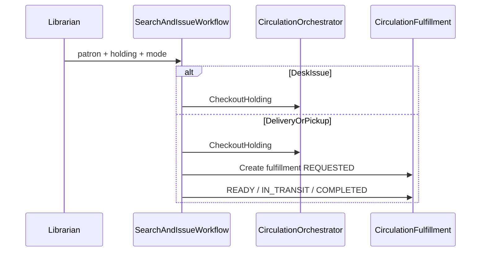
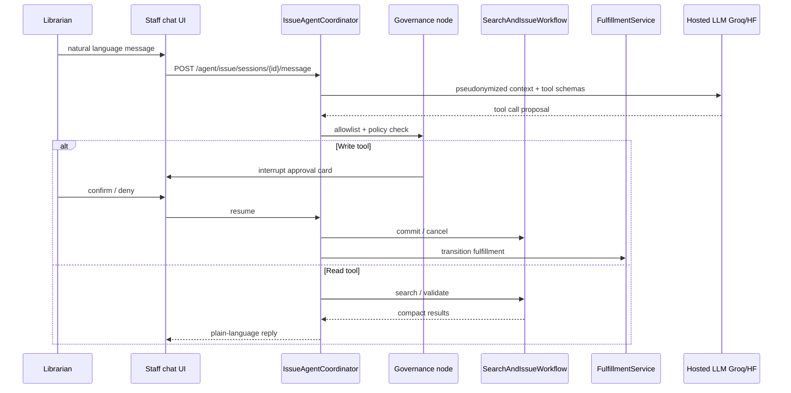
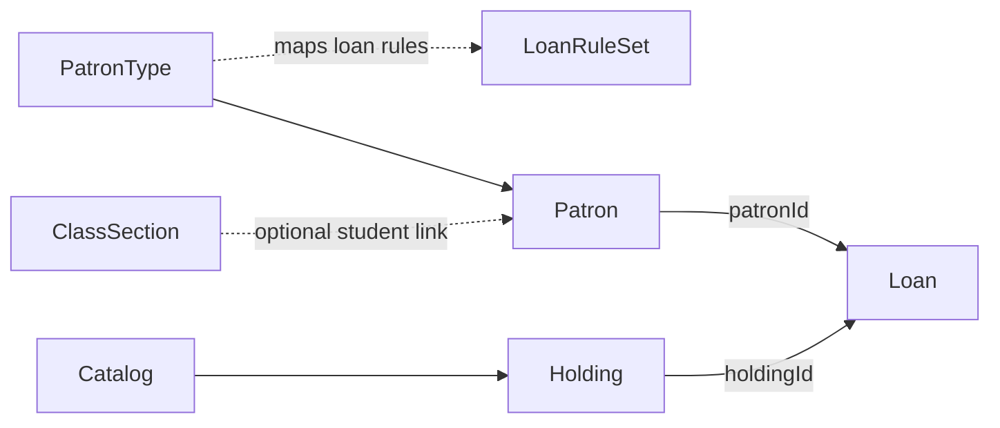
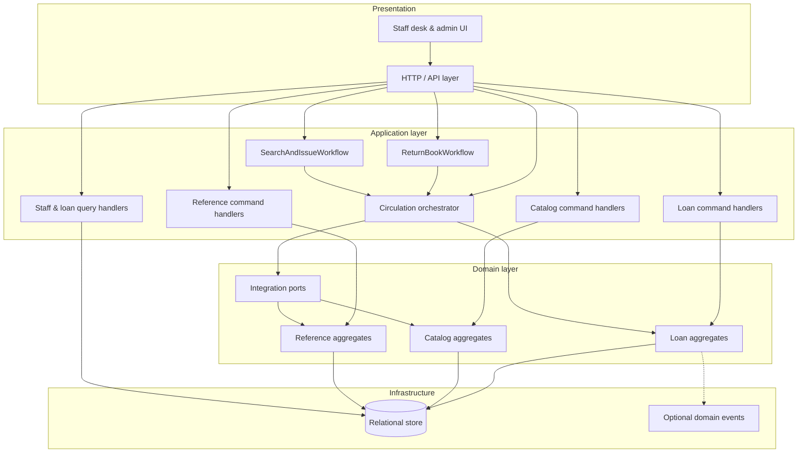

# MVP — LMS-AI · K‑12 Library Management (minimal ship)

This document collects **MVP / minimal-scope** behavior across the three bounded contexts. Authoritative rules, entities, APIs, and diagrams remain in **[reference.md](reference.md)**, **[catalog.md](catalog.md)**, and **[loan.md](loan.md)**.

**Staff desk workflows** (search & issue, return, optional delivery/pick-up) → **§2.1**. **Conversational issue & agentic fulfillment** (Phase 8) → **§2.2**. **Knowledge graph (ontology layers)** for the MVP slice → **§7**. **Architecture, design decisions, and traceability** → **§8–§10**. **Phased implementation plan** → **[plan-mvp.md](plan-mvp.md)**. **Discovery conversation and user intent** → **[research.md](research.md)**. **Agent governance** → **[research.md §15](research.md)** + IMDA skill.

---

## 1. Purpose

The MVP is the smallest **coherent** product slice: enough **Reference** master data to borrow, enough **Catalog** metadata and holdings to lend physical items, and enough **Loan** configuration and circulation to issue and return—plus **staff discovery** of titles, **basic overdue visibility**, and **orchestrated desk workflows** so librarians can search, issue, and return with optional **delivery / pick-up** fulfillment (§2.1). **Phase 8** adds a **conversational desk channel** for WF-01 (question-driven search & issue) and **agent-guided fulfillment follow-up**, governed per IMDA MGF v1.5 (§2.2, ADR-025–028).

**Out of scope for this MVP list** (unless noted in domain docs): guardian portals, fines ledger, bulk class issue, renewals, procurement integration, full OPAC polish.

---

## 2. Cross-domain MVP journey (suggested order)

| Step | Outcome | Primary domain doc |
|------|---------|---------------------|
| 1 | Register / update **patrons** with **`PatronType`** | [reference.md](reference.md) |
| 2 | Maintain **patron types** and map them to **`LoanRuleSet`** | [reference.md](reference.md) · [loan.md](loan.md) |
| 3 | Configure **`LoanRuleSet`** (`maxActiveLoans`, `loanPeriodDays`) | [loan.md](loan.md) |
| 4 | Create / **publish** **`Catalog`** records | [catalog.md](catalog.md) |
| 5 | Add **`Holding`** rows (`AVAILABLE`, barcode, accession) | [catalog.md](catalog.md) |
| 6 | **Checkout** (`patronId` + `holdingId`) | [loan.md](loan.md) |
| 7 | **Return** | [loan.md](loan.md) |
| 8 | **Staff catalog search**; **list open loans / overdue** (queries) | [catalog.md](catalog.md) · [loan.md](loan.md) |

### 2.1 Staff desk workflows

Two primary **librarian workflows** compose existing domain commands and queries. They are **application processes** (ADR-021), not new aggregates in the Reference, Catalog, or Loan kernels. Cross-context writes still flow only through **`CirculationOrchestrator`** (ADR-002).

#### WF-01 — Search and issue a book

| Step | Action | Type | Domain rules validated |
|------|--------|------|------------------------|
| 1 | Identify patron (card / admission no. / **name**) | Query | Patron exists |
| 2 | Pre-flight eligibility preview | Query via ports | REF-P6, REF-B2, LN-R1, LN-R2 |
| 3 | Search catalog (title / ISBN / call no.) | Query | CAT-5, XCAT-1 (published only for issue UI) |
| 4 | Select copy / scan barcode | Query | LN-H1, HLD-4, HLD-5 (`AVAILABLE`, `circulating`) |
| 5 | Choose fulfillment mode | Input | `DESK` / `DELIVERY` / `PICKUP_POINT` |
| 6 | Commit issue | Command | Full LN-X1 via `CirculationOrchestrator` |
| 7 | Fulfillment follow-up (if not desk) | Command | `CirculationFulfillment` lifecycle (§5.1) |



**Custody policy (ADR-023):** Loan clock and `Holding.ON_LOAN` follow **library custody**—checkout runs when the item leaves library control (desk: immediately; delivery: when dispatched per policy).

#### WF-02 — Return a book

| Step | Action | Rules |
|------|--------|-------|
| 1 | Resolve by holding barcode or loan id | Open loan exists (LN-X2) |
| 2 | Show context (patron, title, due, overdue) | LN-T1 |
| 3 | Choose desk return vs pick-up collection | Logistics only for pick-up |
| 4 | Commit desk return | LN-X2 idempotent close + `AVAILABLE` |
| 5 | Confirm pick-up receipt (async path) | `ReturnHolding` only when library has custody |

**Pick-up return:** loan stays **open** until `ConfirmReturnReceived`; do not call `ReturnHolding` when the patron only requests collection.

#### Rule validation contract (REQ-29)

- Workflows expose **`ValidationReport`** — a list of `{rule_id, message}` on preview and before commit.
- Authoritative checks remain in domain ports and the orchestrator; the workflow aggregates failures for desk UX.
- Rule IDs map to existing catalogs: REF-P*, REF-B*, CAT-*, XCAT-*, LN-P*, LN-H*, LN-R*, LN-X*.

**Planned API surface:** `POST /api/v1/workflows/issue/start`, `.../issue/search-patrons`, `.../issue/back`, `.../issue/cancel`, `.../issue/commit`, `POST /api/v1/workflows/return/...` (see [plan-mvp.md](plan-mvp.md) Phase 5A/5B).

**Rollback:** Before commit, **`POST .../issue/back`** returns the desk to an earlier wizard step (client-held state). After commit, **`POST .../issue/cancel`** reverses the loan via `ReturnHolding` and cancels open ISSUE fulfillments (orchestrator only).

#### WF-01 wizard mode vs conversational mode

| Mode | UX | API / implementation | Status |
|------|-----|----------------------|--------|
| **Wizard** (§2.1 steps 1–7) | Multi-step forms at `/staff/` | `POST /api/v1/workflows/issue/*` | **Shipped** (Phases 5A/5B, 6) |
| **Conversational** (§2.2) | Natural-language questions + confirm cards | `POST /api/v1/agent/issue/*` (+ session) | **Shipped** (Phase 8) |

Both modes compose the **same** `SearchAndIssueWorkflow` and `FulfillmentService` (ADR-021). The agent is an additional **application edge** (ADR-025); it must not bypass the orchestrator or domain validators.

### 2.2 Conversational search & issue + agentic fulfillment (Phase 8)

Librarians interact with WF-01 as a **dialogue** (“Issue *Harry Potter* to Riya Sharma, deliver to Class 5A”) instead of only a fixed wizard. **Fulfillment follow-up** (step 7 when `mode != DESK`) is driven by an **SOP-bound agent graph** that proposes transitions; the librarian **confirms** before any write.

**Non-negotiable (ADR-025, ADR-027):**

- The **LLM never performs circulation writes** — only typed **tools** call `SearchAndIssueWorkflow` / `FulfillmentService`.
- **Human-in-the-loop (HITL)** via **`pending_approval` + `POST .../resume`** before `commit_issue`, `cancel_issue`, and `transition_fulfillment` (LangGraph `interrupt()` equivalent).
- **Deny-by-default** if approval UI or session infrastructure is unavailable.
- **Wizard APIs remain** the contract of record; agent channel is additive (ADR-020: no feature flags on circulation invariants).

#### SOP graph (maps to §2.1 steps)

| Graph step | Librarian intent (examples) | Tools (read / write) | HITL |
|------------|----------------------------|----------------------|------|
| 1 | “Find patron Riya” / admission no. | `search_patrons`, `resolve_patron` (read) | If multiple matches |
| 2 | “Can she borrow?” | `resolve_patron` (includes patron eligibility), `validate_issue` (read) | If violations — explain only |
| 3 | “Search Harry Potter” | `search_lendable` (read) | If ambiguous title |
| 4 | “Use barcode ABC123” | `select_barcode` (read; via `find_lendable_copy_by_barcode`) | — |
| 5 | “Deliver to 5A” | Slot fill only (no write) | — |
| 6 | “Go ahead” | `commit_issue` (write) | **Required** (`pending_approval` → `/resume`) |
| 6b | “Cancel the issue” | `cancel_issue` (write) | **Required** |
| 7 | “Mark in transit” | `get_fulfillment_status`, `transition_fulfillment` (write) | **Required** |

**Authorized tool allowlist** (`src/lms/agent/tools.py`): read — `search_patrons`, `resolve_patron`, `search_lendable`, `select_barcode`, `validate_issue`, `get_fulfillment_status`; write — `commit_issue`, `cancel_issue`, `transition_fulfillment`. **Restricted (never bound):** `direct_checkout`, `direct_db`, `admin_api`, `remote_mcp`.

On tool failure: **halt and notify** — no unbounded self-retry (IMDA SOP; see [research.md §15](research.md)).



#### Hosted LLM (ADR-028) — no local inference for MVP

| Role | Provider | Model | Notes |
|------|----------|-------|-------|
| **Primary** | **Groq API** | `llama-3.3-70b-versatile` | Dialogue + tool calling; low latency |
| **Fast routing (optional)** | Groq | `llama-3.1-8b-instant` | Short clarifications only |
| **Fallback (optional, off by default)** | **Hugging Face Inference** | Pinned model + provider (e.g. `Qwen/Qwen2.5-72B-Instruct`) | No `:fastest` routing in production |

Routing via **LiteLLM**; orchestration via **LangGraph** (fixed `StateGraph` edges, not open-ended ReAct). **Do not** use Groq Compound remote MCP or arbitrary HF MCP servers for circulation tools (IMDA supply-chain control).

#### Data masking & token minimization (ADR-026)

| Data | In LLM prompt | Server session / tools only |
|------|---------------|----------------------------|
| Patron identity | Pseudonym (`PATRON_A`) + display label | `patron_id`, admission no., card barcode |
| Holdings / loans | Title, barcode, shelf | `holding_id`, `loan_id` |
| Destination contact | Redacted or “[on file]” | Full `destination_contact` |
| Validation | `message` text only | `rule_id` (API traceability) |
| Secrets | Never | JWT, API keys, DB URLs |

**Server-side session** holds slot state; prompts carry deltas and short summaries only. **Langfuse** traces use redacted tool args (see §13.8).

#### Agent API surface (shipped)

| Endpoint | Purpose |
|----------|---------|
| `POST /api/v1/agent/issue/sessions` | Start agent session (operator-scoped) |
| `GET /api/v1/agent/issue/sessions/{id}` | Session status for UI |
| `POST /api/v1/agent/issue/sessions/{id}/message` | Turn-based chat; returns assistant text + optional `pending_approval` |
| `POST /api/v1/agent/issue/sessions/{id}/resume` | HITL approve / deny after pending action |

RBAC: same as workflow APIs — **LIBRARIAN** / **ADMIN** JWT (ADR-024). Feature flag: `AGENT_ISSUE_ENABLED` (extension edge only; ADR-020).

#### Enterprise agent charter (summary)

Full charter: [research.md §15.2](research.md). Restricted actions: direct orchestrator/DB access, patron admin, catalog publish, external HTTP, Groq/HF remote MCP, unbounded tool loops.

---

## 3. Reference — MVP use cases

Minimal patron and structure setup before circulation.

| # | MVP item | Primary actor | Stakeholders |
|---|----------|---------------|--------------|
| 1 | Register / update **patron** (minimal fields + **`PatronType`**) | Librarian, admin | Patron, loan desk |
| 2 | Maintain **patron types** (codes used by loan rules) | Admin | Librarians, borrowers (indirect via limits) |
| 3 | **Suspend / exit** patron (status); optional **block** flag or **`PatronBlock`** | Admin, librarian | Patron, loan desk |
| 4 | Student → **`classSectionId`** (or free-text class/section for smallest MVP) | Librarian, admin | Student, teachers |

### Reference — MVP enrollment ontology chain

Illustrative mapping from MVP rows to use cases and action types (detail in [reference.md](reference.md) §3.3).

| MVP # | Workflow lens | Use cases | Action type chain (illustrative) |
|-------|---------------|-----------|----------------------------------|
| 1 | Register / maintain patron | REF-UC01, REF-UC02 | `RegisterPatron` → `UpdatePatron` |
| 2 | Patron types for loan rules | REF-UC03 | `CreatePatronType` / `UpdatePatronType` |
| 3 | Suspend / exit / block | REF-UC04, REF-UC05 | `SuspendPatron` / `ExitPatron`; optional `SetPatronBlock` |
| 4 | Class link | REF-UC02, REF-UC06 | `CreateClassSection`; `AssignPatronToClassSection` |

---

## 4. Catalog — MVP use cases

Minimal bibliographic and inventory footprint.

| # | MVP item | Primary actor | Stakeholders |
|---|----------|---------------|--------------|
| 1 | Create/update **`Catalog`** record (minimal: title, language, optional ISBN, tags) | Librarian | Patrons, teachers |
| 2 | Publish **`Catalog`** (or equivalent gate before lending) | Librarian | Borrowers, loan desk |
| 3 | Add **`Holding`** (barcode, accession, `catalogId`, `AVAILABLE`) | Librarian | Patrons, circulation |
| 4 | Staff search **`Catalog`** / list holdings | Librarian | Same team |
| 5 | Withdraw **`Holding`** when policy requires | Librarian | Patrons, admin |

### Catalog — MVP lifecycle (record & holding states)

| Workflow | Steps | Resulting state |
|----------|--------|-----------------|
| Draft | Minimal title + language | `Catalog` = `DRAFT` |
| Enrich | Authors, ISBN, subjects, classification | Still `DRAFT` until publish |
| Publish | Validation passes | `PUBLISHED` |
| Suppress | Administrative hide | `SUPPRESSED` |
| Add holding | Barcode + accession + link | New `Holding`, typically `AVAILABLE` |
| Withdraw holding | Remove from lending | `holdingStatus` = `WITHDRAWN` |

### Catalog — MVP ontology chain

Illustrative mapping from lifecycle labels to use cases and commands (detail in [catalog.md](catalog.md) §3.3).

| Lifecycle label | Typical use cases | Action type chain (illustrative) |
|-----------------|-------------------|--------------------------------|
| Draft | C-UC01 | `CreateCatalogDraft` |
| Enrich | C-UC01 | `UpdateCatalogMetadata` |
| Publish | C-UC02 | `PublishCatalog` |
| Suppress | C-UC03 | `SuppressCatalog` |
| Add holding | C-UC04 | `AddHoldingToCatalog` |
| Withdraw holding | C-UC06 | `WithdrawHolding` |

---

## 5. Loan — MVP use cases

| # | MVP item | Primary actor | Stakeholders |
|---|----------|---------------|--------------|
| 1 | Configure **`LoanRuleSet`** (max loans, loan days per patron type) | Admin | Librarians, borrowers |
| 2 | **Checkout** by `patronId` + `holdingId` | Librarian, patron (self-checkout) | Catalog staff (status), borrower |
| 3 | **Return** by `holdingId` (or loan id) | Librarian, patron (self-return) | Same |
| 4 | **List open loans** / **overdue** (query-only) | Librarian | Patrons named on loans, guardians if notices enabled |

### Loan — MVP lifecycle (loan states)

| State | Condition |
|--------|-----------|
| Open | `returnedAt` is null |
| Closed | `returnedAt` set |
| Overdue (derived) | Open and `today > dueDate` per policy |

### Loan — MVP ontology chain

Illustrative mapping from loan states to use cases and commands (detail in [loan.md](loan.md) §3.3).

| State / lens | Typical use cases | Action type chain (illustrative) |
|----------------|-------------------|-----------------------------------|
| Open loan | L-UC02 | `CheckoutHolding` → persisted `Loan` (`returnedAt` null) |
| Closed loan | L-UC03 | `ReturnHolding` → `returnedAt` set |
| Overdue (derived) | L-UC05 | `ListOverdueLoans` (read; no state change) |
| Policy before checkout | L-UC01 | `ConfigureLoanRuleSet` / `UpdateLoanRuleSet` |

### 5.1 Circulation fulfillment (delivery / pick-up)

Supporting aggregate for optional physical handoff (ADR-022). Lives in the Loan module (`loan/`); does not replace the circulation kernel.

**Aggregate:** `CirculationFulfillment`

| Field / VO | Purpose |
|------------|---------|
| `loan_id`, `holding_id` | Links to circulation fact |
| `direction` | `ISSUE` \| `RETURN` |
| `mode` | `DESK` \| `DELIVERY` \| `PICKUP_POINT` |
| `status` | `NOT_REQUIRED` \| `REQUESTED` \| `READY` \| `IN_TRANSIT` \| `COMPLETED` \| `CANCELLED` |
| `destination` | Class section, room, contact notes (value object) |

**Invariants:**

- Cannot complete issue fulfillment without an open `Loan`.
- Cannot complete return pick-up fulfillment without a linked open `Loan`.
- `DESK` mode may omit a fulfillment row (`NOT_REQUIRED`).

**Commands:** `CreateIssueFulfillment`, `CompleteIssueFulfillment`, `InitiateReturnPickup`, `ConfirmReturnReceived`.

---

## 6. Cross-domain MVP dependencies

- **Checkout** requires **`Catalog`** suitable for lending ([catalog.md](catalog.md) publish/checkout gate) and an **`AVAILABLE`** **`Holding`**.
- **Loan** stores **`patronId`** and **`holdingId`** only; eligibility comes from **Reference** and **Catalog** at runtime.
- **PatronType → LoanRuleSet** mapping must be configured before rule-based limits apply ([reference.md](reference.md), [loan.md](loan.md)).

### 6.1 Fulfillment dependencies

- **WF-01** with `mode != DESK` creates a `CirculationFulfillment` row after `CheckoutHolding` succeeds.
- **WF-02** pick-up return uses a two-phase path: `InitiateReturnPickup` (loan stays open) → `ConfirmReturnReceived` → `ReturnHolding`.
- Fulfillment references `Loan` and `Holding` by FK; it does not store patron eligibility or lendability rules.

---

## 7. Knowledge graph (MVP)

The MVP can be expressed as the same **layered ontology graph** used in each domain doc (**workflow → use case → action type → aggregate**), restricted to **minimal-ship** paths. Predicates match **[catalog.md](catalog.md) §3.4**, **[reference.md](reference.md) §3.4**, **[loan.md](loan.md) §3.4**.

### 7.1 Predicates (edge labels)

| Predicate | Meaning |
|-----------|---------|
| **`maps_to`** | MVP workflow / journey step operationalized by a use case. |
| **`realized_by`** | Use case implemented by an action type (command or query). |
| **`targets`** | Action reads or mutates an aggregate / read projection. |
| **`integrates_with`** | Action spans bounded contexts (FK validation or side effect). |

### 7.2 MVP unified graph (workflow → use case → action → aggregate)

**Legend:** **`-->`** = `maps_to`; **`-.->`** = `realized_by`; **`==>`** = `targets` or `integrates_with` (thick edges to aggregates; checkout/return also touch external **`Patron`** / **`Holding`**).

```mermaid
flowchart TB
  subgraph aggR["Reference agg"]
    RPAT[("Patron")]
    RPT[("PatronType")]
    RCS[("ClassSection")]
    RPB[("PatronBlock")]
  end

  subgraph aggC["Catalog agg"]
    CAT[("Catalog")]
    HLD[("Holding")]
    RDq[["Staff / catalog reads"]]
  end

  subgraph aggL["Loan agg"]
    LRS[("LoanRuleSet")]
    LN[("Loan")]
    FF[("CirculationFulfillment")]
    RL[["Loan reads overdue / open"]]
  end

  subgraph ucMVP["MVP use cases uc"]
    UR1["REF-UC01·02"]
    UR2["REF-UC03"]
    UR3["REF-UC04·05"]
    UR4["REF-UC06"]
    UC1["C-UC01·02"]
    UC2["C-UC04"]
    UC3["C-UC06"]
    UC4["C-UC08"]
    UL1["L-UC01"]
    UL2["L-UC02"]
    UL3["L-UC03"]
    UL4["L-UC05"]
  end

  subgraph actMVP["MVP action types act"]
    AR["RegisterPatron UpdatePatron"]
    AT["CreatePatronType UpdatePatronType"]
    AX["SuspendPatron ExitPatron SetPatronBlock"]
    AC["CreateClassSection AssignPatronToClassSection"]
    CC["CreateCatalogDraft UpdateCatalogMetadata PublishCatalog"]
    CH["AddHoldingToCatalog WithdrawHolding"]
    CQ["SearchCatalogStaff ListHoldings"]
    LR["ConfigureLoanRuleSet UpdateLoanRuleSet"]
    CK["CheckoutHolding"]
    RT["ReturnHolding"]
    LQ["ListOpenLoansByPatron ListOverdueLoans"]
    WFI["SearchAndIssueWorkflow"]
    WFR["ReturnBookWorkflow"]
    CIF["CreateIssueFulfillment CompleteIssueFulfillment"]
    CRP["InitiateReturnPickup ConfirmReturnReceived"]
  end

  subgraph wfMVP["MVP journey wf — aligns with §2"]
    S1["1 Patrons + PatronType"]
    S2["2 Types ↔ LoanRuleSet map"]
    S3["3 Configure LoanRuleSet"]
    S4["4–5 Publish Catalog + Holding"]
    S5["6 Checkout"]
    S5a["WF-01 Search and issue"]
    S6["7 Return"]
    S6a["WF-02 Return book"]
    S6b["Fulfillment delivery pick-up"]
    S7["8 Staff search + overdue"]
  end

  S5a --> UL2 & UC4
  S6a --> UL3
  S6b --> FF

  S1 --> UR1 & UR3 & UR4
  S2 --> UR2
  S3 --> UL1
  S4 --> UC1 & UC2
  S5 --> UL2
  S6 --> UL3
  S7 --> UC4 & UL4

  UR1 -.-> AR
  UR2 -.-> AT
  UR3 -.-> AX
  UR4 -.-> AC
  UL1 -.-> LR
  UC1 -.-> CC
  UC2 -.-> CH
  UC3 -.-> CH
  UC4 -.-> CQ
  UL2 -.-> CK
  UL3 -.-> RT
  UL4 -.-> LQ

  AR ==> RPAT & RPT & RCS
  AT ==> RPT & LRS
  AX ==> RPAT & RPB
  AC ==> RCS & RPAT
  LR ==> LRS
  CC ==> CAT
  CH ==> HLD & CAT
  CQ ==> RDq & CAT & HLD
  CK ==> LN
  CK ==> RPAT
  CK ==> HLD
  RT ==> LN
  RT ==> HLD
  LQ ==> RL & LN
  WFI -.-> CK & CQ
  WFR -.-> RT
  CIF ==> FF & LN
  CRP ==> FF & LN
  FF ==> LN & HLD
```



*Notes:* **`MapPatronTypeToLoanRuleSet`** is omitted as a label but implied between **`PatronType`** and **`LoanRuleSet`**. **`MergeCatalogRecords`**, OPAC search, renewals, and fines are **out of MVP** or phase 2 and are not drawn. Patron **`ACTIVE`** / block checks occur **inside** **`CheckoutHolding`** (`integrates_with` Reference). Staff workflows (**§2.1**) compose queries and orchestrator calls; **`CirculationFulfillment`** is optional per transaction.

### 7.3 Integration slice (who borrows what, under which policy)

Compact view of **foreign keys** and policy edge at checkout (no workflow layer).



### 7.4 Sample triples (informative Turtle)

```turtle
@prefix mvp:  <https://example.invalid/lms/mvp#> .
@prefix loan: <https://example.invalid/lms/loan#> .

mvp:journey-step-3 :maps_to loan:configure-loan-rules-uc .
loan:configure-loan-rules-uc :realized_by loan:ConfigureLoanRuleSet .
loan:ConfigureLoanRuleSet :targets loan:LoanRuleSetAggregate .
```

Full per-domain graphs and additional triples: [reference.md](reference.md) §3.4 · [catalog.md](catalog.md) §3.4 · [loan.md](loan.md) §3.4.

---

## 8. Architecture overview

The MVP is delivered as a **modular monolith** with three **bounded contexts**—**Reference**, **Catalog**, and **Loan**—matching §7.2. A single **circulation orchestration** layer coordinates cross-context writes for **`CheckoutHolding`** and **`ReturnHolding`**; all other MVP commands stay within their owning context.



**Circulation kernel (change rarely):** `CheckoutHolding`, `ReturnHolding`, and their invariants (§6).

**Extension edge (change often):** staff search/overdue read models, admin configuration UI, future commands listed in §1 out-of-scope.

---

## 9. Quality attributes & design principles

### 9.1 MVP quality attributes

Attributes below are **in scope for MVP** (derived from §1–§7). Items explicitly **out of MVP** (§1) are not architectural commitments here.

| Attribute | MVP driver | Architectural response |
|-----------|------------|------------------------|
| **Correctness** | Publish gate, `AVAILABLE` holding, patron eligibility at checkout, `LoanRuleSet` limits, lifecycle states (§4–§6) | Domain rules in aggregates; orchestrator enforces cross-context invariants in one unit of work |
| **Integration integrity** | `integrates_with` on checkout/return (§7.2) | Narrow ports (`PatronEligibility`, `HoldingLendability`); orchestrator coordinates Loan + Holding status |
| **Single-item circulation safety** | One `patronId` + one `holdingId` per checkout (§2, §5) | At most one open loan per `holdingId`; concurrency control on holding row |
| **Authorization** | Actors per §3–§5 (librarian, admin, patron) | Role-based API authorization aligned to MVP use cases |
| **Read-model correctness** | Staff search, open/overdue queries (§1, §2 step 8) | Query handlers / projections; overdue derived from open loan + `dueDate` policy |
| **Coherence** | Three-context coherent slice (§1) | Module boundaries match contexts; shared orchestration only for circulation |
| **Durability** | Persisted `Loan` on checkout (§5) | Transactional persistence; committed circulation facts not lost |

### 9.2 Key design principles — extensibility, maintainability, configurability

| Principle | Intent | MVP design choice |
|-----------|--------|-------------------|
| **Extensibility** | Add post-MVP features without rewriting circulation | New **commands** per feature (renewals, fines, bulk issue); **domain events** optional at loan/catalog boundaries; **policy resolver** hook for `LoanRuleSet` |
| **Maintainability** | Small team can change one context with low regression risk | **One handler per MVP action** (§7.2); rules in **domain layer**; **circulation orchestrator** is the only cross-context write coordinator |
| **Configurability** | Schools differ in limits and loan period without redeploy | **`LoanRuleSet`** + **`PatronType`** mapping as data (§2 steps 2–3); fail closed if mapping missing; optional `loanRuleSetId` on `Loan` for future policy audit |

### 9.3 Extension roadmap (out of MVP — §1)

| Future capability | Extend by | Touch circulation kernel? |
|-------------------|-----------|---------------------------|
| Bulk class issue | New command + batch orchestration | Reuse eligibility/lendability ports |
| Renewals | `RenewLoan` in Loan | Policy resolver + `Loan` aggregate |
| Fines | New aggregate or Loan extension | Subscribe to overdue/return events |
| Guardian / notices | Reference + notification adapter | Read via ports only |
| Full OPAC | Catalog patron read model | No change to `PublishCatalog` |

---

## 10. Architecture & design decisions

Decisions are numbered **ADR-001** … for traceability in §11.

| ID | Decision | Rationale | Consequences |
|----|----------|-----------|--------------|
| **ADR-001** | **Modular monolith** (three internal modules: Reference, Catalog, Loan) | Matches MVP coherent slice (§1); simplest deploy and test for minimal ship | Single database acceptable; extract services later only if needed |
| **ADR-002** | **Circulation orchestrator** for `CheckoutHolding` / `ReturnHolding` | Only MVP writes spanning contexts (§6, §7.2) | All cross-context invariants tested in one place; other commands stay local |
| **ADR-003** | **Command/query separation** per §7.2 action types | Maintains clear write vs read paths; supports staff search/overdue projections | Queries may use read models; writes stay authoritative on aggregates |
| **ADR-004** | **Integration ports** (not direct cross-module persistence) | Extensibility + maintainability; contexts own aggregates | `PatronEligibilityPort`, `HoldingLendabilityPort` implemented by Reference/Catalog adapters |
| **ADR-005** | **Policy resolver** for `PatronType` → `LoanRuleSet` | Configurability (§6); single place for limit/duration logic | Checkout fails with clear error if mapping or rule set missing |
| **ADR-006** | **Strong consistency** on checkout/return (single transaction or equivalent) | MVP circulation safety and §6 dependencies | Staff reads may use projections; circulation path does not rely on eventual consistency |
| **ADR-007** | **Data-driven `LoanRuleSet`** (not hard-coded limits) | Configurability for admin (§5 #1) | `maxActiveLoans`, `loanPeriodDays` stored as configuration rows |
| **ADR-008** | **Lifecycle state machines** in domain layer | Catalog/loan/holding states in §4–§5 | `PublishCatalog`, withdraw holding, open/closed loan enforced by domain transitions |
| **ADR-009** | **Optional domain events** (`LoanCheckedOut`, `LoanReturned`, `CatalogPublished`) | Extensibility without coupling MVP to notifications | Consumers added post-MVP; MVP works without event bus |
| **ADR-010** | **Role-based authorization** mapped to MVP actors | §3–§5 actor columns | Admin vs librarian vs patron scopes on API operations |
| **ADR-011** | **MVP scope guardrail** — no implementation of §1 out-of-scope in core | Maintainability; avoids premature complexity | Bulk issue, renewals, fines, guardian portal deferred to extension edge |
| **ADR-021** | **Application workflow coordinators** (`SearchAndIssueWorkflow`, `ReturnBookWorkflow`) | Desk UX needs multi-step compose of queries + commands (§2.1) | Workflows call orchestrator for writes only; no cross-context persistence bypass |
| **ADR-022** | **`CirculationFulfillment` aggregate** for optional delivery/pick-up | K-12 schools may deliver to class/home (§2.1, §5.1) | References `Loan`/`Holding`; does not replace circulation kernel |
| **ADR-023** | **Custody-aligned loan clock** | Due dates and `checkoutAt` must reflect library custody, not patron doorstep | Desk: immediate checkout; delivery: on dispatch; pick-up return: two-phase close |
| **ADR-024** | **JWT Bearer auth** on all domain APIs | REQ-21, REQ-30; desk and Swagger clients need token-based access | `POST /api/v1/auth/token` public; `domain_api_router` requires Bearer JWT; Swagger `BearerJWT` scheme |
| **ADR-025** | **Agent edge module** (`IssueAgentCoordinator`) | Conversational WF-01 without changing circulation kernel (§2.2) | LangGraph SOP graph; tools wrap workflow services only; LLM never writes directly |
| **ADR-026** | **PII pseudonymization & token-minimized prompts** | K-12 patron data + hosted LLM (Groq/HF) | Server session holds IDs; prompts use pseudonyms; redact before Langfuse/HITL |
| **ADR-027** | **Mandatory HITL on agent writes** | Irreversible desk actions; IMDA meaningful oversight | `pending_approval` + `/resume` before `commit_issue`, `cancel_issue`, `transition_fulfillment`; deny-by-default |
| **ADR-028** | **Hosted OSS LLM routing (no local inference)** | MVP uses Groq primary, HF Inference optional fallback | LiteLLM; pin models/providers; document third-party residual risk |

### 10.1 Design elements (implementation map)

| Layer | Element | Responsibility |
|-------|---------|----------------|
| **API** | REST (or RPC) resources per command/query | Authentication, authorization, DTO mapping, validation of input shape |
| **Application** | Command handlers (`RegisterPatron`, `PublishCatalog`, …) | Load aggregate, invoke domain behavior, persist, publish events |
| **Application** | **CirculationOrchestrator** | `CheckoutHolding` / `ReturnHolding`: call ports, apply policy, persist `Loan`, update holding status |
| **Application** | Query handlers (`SearchCatalogStaff`, `ListOverdueLoans`, …) | Read models, filters, overdue derivation |
| **Application** | **Workflow coordinators** (§2.1) | `SearchAndIssueWorkflow`, `ReturnBookWorkflow`; `IssueEligibilityValidator` → `ValidationReport` |
| **Application** | **Fulfillment service** | `CirculationFulfillment` state transitions for delivery/pick-up |
| **Application** | **Agent coordinator** (§2.2, Phase 8) | `IssueAgentCoordinator` — LangGraph SOP, governance node, HITL; tools → workflow layer |
| **Infrastructure** | **LLM router** | LiteLLM → Groq (primary) / HF Inference (fallback); Langfuse callbacks |
| **Domain** | Aggregates | `Patron`, `PatronType`, `ClassSection`, `PatronBlock`; `Catalog`, `Holding`; `Loan`, `LoanRuleSet`, `CirculationFulfillment` |
| **Domain** | **PolicyResolver** | Resolve `LoanRuleSet` from patron type; compute `dueDate` |
| **Domain** | Ports | `PatronEligibilityPort`, `HoldingLendabilityPort` |
| **Infrastructure** | Repositories, ORM, migrations | Persistence per aggregate; unique constraint on open loan per `holdingId` |
| **Infrastructure** | Event publisher (optional) | Outbox or direct publish for ADR-009 |

### 10.2 Technical architecture decisions (implementation-level ADRs)

| ID | Decision | Rationale | Consequences |
|----|----------|-----------|--------------|
| **ADR-012** | Single deployable service for MVP API | Keep operational overhead low while module boundaries stay strict in code | Faster MVP delivery; no network hops between bounded contexts |
| **ADR-013** | Relational primary store with strict transactional writes | Checkout/return correctness and constraints are central requirements | Strong integrity for circulation; schema design and indexing are critical |
| **ADR-014** | Migration-first schema management (versioned DB migrations only) | Preserve deterministic environment promotion | Every release carries explicit up/down-safe schema evolution plan |
| **ADR-015** | Canonical write path via command handlers only | Prevent bypass of domain invariants | No direct repository writes from controllers or query handlers |
| **ADR-016** | Read model strategy: direct SQL for MVP, optional projection tables where needed | Avoid premature complexity while meeting search/overdue responsiveness | Can start simple; promote heavy queries to dedicated read projections |
| **ADR-017** | API idempotency required for circulation commands | Network retries and client resubmits are expected at desk workflows | `CheckoutHolding`/`ReturnHolding` become safely retryable |
| **ADR-018** | Correlation and audit metadata mandatory on write operations | Need traceability for operational incidents and user actions | Improved diagnosability; slight payload/log overhead |
| **ADR-019** | Outbox-ready event publication boundary at Loan/Catalog | Extensibility requires safe event emission without dual-write risk | MVP may run sync/no bus; later event bus can be added without core rewrite |
| **ADR-020** | Feature toggles only for extension-edge behavior, never circulation invariants | Core lending rules must remain deterministic and testable | Reduces production risk from configuration drift on kernel logic |

### 10.3 Runtime and deployment blueprint (MVP)

| Runtime node | Responsibilities | Scaling approach |
|--------------|------------------|------------------|
| **API app node** | REST endpoints, authz checks, command/query dispatch, orchestration | Horizontal scale behind load balancer |
| **Worker node (optional in MVP)** | Async notifications, projection refresh, deferred jobs | Scale independently based on queue depth |
| **Relational DB** | System of record for aggregates + idempotency keys + audit metadata | Vertical first; read replicas optional for heavy queries |
| **Cache (optional)** | Hot query caching for staff discovery | Add only if p95 targets are not met without cache |
| **Object/log sink** | Structured logs, audit export, trace data | Retention by policy and compliance needs |

### 10.4 Data architecture decisions

| Area | Decision | Notes |
|------|----------|-------|
| Aggregate tables | Separate tables per aggregate root with explicit FK boundaries | Preserve context ownership in schema |
| Concurrency | Row lock on `Holding` plus unique open-loan index | Enforces one active loan per physical copy |
| Time handling | Persist timestamps in RFC 3339-compatible UTC instants | Convert to library timezone at query/report edge |
| Soft vs hard delete | Soft delete/audit for master entities; no hard delete on circulation facts | Keeps historical accountability |
| Index strategy | Covering indexes for checkout predicates, overdue queries, barcode lookup | Revalidate via performance tests before go-live |

### 10.5 API and integration decisions

| Area | Decision | MVP guidance |
|------|----------|--------------|
| API style | Resource-oriented REST with command-like endpoints where needed | Keep DTOs explicit and versionable |
| API versioning | URI or header versioning with backward-compatible additive changes in MVP | Breaking changes require new version |
| Error model | Deterministic machine-readable error codes | Flat JSON envelope on every error response (see below) |
| Validation | Edge validation at API + invariant validation in domain | Never rely only on controller validation |
| Cross-context calls | In-process ports only for MVP | Do not introduce network RPC across modules yet |

**Error response envelope** (ADR-016; implemented in `api/errors.py`):

```json
{
  "code": "VALIDATION_ERROR",
  "message": "Invalid input",
  "retriable": false,
  "details": {}
}
```

| HTTP status | Typical `code` values |
|-------------|----------------------|
| 401 | `UNAUTHORIZED` |
| 403 | `FORBIDDEN` |
| 404 | `NOT_FOUND` |
| 409 | `CONFLICT` |
| 422 | `VALIDATION_ERROR`, `DOMAIN_RULE_VIOLATION` |
| 429 | `RATE_LIMIT_EXCEEDED` |
| 500 | `RETRIABLE_ERROR` |

When `APP_DEBUG=false`, validation `details` and 500 `message` are generic (no internal paths or stack traces).

### 10.6 Delivery and release decisions

| Area | Decision | Practical rule |
|------|----------|----------------|
| CI quality gate | Unit + integration + migration tests required | No deploy if migration or circulation tests fail |
| Release style | Small, frequent releases with migration compatibility checks | Prefer forward-compatible schema changes |
| Rollback | App rollback allowed only with schema compatibility guarantee | Otherwise use roll-forward fix |
| Test data | Seeded reference/catalog fixtures for deterministic circulation tests | Keep fixtures versioned with code |
| Go-live readiness | Pass SLO baseline, idempotency checks, and lock-contention tests | Mandatory before production cutover |

---

## 11. Traceability — requirements → architecture → design

**Columns:** **Requirement** (MVP source) → **Architecture** (structure, ADR) → **Design** (concrete element).

| Req ID | Requirement (MVP) | Architecture | Design |
|--------|-------------------|--------------|--------|
| **REQ-01** | Coherent three-context product slice (§1) | ADR-001 modular monolith; §8 diagram | Three modules: `Reference`, `Catalog`, `Loan` |
| **REQ-02** | Cross-domain journey steps 1–8 (§2) | Orchestrator + local handlers (ADR-002, ADR-003) | `CirculationOrchestrator` for steps 6–7; per-step command handlers otherwise |
| **REQ-03** | Register / update patron + `PatronType` (§3 #1) | Reference module (ADR-001) | `RegisterPatronHandler`, `UpdatePatronHandler` → `Patron` aggregate |
| **REQ-04** | Maintain patron types (§3 #2) | Reference module; policy link to Loan (§6) | `CreatePatronTypeHandler`, `UpdatePatronTypeHandler` → `PatronType` |
| **REQ-05** | Suspend / exit / optional block (§3 #3) | Reference module | `SuspendPatronHandler`, `ExitPatronHandler`, `SetPatronBlockHandler` → `Patron`, `PatronBlock` |
| **REQ-06** | Student → class section (§3 #4) | Reference module | `CreateClassSectionHandler`, `AssignPatronToClassSectionHandler` |
| **REQ-07** | Create/update catalog; draft lifecycle (§4 #1, §4 lifecycle) | Catalog module (ADR-008) | `CreateCatalogDraftHandler`, `UpdateCatalogMetadataHandler` → `Catalog` (`DRAFT`) |
| **REQ-08** | Publish catalog before lend (§4 #2, §6) | Catalog module; publish gate (ADR-008) | `PublishCatalogHandler` → `PUBLISHED`; lendability port checks status |
| **REQ-09** | Add holding (`AVAILABLE`, barcode, accession) (§4 #3) | Catalog module | `AddHoldingToCatalogHandler` → `Holding` |
| **REQ-10** | Staff search catalog / list holdings (§4 #4) | ADR-003 query side | `SearchCatalogStaffHandler`, `ListHoldingsHandler` → read model / repository query |
| **REQ-11** | Withdraw holding (§4 #5) | Catalog module (ADR-008) | `WithdrawHoldingHandler` → `WITHDRAWN` |
| **REQ-12** | Configure `LoanRuleSet` (§5 #1) | Loan module; ADR-007 | `ConfigureLoanRuleSetHandler`, `UpdateLoanRuleSetHandler` → `LoanRuleSet` |
| **REQ-13** | Checkout `patronId` + `holdingId` (§5 #2, §6) | ADR-002 orchestrator; ADR-004 ports; ADR-006 | `CirculationOrchestrator.checkout` → ports + `PolicyResolver` + `Loan` + holding `ON_LOAN` |
| **REQ-14** | Return by holding or loan id (§5 #3) | ADR-002 orchestrator; ADR-006 | `CirculationOrchestrator.return` → close `Loan`, holding `AVAILABLE` |
| **REQ-15** | List open loans / overdue (§5 #4) | ADR-003 queries | `ListOpenLoansByPatronHandler`, `ListOverdueLoansHandler`; overdue = open ∧ `today > dueDate` |
| **REQ-16** | `PatronType` → `LoanRuleSet` before limits apply (§6) | ADR-005 policy resolver | `PolicyResolver.resolve(patronTypeId)`; error if unmapped |
| **REQ-17** | Checkout: published catalog + `AVAILABLE` holding (§6) | ADR-004 `HoldingLendabilityPort` | Port implementation validates catalog publish state + holding status |
| **REQ-18** | Checkout: patron eligibility from Reference (§6, §7.2 note) | ADR-004 `PatronEligibilityPort` | Port checks `ACTIVE`, block; invoked inside orchestrator |
| **REQ-19** | Loan stores `patronId`, `holdingId` only (§6) | Loan aggregate boundary | `Loan` entity fields; display data via Reference/Catalog queries |
| **REQ-20** | Derived overdue, no separate overdue state (§5 lifecycle) | Query design | `ListOverdueLoans` SQL/filter on open loans + date compare in library policy timezone |
| **REQ-21** | Librarian / admin / patron actors (§3–§5) | ADR-010 | API middleware: roles `ADMIN`, `LIBRARIAN`, `PATRON` per operation |
| **REQ-22** | Extensibility for §1 out-of-scope features | ADR-009 events; §9.3 roadmap | Event contracts; new handlers without changing orchestrator contract |
| **REQ-23** | Configurable limits and loan period | ADR-007; ADR-005 | `LoanRuleSet` table; optional `loan.loanRuleSetId` FK at checkout |
| **REQ-24** | One open loan per physical copy (implied by §5–§6) | ADR-006; infrastructure | DB unique partial index on `(holding_id) WHERE returned_at IS NULL`; row lock on checkout |
| **REQ-25** | Staff discovery + basic overdue visibility (§1) | ADR-003 read models | Dedicated query handlers; optional search index later |
| **REQ-26** | WF-01 search + issue with rule preview (§2.1) | ADR-021 workflow coordinators | `SearchAndIssueWorkflow`, `IssueEligibilityValidator`, `POST /api/v1/workflows/issue/*` |
| **REQ-27** | WF-02 return with desk + pick-up paths (§2.1) | ADR-021, ADR-023 | `ReturnBookWorkflow`, `POST /api/v1/workflows/return/*` |
| **REQ-28** | Optional delivery/pick-up fulfillment (§5.1) | ADR-022 | `CirculationFulfillment` aggregate; migration `004_fulfillment` |
| **REQ-29** | Aggregated validation report at workflow boundary (§2.1) | ADR-021 | `ValidationReport` VO with traceable `rule_id` |
| **REQ-30** | JWT on all domain APIs (shipped) | ADR-024 | `domain_api_router`, `HTTPBearer`, `api_users` table, `POST /api/v1/auth/token` |
| **REQ-31** | Conversational WF-01 via agent (§2.2) | ADR-025, ADR-027 | `IssueAgentCoordinator`, `POST /api/v1/agent/issue/*`; same workflow tools as wizard |
| **REQ-32** | Agentic fulfillment follow-up (§2.2 step 7) | ADR-025, ADR-022 | Fulfillment subgraph; HITL before `transition_fulfillment` |
| **REQ-33** | PII masking & token-minimized agent prompts | ADR-026 | Pseudonym session map; compact tool payloads; no secrets in checkpoints |
| **REQ-34** | IMDA-governed agent deployment | ADR-027, ADR-028; [research.md §15](research.md) | Enterprise charter, Langfuse audit, tool allowlist, phased rollout |

### 11.1 Traceability — quality attributes & principles

| Concern | Architecture | Design |
|---------|--------------|--------|
| **Correctness** | ADR-002, ADR-006, ADR-008 | Domain validators on aggregates; orchestrator transaction |
| **Extensibility** | ADR-004, ADR-009; §9.3 | Ports + events; new commands at module edge |
| **Maintainability** | ADR-001, ADR-003, ADR-011 | Handler-per-action; no cross-module repository calls |
| **Configurability** | ADR-005, ADR-007 | `LoanRuleSet` + mapping tables; admin APIs |

### 11.2 Traceability — MVP commands (§7.2) to handlers

| Action type (§7.2) | Handler / component |
|--------------------|---------------------|
| `RegisterPatron`, `UpdatePatron` | Reference command handlers |
| `CreatePatronType`, `UpdatePatronType` | Reference command handlers |
| `SuspendPatron`, `ExitPatron`, `SetPatronBlock` | Reference command handlers |
| `CreateClassSection`, `AssignPatronToClassSection` | Reference command handlers |
| `CreateCatalogDraft`, `UpdateCatalogMetadata`, `PublishCatalog`, `SuppressCatalog` | Catalog command handlers |
| `AddHoldingToCatalog`, `WithdrawHolding` | Catalog command handlers |
| `SearchCatalogStaff`, `ListHoldings` | Catalog query handlers |
| `ConfigureLoanRuleSet`, `UpdateLoanRuleSet` | Loan command handlers |
| `CheckoutHolding` | **CirculationOrchestrator** |
| `ReturnHolding` | **CirculationOrchestrator** |
| `ListOpenLoansByPatron`, `ListOverdueLoans` | Loan query handlers |
| `SearchAndIssueWorkflow` (WF-01) | `loan/application/workflows/search_and_issue.py` + workflow API router |
| `ReturnBookWorkflow` (WF-02) | `loan/application/workflows/return_book.py` + workflow API router |
| `CreateIssueFulfillment`, `CompleteIssueFulfillment` | Fulfillment service (Phase 5B) |
| `InitiateReturnPickup`, `ConfirmReturnReceived` | Fulfillment service + `ReturnBookWorkflow` |
| `IssueAgentCoordinator` (conversational WF-01) | `agent/` edge module + LangGraph; tools → `SearchAndIssueWorkflow` / `FulfillmentService` (Phase 8) |

---

## 12. Related documents

| Document | Role |
|----------|------|
| [research.md](research.md) | Discovery conversation, user intent, deferred decisions (context rebuild) |
| [reference.md](reference.md) | Patron, types, class, blocks |
| [catalog.md](catalog.md) | `Catalog`, `Holding`, discovery |
| [loan.md](loan.md) | `Loan`, `LoanRuleSet`, checkout/return |
| [library_domain_model_final.md](library_domain_model_final.md) | One-page cross-domain overview |
| [plan-mvp.md](plan-mvp.md) | Phased implementation plan, verify gates, REQ checklist |
| [go-live-checklist.md](go-live-checklist.md) | G1–G13 sign-off and verification commands |
| [runbook.md](runbook.md) | Deploy, backup, migration rollback, incidents, LLM config (§10) |
| [research.md §15](research.md) | IMDA agent governance + desk agent charter |

---

## 13. High-impact implementation guardrails (MVP)

The following guardrails operationalize §8-§11 so the architecture is production-usable, not only structurally correct.

### 13.1 Operational guarantees (minimum SLOs)

| Concern | MVP guarantee | Notes |
|---------|---------------|-------|
| Checkout / return latency | p95 <= 1200 ms at normal desk load | Includes policy checks and persistence in one transaction. |
| Staff search latency | p95 <= 1500 ms for common filters | Applies to `SearchCatalogStaff` and overdue/open-loan reads. |
| Availability | 99.5% monthly for API | Planned maintenance excluded by policy window. |
| Circulation write durability | No committed checkout/return loss | Commits are transactional; recovery must preserve committed writes. |
| Error budget handling | If SLO is breached, prioritize reliability fixes over new features | Scope guardrail for MVP stabilization. |

### 13.2 Consistency pattern for circulation writes

**`CheckoutHolding`** and **`ReturnHolding`** MUST follow one consistency pattern:

1. Start one database transaction.
2. Acquire lock on target `Holding` row (`FOR UPDATE` or equivalent).
3. Validate lendability and patron eligibility via ports.
4. Apply domain transition (`Loan` open/close + `Holding` status transition).
5. Persist both sides and commit atomically.
6. Rely on unique open-loan constraint (`holding_id` where `returned_at IS NULL`) as a final safety net.

If transaction or lock acquisition fails, return a deterministic retriable error and do not partially persist circulation changes.

### 13.3 Command idempotency contract

| Command | Idempotency requirement | Behavior on duplicate |
|---------|-------------------------|------------------------|
| `CheckoutHolding` | `Idempotency-Key` required (UUID recommended) | Return original success/failure response for same key + same payload. |
| `ReturnHolding` | `Idempotency-Key` required | Repeated return with same key is treated as already applied. |

Idempotency keys should be retained for a bounded replay window (for example 24 hours) and scoped by tenant + actor.

### 13.4 RBAC operation matrix (MVP)

| Operation group | ADMIN | LIBRARIAN | PATRON |
|-----------------|:-----:|:---------:|:------:|
| Manage `PatronType`, `LoanRuleSet`, class-section setup | Yes | Optional (policy) | No |
| Register/update/suspend/exit patron | Yes | Yes | No |
| Catalog draft/publish/suppress/holding maintenance | Yes | Yes | No |
| Checkout / return at desk | Optional (policy) | Yes | Optional (self-checkout policy) |
| Staff discovery / overdue operational views | Yes | Yes | No |
| Workflow issue / return (§2.1) | Optional (policy) | Yes | No |
| Agent conversational issue (§2.2) | Optional (policy) | Yes | No |
| Fulfillment state transitions (delivery / pick-up) | Optional (policy) | Yes | No |
| Agent fulfillment transitions (§2.2) | Optional (policy) | Yes | No |
| Patron self views (if enabled) | No | No | Yes |

Policy choice on self-checkout must be explicitly fixed in product configuration before go-live. All domain and workflow APIs require **Bearer JWT** (ADR-024); obtain token via `POST /api/v1/auth/token`.

### 13.5 Observability and audit minimums

All API requests must carry or emit a correlation id (`X-Correlation-Id` or generated equivalent). For MVP, capture:

- structured logs for command start/success/failure;
- actor id, role, tenant id, command name, aggregate ids (`patronId`, `holdingId`, `loanId`);
- domain event log entries for checkout/return and catalog publish (even if async bus is not enabled);
- audit fields (`createdAt`, `updatedAt`, `createdBy`, `updatedBy`) on mutable records.

### 13.6 Scale guardrails (capacity assumptions)

The MVP should be validated against explicit baseline assumptions before release:

| Dimension | Baseline for MVP validation |
|-----------|-----------------------------|
| Total catalog records | Up to 100k `Catalog` rows |
| Total holdings | Up to 250k `Holding` rows |
| Concurrent desk users | 25 concurrent circulation users |
| Peak circulation writes | 10 checkout/return writes per second (short bursts) |
| Overdue/report query window | Up to 12 months history without timeout at p95 targets |

If expected production numbers exceed these baselines, run targeted performance tests and revise SLOs before rollout.

### 13.7 Security hardening

Operational security controls shipped with the API (see `.cursor/rules/security-and-hardening.md`).

| Control | Implementation | Config / notes |
|---------|----------------|----------------|
| Password hashing | bcrypt, cost factor 12 | `shared/auth/password.py` |
| JWT signing | HS256 via `APP_SECRET_KEY` | Refuse default secret when `APP_ENV=production` |
| RBAC | `ADMIN`, `LIBRARIAN`, `PATRON` on domain routes | §13.4; `domain_api_router` requires Bearer JWT |
| Auth rate limiting | Per-IP fixed window on `/api/v1/auth/` | Default 10 requests / 15 min → `429 RATE_LIMIT_EXCEEDED` |
| API rate limiting | Per-IP fixed window on `/api/` | Default 100 requests / 15 min; `/health`, `/docs` exempt |
| Security headers | CSP, `X-Frame-Options: DENY`, `X-Content-Type-Options: nosniff`, Referrer-Policy | Optional HSTS via `SECURITY_HSTS_ENABLED` (HTTPS only) |
| CORS | Explicit allowlist in production | Startup rejects `CORS_ORIGINS=*` when `APP_ENV=production` |
| Error disclosure | Generic client messages when `APP_DEBUG=false` | Full validation detail only in debug |
| Staff UI token storage | JWT in `sessionStorage` (not `localStorage`) | `staff/static/app.js`; user HTML escaped via `escapeHtml` |
| Supply chain | `npm ci` + `npm audit --audit-level=high` in CI | Lockfile committed |

**Verify:** `pytest tests/hardening/test_security.py`; sign-off items in [go-live-checklist.md](go-live-checklist.md).

### 13.8 Agent and LLM security (Phase 8)

Extends §13.7 for hosted LLM desk agents (OWASP LLM Top 10; IMDA MGF v1.5). Authority: [research.md §15](research.md), `.cursor/skills/imda-agentic-ai-governance/SKILL.md`.

| Control | Implementation | Config / notes |
|---------|----------------|----------------|
| LLM output untrusted | Pydantic-validated tool args only; no raw LLM → SQL/shell/orchestrator | Governance node on tool path |
| Prompt injection | Catalog titles / patron text treated as data; structural tool allowlist | Not prompt-only restrictions |
| PII in prompts | Pseudonyms in LLM context; full IDs in server session only | ADR-026 |
| HITL on writes | `pending_approval` + `/resume` before commit, cancel, fulfillment transition | ADR-027; deny-by-default |
| Bounded consumption | `max_tokens`, max tool calls/turn, API + LLM rate limits | `AGENT_MAX_TOOL_CALLS_PER_TURN` |
| Secrets | Never in prompts, graph checkpoints, or Langfuse spans | `GROQ_API_KEY`, `HF_TOKEN` in env only |
| Observability | Langfuse: `agent_id`, `thread_id`, redacted args, HITL events | Correlate with `X-Correlation-Id` (ADR-018) |
| Third-party LLM | Document Groq/HF residual risk; pin model versions | ADR-028; no `:fastest` HF routing in prod |
| Supply chain | No remote MCP for circulation; local tools only | Groq Compound / HF MCP disabled for desk agent |
| Checkpoint store | Encrypt Postgres checkpointer; retention TTL; no JWT in state | Same classification as app DB |
| Feature flag | `AGENT_ISSUE_ENABLED` — extension edge | Circulation kernel unchanged when off (ADR-020) |

**Verify (Phase 8):** agent security tests + IMDA charter sign-off in [go-live-checklist.md](go-live-checklist.md) §Agent criteria (G11–G13).

---

## 14. Implementation status (snapshot)

Current codebase vs planned work. Authoritative execution tracking: **[plan-mvp.md](plan-mvp.md) §0**.

| Area | Status | Notes |
|------|--------|-------|
| Phase 0 — Foundation | **Done** | CI, idempotency, module boundaries, JWT auth (`api_users`, `POST /api/v1/auth/token`) |
| Phase 1 — Reference | **Done** | Patron, types, class sections, blocks; REST under `/api/v1/reference` |
| Phase 2 — Loan policy | **Done** | `LoanRuleSet`, `PolicyResolver` |
| Phase 3 — Catalog | **Done** | Draft/publish/holdings; REST under `/api/v1/catalog` |
| Phase 4 — Circulation | **Done** | `CirculationOrchestrator`, ports, partial unique index |
| Phase 5 — Queries | **Done** | Lendable search, open/overdue with display labels; G1 E2E |
| Phase 5A — Desk workflows | **Done** | WF-01, WF-02 + rollback/name lookup (§2.1) |
| Phase 5B — Fulfillment | **Done** | Delivery/pick-up in MVP scope (§5.1) |
| Phase 6 — Staff UI | **Done** | Issue/return wizards at `/staff/` |
| Phase 7 — Hardening | **Done** | Concurrency, idempotency, SLO, security tests (`test_security.py`); [runbook.md](runbook.md), [go-live-checklist.md](go-live-checklist.md) |
| Phase 8 — Agent desk | **Done** | Conversational WF-01 + agentic fulfillment (§2.2); tool allowlist incl. `select_barcode`, `cancel_issue`; Groq/HF via LiteLLM; HITL via `/resume`; ADR-025–028 |
