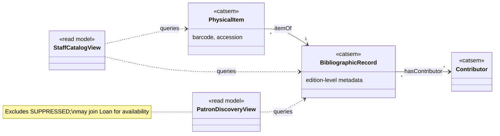
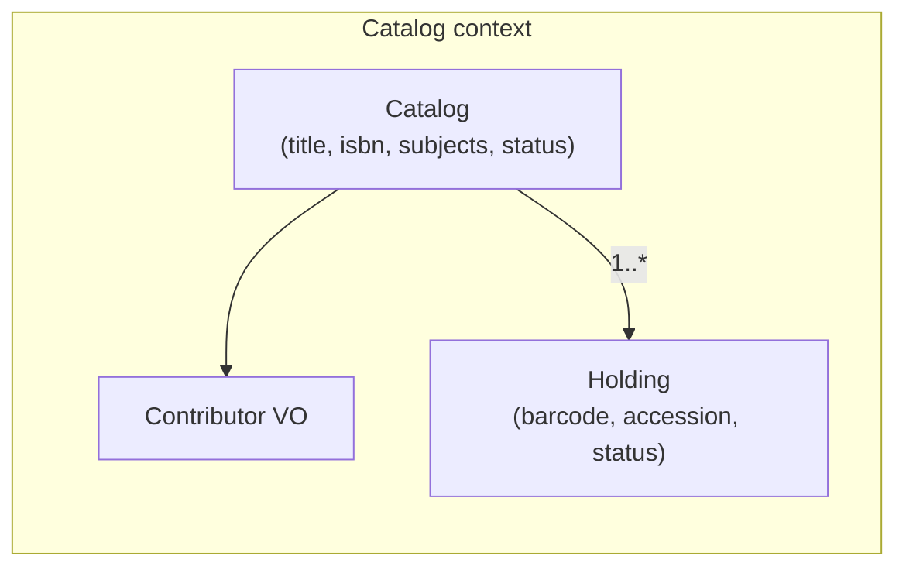
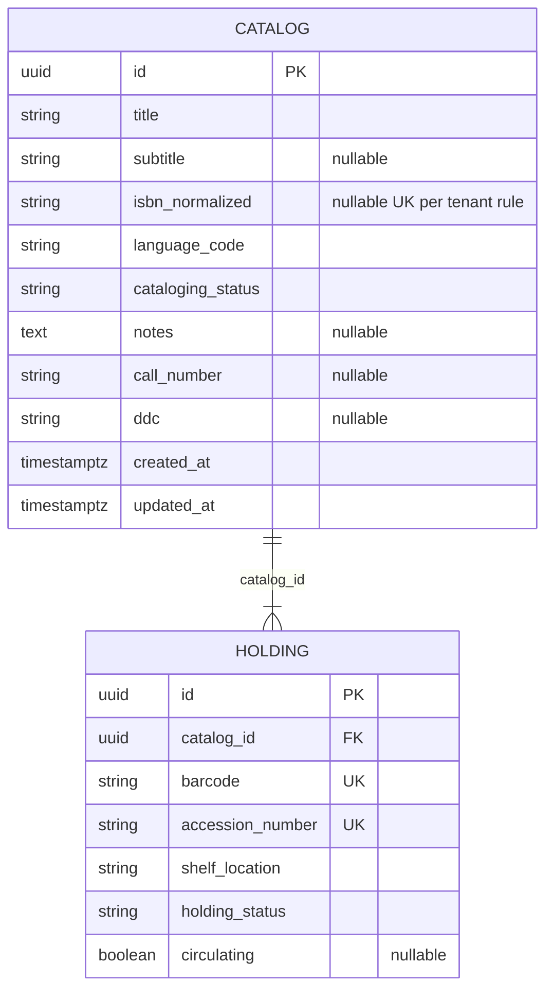

# Catalog domain

_K-12 Library Management — bibliographic records (`Catalog`) and physical units (`Holding`)._

---

## 1. Bounded context

**Purpose:** Own **what the library lists** (edition-level metadata) and **what sits on the shelf** (barcoded holdings). Support discovery (staff OPAC / patron search) and supply **`holdingId`** to the Loan domain for circulation.

**Owns**

- Aggregate **`Catalog`** (bibliographic / edition-level record).
- Aggregate **`Holding`** (physical unit; FK `catalogId` → `Catalog`).
- Subject/series reference data *optional* (or flatten into tags on `Catalog`).
- Catalog-specific validation: publish/suppress, duplicate ISBN handling, holding uniqueness.

**Does not own**

- **Patron**, patron types, blocks → **Reference** domain.
- **Loan**, due dates, fines → **Loan** domain (Loan references `holdingId`).

**Integration touchpoints**

- Loan checks **`holdingStatus`** (e.g. only `AVAILABLE` for checkout; Loan sets `ON_LOAN` / release to `AVAILABLE` on return).
- Availability counts in search are often **read models**: `Catalog` + `Holding` + open loans from Loan.

---

## 2. Workflows

### 2.1 Stewardship (ongoing)

| Workflow | Goal | Typical steps |
|----------|------|----------------|
| **Catalog maintenance** | Keep bibliographic records accurate | Edit title, contributors, ISBN, language, subjects, classification |
| **Holding maintenance** | Track physical units | Add/move holdings; update shelf; note condition if modeled |
| **Inventory / stocktake** | Match shelves to system | Physical count → variance → adjust holding records |
| **Withdrawal / weeding** | Remove unit from lending | Criteria → withdraw holding (`WITHDRAWN`); retain `Catalog` if other holdings exist |
| **Relocation / transfer** | Move stock between rooms/sites | Update shelf or branch on `Holding` |

### 2.2 Acquisition path → Catalog (high level)

| Workflow | Goal | Catalog outcome |
|----------|------|------------------|
| **Accessioning** | Bring stock under control | Generate accession; attach barcode; link new **`Holding`** to **`Catalog`** (existing or new draft) |
| **Donation / gift** | Non-PO intake | Same as accessioning; may skip PO line |

*(Procurement PO/GRN lives outside pure Catalog; Catalog consumes **received** items as holdings.)*

### 2.3 K-12–specific (India)

| Workflow | Notes |
|----------|--------|
| **Class-set / textbook sets** | Tag **`Catalog`** or **`Holding`** as class-set; quantity per section; circulation rules enforced in Loan |
| **Cataloguing & classification** | Accession register + simple taxonomy (e.g. DDC lite) + CBSE-oriented keywords |
| **Bilingual metadata** | Optional parallel title/script fields on **`Catalog`** |

### 2.4 Discovery

| Workflow | Actor | Goal |
|----------|-------|------|
| **Staff catalog search** | Librarian | Find titles and holdings for desk work |
| **OPAC / patron search** | Student, teacher | Discover **`PUBLISHED`** records; respect **`SUPPRESSED`** |

### 2.5 Semantic model

The **semantic model** is a stable **conceptual vocabulary** (classes and properties) for describing bibliographic resources and physical items **independently of** UI workflows. Workflows in §2 are **operational processes** that **read or assert** statements in this model. Implementation aggregates (**`Catalog`**, **`Holding`**) are **application projections** of the same concepts—see mapping table below.

**Namespace (informative IRI prefix for docs & JSON-LD)**

| Prefix | Example IRI | Role |
|--------|-------------|------|
| `catsem` | `https://example.invalid/lms/catalog/sem#` | Catalog bounded-context **semantic** terms (replace host in production) |
| `dcterms` | `http://purl.org/dc/terms/` | Dublin Core **Terms** (reuse where alignment matters) |
| `bibo` | `http://purl.org/ontology/bibo/` | Bibliographic ontology (**optional** reuse for `Book`, `Document`, etc.) |

*This document does **not** mandate full **[BIBFRAME 2.0](https://www.loc.gov/bibframe/)** mapping; `catsem` can be bridged to BIBFRAME / **MARC** later via rules.*

#### 2.5.1 Classes (`owl:Class`)

| Semantic class | Local name | Maps to (§6) | Intuition |
|----------------|------------|--------------|-----------|
| **`catsem:BibliographicRecord`** | Edition-level description | Aggregate **`Catalog`** | One **manifestation / edition** in FRBR-like terms: metadata shared by all copies. |
| **`catsem:PhysicalItem`** | Single copy on shelf | Aggregate **`Holding`** | **Item** with barcode, accession, shelf; always **`catsem:itemOf`** exactly one **`BibliographicRecord`**. |
| **`catsem:Contributor`** | Agent + role on a record | Optional VO on **`Catalog`** | Author, translator, etc. (normalized as needed). |
| **`catsem:StaffCatalogView`** | Staff search / index slice | Read model for **`SearchCatalogStaff`** | May include **`DRAFT`** per policy. |
| **`catsem:PatronDiscoveryView`** | OPAC-safe projection | Read model for **`SearchCatalogOPAC`** | Excludes **`SUPPRESSED`**; may attach availability from Loan. |

#### 2.5.2 Object properties (relationships)

| Property | Domain → range | Notes |
|----------|------------------|--------|
| **`catsem:itemOf`** | `PhysicalItem` → `BibliographicRecord` | 1:**N** from bibliographic side (`hasItem` inverse). |
| **`catsem:hasContributor`** | `BibliographicRecord` → `Contributor` | Optional **N** contributors. |
| **`catsem:hasRepresentationStatus`** | `BibliographicRecord` → `CatalogingStatus` | Enum-like: `DRAFT`, `PUBLISHED`, `SUPPRESSED` (as SKOS concepts or plain literals per implementation). |

#### 2.5.3 Data properties (literal attributes)

| Property | Attached to | Typical type | Aligns with entity attribute (§7) |
|----------|-------------|--------------|-----------------------------------|
| **`dcterms:title`** | `BibliographicRecord` | `rdf:langString` or `xsd:string` | `title`, optional parallel for bilingual |
| **`dcterms:language`** | `BibliographicRecord` | `xsd:string` (ISO 639-1 / BCP 47) | `language` |
| **`catsem:isbnNormalized`** | `BibliographicRecord` | `xsd:string` | `isbn13` / normalized |
| **`catsem:classificationDdc`** | `BibliographicRecord` | `xsd:string` | `ddc` |
| **`catsem:barcode`** | `PhysicalItem` | `xsd:string` | `barcode` |
| **`catsem:accessionNumber`** | `PhysicalItem` | `xsd:string` | `accessionNumber` |
| **`catsem:shelfLocation`** | `PhysicalItem` | `xsd:string` | `shelfLocation` |
| **`catsem:holdingCirculationStatus`** | `PhysicalItem` | enum | `holdingStatus` (`AVAILABLE`, `ON_LOAN`, `WITHDRAWN`) |
| **`catsem:circulating`** | `PhysicalItem` | `xsd:boolean` | `circulating` |

#### 2.5.4 Workflows → semantic model (connection)

Each **workflow** from §2 is characterized by which **semantic classes** are created, updated, or queried, and what kind of **activity** it is (assert metadata, assert inventory fact, discover).

| Workflow (§2) | § subsection | Primary semantic subjects | Activity (on the model) |
|---------------|--------------|---------------------------|-------------------------|
| **Catalog maintenance** | §2.1 | `BibliographicRecord`, `Contributor` | **Assert/update** descriptive triples (title, language, ISBN, subjects, classification). |
| **Holding maintenance** | §2.1 | `PhysicalItem`, `BibliographicRecord` | **Assert/update** copy-level facts (barcode, shelf, condition); link via **`itemOf`**. |
| **Inventory / stocktake** | §2.1 | `PhysicalItem` | **Reconcile** asserted shelf/status with physical reality (same predicates, verification intent). |
| **Withdrawal / weeding** | §2.1 | `PhysicalItem` | **Assert** `holdingCirculationStatus` → withdrawn; record may remain linked to **`BibliographicRecord`**. |
| **Relocation / transfer** | §2.1 | `PhysicalItem` | **Update** `shelfLocation` (and branch if modeled). |
| **Accessioning** | §2.2 | `BibliographicRecord`, `PhysicalItem` | **Create** item **`itemOf`** new or existing record; **mint** barcode/accession. |
| **Donation / gift** | §2.2 | Same as accessioning | Same semantic activity; provenance outside pure Catalog. |
| **Class-set / textbook sets** | §2.3 | `BibliographicRecord`, `PhysicalItem` | **Annotate** (tags/flags) for loan policy consumption; still edition + item facts. |
| **Cataloguing & classification** | §2.3 | `BibliographicRecord` | **Assert** `classificationDdc`, subject terminology, call number analogues. |
| **Bilingual metadata** | §2.3 | `BibliographicRecord` | **Assert** additional language-tagged titles or script variants on same **`BibliographicRecord`**. |
| **Staff catalog search** | §2.4 | `StaffCatalogView` → `BibliographicRecord`, `PhysicalItem` | **Query** graph-shaped index (no change to canonical assertions unless staff edits). |
| **OPAC / patron search** | §2.4 | `PatronDiscoveryView` → `BibliographicRecord` | **Query** public-safe projection; filter **`hasRepresentationStatus`** ≠ suppressed for patron. |

**Summary:** Stewardship and acquisition workflows **mutate** **`BibliographicRecord`** and **`PhysicalItem`** assertions; discovery workflows **query** projections (**`StaffCatalogView`**, **`PatronDiscoveryView`**) built from those assertions. The detailed chain workflow → use case → command → aggregate remains in **§3.3**.

#### 2.5.5 Semantic model diagram (classes & links)



**Sample RDF/Turtle (informative)**

```turtle
@prefix catsem: <https://example.invalid/lms/catalog/sem#> .
@prefix dcterms: <http://purl.org/dc/terms/> .
@prefix xsd:   <http://www.w3.org/2001/XMLSchema#> .

catsem:record-uuid-123 a catsem:BibliographicRecord ;
  dcterms:title "Physics Part 1"@en ;
  dcterms:language "en" ;
  catsem:isbnNormalized "9780123456789" .

catsem:holding-uuid-456 a catsem:PhysicalItem ;
  catsem:itemOf catsem:record-uuid-123 ;
  catsem:barcode "39001234567890"^^xsd:string ;
  catsem:holdingCirculationStatus "AVAILABLE"^^xsd:string .
```

---

## 3. Use cases

### 3.0 Stakeholders and user roles (Catalog)

| Role | Typical users | Interest in Catalog |
|------|----------------|----------------------|
| **Library staff** | Librarian, library assistant | Create/edit/publish records, holdings, staff search, withdrawal |
| **Library / school admin** | Lead librarian, tenant admin | Catalog policy, suppression rules, accession conventions |
| **Patron (borrower)** | Student, teacher, parent borrower | OPAC discovery; accurate availability via published records |
| **IT / integration** | MIS vendor, SSO admin | Optional sync of metadata from external systems (not core MVP) |
| **Leadership / reporting** | Principal, HOD | Aggregate collection reports (phase 2+) |

**Primary actor** = who performs the use case. **Stakeholders** = who benefits, is affected, or must approve / be informed.

### 3.1 Catalog use cases → rule sets

| ID | Use case | Primary actor | Stakeholders | Goal | Rule sets |
|----|----------|---------------|--------------|------|-----------|
| C-UC01 | Create / edit bibliographic record | Librarian | Patrons (discovery), school admin (policy alignment) | Maintain **`Catalog`** metadata | **Catalog completeness**, **Controlled vocabulary** (optional), **Duplicate catalog detection** |
| C-UC02 | Publish catalog record | Librarian | Patrons, teachers (resource lists), loan desk (lendable metadata) | Make record visible for lending/search per policy | **Publish guards**, **ISBN uniqueness** (published scope) |
| C-UC03 | Suppress catalog record | Librarian | Patrons (no longer see item), admin (retention policy) | Hide from OPAC; retain history | **Visibility / suppression** |
| C-UC04 | Add holding | Librarian | Patrons (borrowable copy), circulation (barcode scan) | Register physical unit | **Accession numbering**, **Barcode uniqueness**, **Valid `catalogId`**, **Initial holding status** |
| C-UC05 | Update holding | Librarian | Patrons (shelf location), loan desk (status consistency) | Shelf move, condition | **Location validity**, **Not conflicting with open loan** (if restricted move) |
| C-UC06 | Withdraw holding | Librarian | Patrons (copy unavailable), finance (lost/damaged follow-up, phase 2) | Remove unit from active pool | **Not on loan** (or policy), **Withdrawal audit** |
| C-UC07 | Merge duplicate catalogs | Librarian | Patrons (single title view), reporting (clean counts) | Consolidate editions | **Merge procedure**, **Holdings reassignment** |
| C-UC08 | Search catalog (staff) | Librarian | Desk colleagues (shared operational picture) | Operational lookup | **Visibility**, **Search indexing** |
| C-UC09 | Search catalog (OPAC) | Student patron, teacher patron, public visitor (if OPAC open) | Parents (if shared OPAC), library staff (support lookup) | Discovery | **Visibility** (`SUPPRESSED` hidden), **Age/grade filters** (optional) |

### 3.2 MVP scope (minimal ship)

MVP catalog rows, lifecycle table, and ontology chain for the minimal ship are documented in **[MVP.md](MVP.md)** (§4). This file keeps the full use-case and rule set catalog.

### 3.3 Catalog domain ontology (workflow → use case → action type)

This view ties **operational workflows** (§2), **use cases** (§3.1), and **action types**—application-level **commands** (writes) and **queries** (reads)—into one table. It is the behavioral slice of the Catalog bounded context ontology (aggregates: **`Catalog`**, **`Holding`**; see §6). **Semantic concepts** (`BibliographicRecord`, `PhysicalItem`, …) and **workflow → semantic model** mapping → **§2.5**. The same ontology as a **knowledge graph** (predicates, sample triples, Mermaid diagram) → **§3.4**.

**Layers**

| Layer | Meaning in this document |
|-------|---------------------------|
| **Workflow** | Named process from §2 (stewardship, acquisition, K‑12, discovery); MVP lifecycle labels → **[MVP.md](MVP.md)** §4. |
| **Use case** | `C-UCxx` goal from §3.1 (testable scenario). |
| **Action type** | Invocable operation: **Command** mutates state; **Query** reads without mandatory side effects. Full list → §8. |

#### Ontology matrix (primary mappings)

| Workflow (see §2; MVP gates → [MVP.md](MVP.md) §4) | Use case | Action type(s) | Target aggregate |
|------------------------|----------|------------------|------------------|
| **Catalog maintenance** | C-UC01 | `CreateCatalogDraft`, `UpdateCatalogMetadata` | `Catalog` |
| **Catalog maintenance** | C-UC07 | `MergeCatalogRecords` | `Catalog` (+ reassign `Holding`) |
| **Publish** path (MVP lifecycle) | C-UC02 | `PublishCatalog` | `Catalog` |
| **Suppress** path (MVP lifecycle) | C-UC03 | `SuppressCatalog` | `Catalog` |
| **Holding maintenance** | C-UC04 | `AddHoldingToCatalog` | `Holding` |
| **Holding maintenance** | C-UC05 | `UpdateHolding` | `Holding` |
| **Inventory / stocktake** | C-UC05, C-UC08 | `UpdateHolding`, `SearchCatalogStaff`, `ListHoldings` (query) | `Holding`, read models |
| **Withdrawal / weeding** | C-UC06 | `WithdrawHolding` | `Holding` |
| **Relocation / transfer** | C-UC05 | `UpdateHolding` | `Holding` |
| **Accessioning** | C-UC01 → C-UC04 | `CreateCatalogDraft` / `UpdateCatalogMetadata`, `AddHoldingToCatalog` | `Catalog`, `Holding` |
| **Donation / gift** | C-UC01 → C-UC04 | Same as accessioning | `Catalog`, `Holding` |
| **Class-set / textbook sets** (§2.3) | C-UC01, C-UC04 / C-UC05 | `UpdateCatalogMetadata`, `AddHoldingToCatalog`, `UpdateHolding` | `Catalog`, `Holding` |
| **Cataloguing & classification** (§2.3) | C-UC01 | `UpdateCatalogMetadata` | `Catalog` |
| **Bilingual metadata** (§2.3) | C-UC01 | `UpdateCatalogMetadata` | `Catalog` |
| **Staff catalog search** (§2.4) | C-UC08 | `SearchCatalogStaff`, `GetCatalog`, `ListHoldings` | read / `Catalog`, `Holding` |
| **OPAC / patron search** (§2.4) | C-UC09 | `SearchCatalogOPAC` | read / `Catalog` (+ availability projection) |

*Queries such as `ListHoldings` / `GetCatalog` are named for API design; implement as CQRS read models or repository methods as needed.*

#### Use case → action types (compact)

| Use case | Command action types | Query action types |
|----------|----------------------|--------------------|
| C-UC01 | `CreateCatalogDraft`, `UpdateCatalogMetadata` | — |
| C-UC02 | `PublishCatalog` | — |
| C-UC03 | `SuppressCatalog` | — |
| C-UC04 | `AddHoldingToCatalog` | — |
| C-UC05 | `UpdateHolding` | — |
| C-UC06 | `WithdrawHolding` | — |
| C-UC07 | `MergeCatalogRecords` | — |
| C-UC08 | — | `SearchCatalogStaff`, `GetCatalog`, `ListHoldings` |
| C-UC09 | — | `SearchCatalogOPAC` |

### 3.4 Knowledge graph (ontology)

The **ontology** in §3.3 can be read as a small **knowledge graph**: **nodes** are workflows, use cases, action types, and aggregates; **edges** carry a fixed predicate vocabulary so the graph is consistent and queryable (e.g. for documentation tooling or future RDF export). Treat **`agg:Catalog`** / **`agg:Holding`** as **instances of** the semantic classes **`catsem:BibliographicRecord`** / **`catsem:PhysicalItem`** from **§2.5** when serializing to RDF.

**Node kinds**

| Kind | Prefix / pattern | Examples |
|------|------------------|----------|
| **Workflow** | `wf:` | Operational or lifecycle process from §2; MVP labels → [MVP.md](MVP.md) §4 |
| **Use case** | `uc:` | `C-UC01` … `C-UC09` |
| **Action type** | `act:` | Command or query name from §8 |
| **Aggregate** | `agg:` | `Catalog`, `Holding`, read projection |

**Predicates (edge labels)**

| Predicate | Meaning |
|-----------|---------|
| **`maps_to`** | Workflow is operationalized by this use case (may be N:M). |
| **`realized_by`** | Use case is implemented by this action type (command or query). |
| **`targets`** | Action type mutates or reads this aggregate / projection. |

**Sample triples** (same content as the matrix; useful for grep or triple stores):

```turtle
# Informative Turtle sketch — not a normative API contract
@prefix : <https://example.invalid/lms/catalog#> .

:wf-catalog-maintenance :maps_to :uc-C-UC01 .
:wf-catalog-maintenance :maps_to :uc-C-UC07 .
:uc-C-UC01 :realized_by :act-CreateCatalogDraft , :act-UpdateCatalogMetadata .
:act-CreateCatalogDraft :targets :agg-Catalog .
:act-UpdateCatalogMetadata :targets :agg-Catalog .
```

**Graph visualization (Mermaid)** — edge styles: **`-->`** = `maps_to` (workflow → use case); **`-.->`** = `realized_by` (use case → action); **`==>`** = `targets` (action → aggregate / projection). *Workflows may share use cases; one action may `targets` several aggregates.*

```mermaid
flowchart TB
  subgraph agg["Aggregates (agg:)"]
    ACat[("Catalog")]
    AHld[("Holding")]
    ARd[["Read / OPAC projection"]]
  end

  subgraph actQ["Queries (act:)"]
    QStaff[SearchCatalogStaff]
    QOPAC[SearchCatalogOPAC]
    QGet[GetCatalog]
    QList[ListHoldings]
  end

  subgraph actC["Commands (act:)"]
    CCreate[CreateCatalogDraft]
    CUpdate[UpdateCatalogMetadata]
    CPub[PublishCatalog]
    CSup[SuppressCatalog]
    CMerge[MergeCatalogRecords]
    CAdd[AddHoldingToCatalog]
    CHUpd[UpdateHolding]
    CWD[WithdrawHolding]
  end

  subgraph uc["Use cases (uc:)"]
    U01[C-UC01]
    U02[C-UC02]
    U03[C-UC03]
    U04[C-UC04]
    U05[C-UC05]
    U06[C-UC06]
    U07[C-UC07]
    U08[C-UC08]
    U09[C-UC09]
  end

  subgraph wf["Workflows (wf:)"]
    Wmaint[Catalog maintenance]
    Wpub[Publish path MVP]
    Wsup[Suppress path MVP]
    Whm[Holding maintenance]
    Winv[Inventory / stocktake]
    Wwd[Withdrawal / weeding]
    Wrel[Relocation / transfer]
    Wacc[Accessioning]
    Wdon[Donation / gift]
    Wcls[Class-set / textbook]
    Wcat[Cataloguing / classification]
    Wbil[Bilingual metadata]
    Wstf[Staff catalog search]
    Wopac[OPAC search]
  end

  Wmaint --> U01 & U07
  Wpub --> U02
  Wsup --> U03
  Whm --> U04 & U05
  Winv --> U05 & U08
  Wwd --> U06
  Wrel --> U05
  Wacc --> U01 & U04
  Wdon --> U01 & U04
  Wcls --> U01 & U04 & U05
  Wcat --> U01
  Wbil --> U01
  Wstf --> U08
  Wopac --> U09

  U01 -.-> CCreate & CUpdate
  U02 -.-> CPub
  U03 -.-> CSup
  U04 -.-> CAdd
  U05 -.-> CHUpd
  U06 -.-> CWD
  U07 -.-> CMerge
  U08 -.-> QStaff & QGet & QList
  U09 -.-> QOPAC

  CCreate & CUpdate & CPub & CSup ==> ACat
  CMerge ==> ACat
  CMerge ==> AHld
  CAdd & CHUpd & CWD ==> AHld
  QGet ==> ACat
  QList ==> AHld
  QStaff ==> ARd
  QStaff ==> ACat
  QStaff ==> AHld
  QOPAC ==> ARd
  QOPAC ==> ACat
```



---

## 4. Rule sets (named bundles)

| Rule set | Meaning |
|----------|---------|
| **Catalog completeness** | Required fields before publish (e.g. title, language; optional subject/grade tag per policy) |
| **Duplicate catalog detection** | Normalized ISBN clash; fuzzy title+author warning |
| **ISBN normalization** | Align with **[ISO 2108](https://www.iso.org/standard/36565.html)** (ISBN structure & registration agency ranges); normalize to ISBN-13 where possible; validate check digit per standard algorithm ([overview](https://www.isbn-international.org/content/what-isbn)). |
| **Language codes** | Bibliographic language uses **[ISO 639-1](https://www.iso.org/iso-639-language-codes.html)** two-letter codes unless product adopts **[BCP 47](https://www.rfc-editor.org/rfc/rfc5646.html)** tags for script/locale (e.g. `hi-Deva`). |
| **Accession / barcode** | Unique barcode and accession per tenant; sequencing policy. Item identifiers may follow library barcode conventions (e.g. **[Codabar](https://en.wikipedia.org/wiki/Codabar)** legacy; **[GS1](https://www.gs1.org/standards/barcodes)** / GTIN where retail-aligned labels are used). |
| **Classification (DDC)** | If `ddc` is used, values align with **[Dewey Decimal Classification](https://www.oclc.org/content/dewey/en/support/summaries.html)** notation (OCLC). |
| **Location / shelf** | Valid shelf codes if controlled vocabulary |
| **Holding issueability** | Lending only when `holdingStatus == AVAILABLE` and `circulating != false` (if field exists) |
| **Visibility** | `SUPPRESSED` excluded from public OPAC; draft handling |
| **Withdrawal** | Preconditions (e.g. not on loan), audit |
| **Temporal audit** | `createdAt` / `updatedAt` stored as **[ISO 8601](https://www.iso.org/iso-8601-date-and-time-format.html)** timestamps (RFC 3339 profile recommended for APIs). |
| **Identifiers (surrogate keys)** | **`id`** values are **[UUID](https://www.rfc-editor.org/rfc/rfc9562.html)** (UTF-8 string form in APIs per RFC). |

---

## 5. Rules (implementable)

### 5.1 `Catalog` invariants

| ID | Rule |
|----|------|
| CAT-1 | `title` non-empty after trim (Unicode text; normalization per **[Unicode Standard](https://www.unicode.org/versions/latest/)** for consistent search—e.g. NFC for composed form where applicable). |
| CAT-2 | `language` required (policy default allowed, e.g. `en`); values MUST be valid **[ISO 639-1](https://www.iso.org/iso-639-language-codes.html)** codes unless extended by policy to **[BCP 47](https://www.rfc-editor.org/rfc/rfc5646.html)**. |
| CAT-3 | If ISBN present → normalized + **check digit** valid per **[ISO 2108](https://www.iso.org/standard/36565.html)**; prefer ISBN-13 canonical hyphenation for display only—storage uses normalized digits. |
| CAT-4 | No two **`PUBLISHED`** rows with same normalized ISBN in tenant (unless explicit override with reason); dedup key derived from ISO 2108–conformant identifier. |
| CAT-5 | **`SUPPRESSED`** excluded from default OPAC search |

### 5.2 `Holding` invariants

| ID | Rule |
|----|------|
| HLD-1 | `catalogId` references existing **`Catalog`** |
| HLD-2 | `barcode` globally unique (per tenant); encoding/charset SHOULD allow **GS1** / **[Code 128](https://www.gs1.org/standards/barcodes)** compatibility if labels are printed (library-specific; Codabar still common for legacy stacks). |
| HLD-3 | `accessionNumber` globally unique (per tenant); format is **local policy** (not international standard)—sequence integrity for audit. |
| HLD-4 | **`WITHDRAWN`** holdings are not lendable |
| HLD-5 | If `circulating == false` → not lendable (reference-only) |

### 5.3 Publish / checkout gate (Catalog ↔ Loan)

| ID | Rule |
|----|------|
| XCAT-1 | New checkout typically requires **`Catalog.catalogingStatus == PUBLISHED`** (strict) or staff-only preview from `DRAFT` (policy) |
| XCAT-2 | Do not delete **`Catalog`** if active holdings exist or **open loans** reference those holdings — prefer **suppress** + **withdraw** holdings |

---

## 6. Domain model

### 6.1 Aggregates

- **`Catalog`** — bibliographic root (edition-level).
- **`Holding`** — inventory root; always belongs to exactly one **`Catalog`**.

### 6.2 Relationships

| From | To | Cardinality |
|------|-----|-------------|
| **Catalog** | **Holding** | 1 : N |
| **Catalog** | Subject (optional ref) | N : M or tags on Catalog |
| **Catalog** | Series (optional ref) | N : 1 optional FK |

### 6.3 Conceptual diagram



### 6.4 Logical ER (relational sketch)



---

## 7. Entities and attributes

Attribute notes include **usage** (why the field exists) and **standards / references** where applicable.

### 7.1 `Catalog`

| Attribute | Notes (usage · standards & references) |
|-----------|----------------------------------------|
| `id` | **Usage:** Surrogate primary key for API and FK references. **Standards:** **[UUID](https://www.rfc-editor.org/rfc/rfc9562.html)** v4 (random) or v7 (time-ordered) recommended; expose as lowercase hex string in **[RFC 9562](https://www.rfc-editor.org/rfc/rfc9562.html)** string form. |
| `title` | **Usage:** Primary title for display and search; required for publish. **Standards:** **[Unicode](https://www.unicode.org/versions/latest/)** plain text; prefer NFC normalization for indexing ([Unicode TR15](https://www.unicode.org/reports/tr15/)). |
| `subtitle` | **Usage:** Secondary title line when edition has distinct subtitle. **Standards:** Same text handling as `title`. |
| `contributors` | **Usage:** Names and roles (author, illustrator, translator). **Standards:** Text as Unicode; optional alignment with **[ISBD](https://www.ifla.org/publications/node/14998)** / **[RDA](https://www.rda-rsc.org/)** cataloging practice when exchanging with union catalogs (field mapping, not storage format). |
| `isbn13` / `isbn10` | **Usage:** Edition identifier for dedup and acquisition matching; store one canonical normalized form. **Standards:** **[ISO 2108](https://www.iso.org/standard/36565.html)** International Standard Book Number; validate check digit; normalize ISBN-10 → ISBN-13 when possible ([ISBN International](https://www.isbn-international.org/content/what-isbn)). |
| `language` | **Usage:** Language of the resource for filtering and display. **Standards:** **[ISO 639-1](https://www.iso.org/iso-639-language-codes.html)** two-letter codes (`en`, `hi`). For script/subtags use **[BCP 47](https://www.rfc-editor.org/rfc/rfc5646.html)** (`hi-Deva`). |
| `subjectTags` | **Usage:** Discovery keywords or controlled headings. **Standards:** Free tags locally; if aligned with school curriculum, map to controlled vocabularies (e.g. **[LCSH](https://id.loc.gov/authorities/subjects.html)** via URIs—policy choice). |
| `callNumber` | **Usage:** Shelf address (often combined classification + cutter). **Standards:** Institution-specific; commonly **[DDC](https://www.oclc.org/content/dewey/en/support/summaries.html)** + local cutter ([OCLC shelf-ready guidance](https://www.oclc.org/en/dewey/resources.html)). |
| `ddc` | **Usage:** Dewey Decimal classification notation for reporting/sorting. **Standards:** **[DDC](https://www.oclc.org/content/dewey/en/support/summaries.html)** syntax as published by OCLC (tenant license may apply). |
| `seriesName` / `seriesPart` | **Usage:** Series grouping and volume numbering in discovery. **Standards:** Text fields; interchange may follow **[MARC 21](https://www.loc.gov/marc/bibliographic/)** series conventions when exporting (optional). |
| `catalogingStatus` | **Usage:** Lifecycle gate for OPAC and checkout policy (`DRAFT` / `PUBLISHED` / `SUPPRESSED`). **Standards:** Enumerated values internal to LMS (no ISO enum). |
| `createdAt`, `updatedAt` | **Usage:** Audit and sync. **Standards:** **[ISO 8601](https://www.iso.org/iso-8601-date-and-time-format.html)**; APIs SHOULD use **[RFC 3339](https://www.rfc-editor.org/rfc/rfc3339)** (`timestamptz` in PostgreSQL). |
| `catalogerId` | **Usage:** Staff attribution for edits. **Standards:** FK to identity provider subject or internal staff UUID (same UUID standard as `id`). |

### 7.2 `Holding`

| Attribute | Notes (usage · standards & references) |
|-----------|----------------------------------------|
| `id` | **Usage:** Surrogate key for circulation (`holdingId` in Loan). **Standards:** **[UUID](https://www.rfc-editor.org/rfc/rfc9562.html)**. |
| `catalogId` | **Usage:** Links physical copy to bibliographic record. **Standards:** FK UUID referencing `Catalog.id`. |
| `barcode` | **Usage:** Machine-readable item id at checkout (scanner input). **Standards:** Unique string per tenant; symbology often **Codabar** ([legacy library](https://en.wikipedia.org/wiki/Codabar)) or **[GS1-128](https://www.gs1.org/standards/barcodes)** / Code 128 for newer deployments ([GS1 General Specifications](https://www.gs1.org/standards/barcodes/gs1-128-barcode)). |
| `accessionNumber` | **Usage:** Official accession register identifier for audit and inventory. **Standards:** No global standard—define numeric or alphanumeric pattern per **school policy** (sometimes aligned with stock register rules). |
| `shelfLocation` | **Usage:** Physical locate string for staff and shelving reports. **Standards:** Local convention (may mirror **call number** + branch suffix). |
| `holdingStatus` | **Usage:** Circulation eligibility (`AVAILABLE`, `ON_LOAN`, `WITHDRAWN`). **Standards:** Enumerated in LMS; **`ON_LOAN`** often set by Loan domain. |
| `circulating` | **Usage:** When `false`, item is reference-only (no loan). **Standards:** Boolean policy flag (no external standard). |

*Note: **`ON_LOAN`** is often updated by the **Loan** bounded context during checkout/return.*

---

## 8. Action types (application API)

**Action types** are the operations the application exposes; they realize the **use cases** in §3.1 and are reached from **workflows** in §2 via the **ontology matrix** in §3.3.

### 8.1 Commands (mutations)

| Action type | Aggregate | Typical use cases |
|-------------|-----------|-------------------|
| `CreateCatalogDraft` | `Catalog` | C-UC01 |
| `UpdateCatalogMetadata` | `Catalog` | C-UC01 |
| `PublishCatalog` | `Catalog` | C-UC02 |
| `SuppressCatalog` | `Catalog` | C-UC03 |
| `MergeCatalogRecords` | `Catalog` | C-UC07 |
| `AddHoldingToCatalog` | `Holding` | C-UC04 |
| `UpdateHolding` | `Holding` | C-UC05 |
| `WithdrawHolding` | `Holding` | C-UC06 |

### 8.2 Queries (reads)

| Action type | Returns / purpose | Typical use cases |
|-------------|-------------------|-------------------|
| `SearchCatalogStaff` | Staff-indexed search (includes drafts per policy) | C-UC08 |
| `SearchCatalogOPAC` | Patron-facing discovery (`SUPPRESSED` excluded) | C-UC09 |
| `GetCatalog` | Single bibliographic record | C-UC08 |
| `ListHoldings` | Holdings for a `catalogId` or filtered list | C-UC08 |

*Availability-at-title-level may join Loan read models outside strict Catalog writes—document at integration boundary.*

**See also:** §3.3 **Catalog domain ontology** (workflow ↔ use case ↔ action type).

---

## 9. Standards quick reference (Catalog)

| Topic | Primary reference |
|-------|-------------------|
| ISBN | [ISO 2108](https://www.iso.org/standard/36565.html), [ISBN International](https://www.isbn-international.org/) |
| Language codes | [ISO 639-1](https://www.iso.org/iso-639-language-codes.html), [BCP 47](https://www.rfc-editor.org/rfc/rfc5646.html) |
| Timestamps | [ISO 8601](https://www.iso.org/iso-8601-date-and-time-format.html), [RFC 3339](https://www.rfc-editor.org/rfc/rfc3339) |
| UUIDs | [RFC 9562](https://www.rfc-editor.org/rfc/rfc9562.html) |
| Dewey (DDC) | [OCLC Dewey](https://www.oclc.org/content/dewey/en/support/summaries.html) |
| Barcodes (general) | [GS1 barcodes](https://www.gs1.org/standards/barcodes) |

---

## 10. Related documents

- **[MVP.md](MVP.md)** — cross-domain minimal ship, including Catalog MVP lifecycle.
- Loan behavior that **updates** `holdingStatus` and creates loans lives in **[loan.md](loan.md)** (not duplicated here).
- Patron and borrower eligibility live in **[reference.md](reference.md)**.
