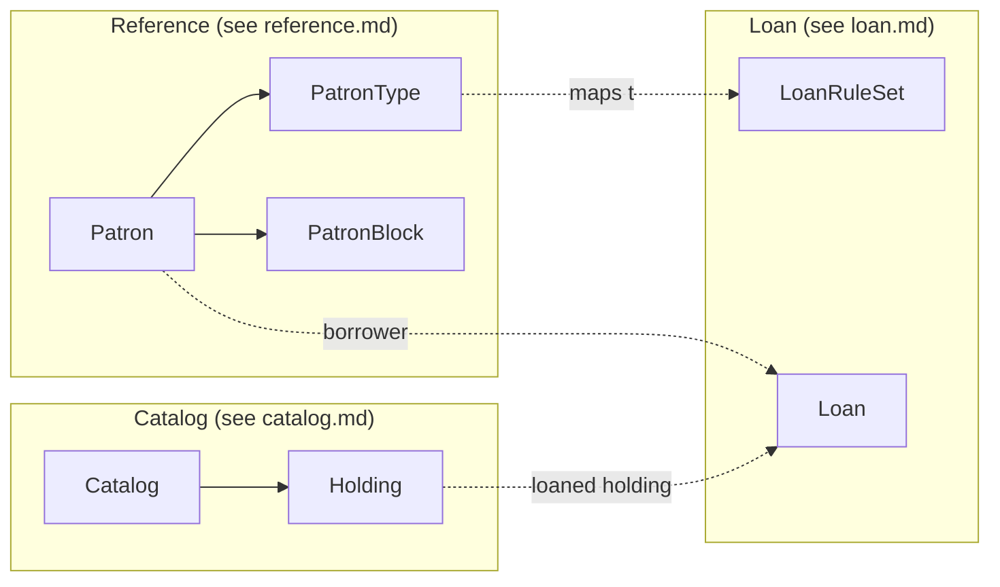

# LMS-AI — K-12 Library Management - Final Domain Model

## Canonical domains

- **Reference**: `Patron`, `PatronType`, class/section, guardian/contact, patron block — **see [`reference.md`](reference.md)** for workflows, use cases, rule sets, entities, and diagrams.
- **Catalog**: bibliographic `Catalog` record + physical `Holding` — **see [`catalog.md`](catalog.md)** for workflows, use cases, rule sets, entities, and diagrams.
- **Loan**: issue/return lifecycle using `patronId` and `holdingId` — **see [`loan.md`](loan.md)** for workflows, use cases, rule sets, entities, and diagrams.

---

## MVP use cases

**Canonical MVP tables, lifecycle states, ontology chains, and cross-domain journey** → **[`MVP.md`](MVP.md)**.

Stakeholder shorthand (for reading domain docs): **Lib** = librarian / library staff; **Adm** = school or library admin; **Pat** = student or teacher patron; **Grd** = guardian/parent (indirect); **Fin** = finance (phase 2). Full role tables live in each domain file §3.0.

---

## Cross-domain diagram

MVP scope: [`MVP.md`](MVP.md) · Full specs: [`reference.md`](reference.md) · [`catalog.md`](catalog.md) · [`loan.md`](loan.md)
