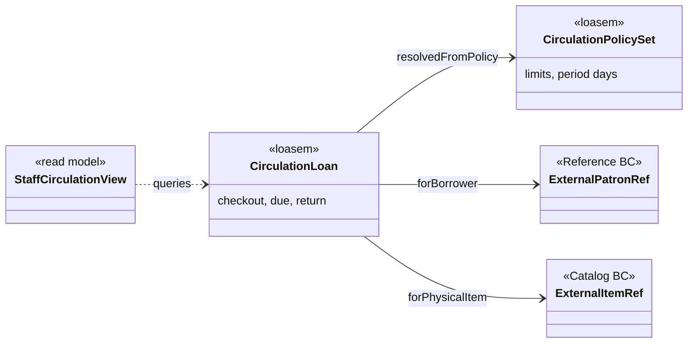
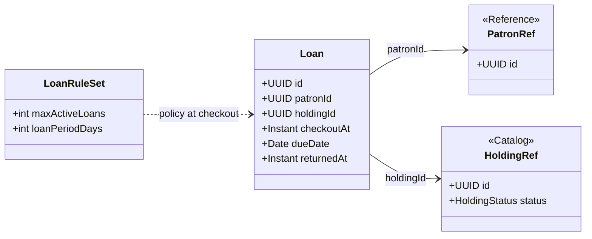
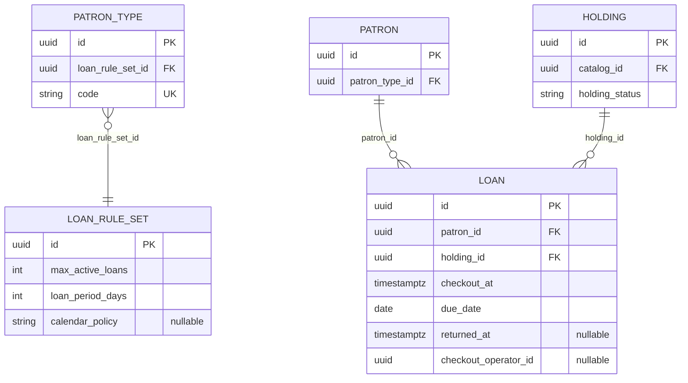

# Loan domain (circulation)

_K-12 Library Management — open/closed **Loan** records, **LoanRuleSet** policy, checkout and return. Patron master data is **Reference**; physical items are **Catalog / Holding**._

---

## 1. Bounded context

**Purpose:** Record **who borrowed which holding**, **when it is due**, and **when it was returned**; enforce **patron eligibility** and **borrowing limits/durations** from configuration.

**Owns**

- **`Loan`** aggregate (circulation transaction: `patronId` + `holdingId` + dates).
- **`LoanRuleSet`** (policy: max concurrent loans, loan period, optional calendar behaviour).
- Action types: checkout (`CheckoutHolding`), return (`ReturnHolding`), and queries (open loans, overdue) — see §8.

**Does not own**

- **`Patron`**, **`PatronType`**, blocks, class/section → **Reference** domain (Loan stores **`patronId`** only).
- Bibliographic data or **`Holding`** rows beyond status updates agreed with Catalog → **Catalog** domain (`holdingId` FK).

**Integration touchpoints**

- **Checkout:** read patron eligibility from Reference; validate **`Holding`** is lendable (typically `AVAILABLE` from Catalog).
- **Checkout success:** create **`Loan`**, set holding **`ON_LOAN`** (often owned by Catalog aggregate or synchronized via application service).
- **Return:** close **`Loan`** (`returnedAt`), set holding **`AVAILABLE`**.
- **LoanRuleSet** is typically keyed by **`PatronType`** (configuration in Loan or Reference—document one place; Loan *uses* the mapping at runtime).

---

## 2. Workflows

### 2.1 Core circulation

| Workflow | Goal | Typical steps |
|----------|------|----------------|
| **Checkout (issue)** | Lend one holding to one patron | Scan patron → scan holding → validate rules → create loan → mark holding on loan |
| **Check-in (return)** | Close loan | Scan holding → find open loan → set returnedAt → release holding |
| **Renewal** (phase 2+) | Extend due date | Eligibility → new due date → renewal count cap |
| **Overdue handling** | Visibility / notices | Query open loans past `dueDate`; notices/fines per school policy |

### 2.2 K-12 / India (optional extensions)

| Workflow | Notes |
|----------|--------|
| **Bulk / class issue** | Roster or cart checkout; shared due date; often phase 1.5 |
| **Textbook / class set** | Loan rules may restrict overnight or home issue — encoded in rule matrix or holding flags from Catalog |
| **Lost / damaged** | Report → fee/replacement workflow may span Loan + finance; holding may move to `WITHDRAWN` / lost in Catalog |

### 2.3 Policy and operations

| Workflow | Goal |
|----------|------|
| **Configure loan rules** | Set `maxActiveLoans`, `loanPeriodDays` per patron type (or rule set) |
| **Run overdue report** | Operational list for librarian |
| **Manual patron block** | Reference sets block; Loan refuses checkout |

### 2.4 Semantic model

The **semantic model** is a stable vocabulary for **circulation facts** and **policy**—independent of desk workflows. Workflows in §2 **create, update, or query** assertions in this model. Aggregates **`Loan`** and **`LoanRuleSet`** (§6) are application projections; **`Patron`** and **`Holding`** appear as **referenced entities** (IRIs or FKs) owned by other bounded contexts.

**Namespace (informative)**

| Prefix | Example IRI | Role |
|--------|-------------|------|
| `loasem` | `https://example.invalid/lms/loan/sem#` | Loan bounded-context **semantic** terms |
| `dcterms` | `http://purl.org/dc/terms/` | **Provenance** / generic metadata where useful |
| `xsd` | `http://www.w3.org/2001/XMLSchema#` | Literals |

#### 2.4.1 Classes (`owl:Class`)

| Semantic class | Local name | Maps to (§6) | Intuition |
|----------------|------------|----------------|-----------|
| **`loasem:CirculationLoan`** | Open or closed loan event | Aggregate **`Loan`** | **Patron** borrows one **physical item** for an interval (`checkoutAt` … `returnedAt`) with a **due** calendar date. |
| **`loasem:CirculationPolicySet`** | Borrowing limits & duration template | **`LoanRuleSet`** | `maxActiveLoans`, `loanPeriodDays`, `calendarPolicy`. |
| **`loasem:StaffCirculationView`** | Desk / report projection | Read models for §8 queries | Open loans, history, overdue lists (may join Reference/Catalog labels). |
| **`loasem:PatronSelfLoanView`** | Patron-visible slice | Optional read model for self-service | Privacy-scoped subset of **`CirculationLoan`**. |
| **`loasem:FineObligation`** | Monetary obligation (phase 2+) | Fine ledger (if introduced) | Payment / waive workflows (**L-UC07**). |

**External references (not defined here; align with [reference.md](reference.md) / [catalog.md](catalog.md) semantics):** borrower **`refsem:BorrowerParty`**, item **`catsem:PhysicalItem`**.

#### 2.4.2 Object properties (relationships)

| Property | Domain → range | Notes |
|----------|----------------|--------|
| **`loasem:forBorrower`** | `CirculationLoan` → **Patron** IRI / identifier | Same as `patronId`; eligibility rules evaluated against Reference. |
| **`loasem:forPhysicalItem`** | `CirculationLoan` → **Holding** / `PhysicalItem` IRI | Same as `holdingId`; Catalog **`holdingStatus`** may change on checkout/return. |
| **`loasem:resolvedFromPolicy`** | `CirculationLoan` → `CirculationPolicySet` | Policy snapshot used at checkout (optional but useful for audit). |
| **`loasem:mapsBorrowingRules`** | `PatronType` (Reference) → `CirculationPolicySet` | Config edge—often stored on **`PatronType.loanRuleSetId`**; documented in both domains. |

#### 2.4.3 Data properties (literal attributes)

| Property | Attached to | Typical type | Aligns with §7 |
|----------|-------------|--------------|----------------|
| **`loasem:checkoutInstant`** | `CirculationLoan` | `xsd:dateTime` | `checkoutAt` (RFC 3339) |
| **`loasem:dueCalendarDate`** | `CirculationLoan` | `xsd:date` | `dueDate` |
| **`loasem:returnInstant`** | `CirculationLoan` | `xsd:dateTime` optional | `returnedAt` |
| **`loasem:renewalCount`** | `CirculationLoan` | `xsd:nonNegativeInteger` | `renewalCount` |
| **`loasem:maxConcurrentLoans`** | `CirculationPolicySet` | `xsd:nonNegativeInteger` | `maxActiveLoans` |
| **`loasem:loanPeriodDays`** | `CirculationPolicySet` | `xsd:nonNegativeInteger` | `loanPeriodDays` |
| **`loasem:calendarPolicyCode`** | `CirculationPolicySet` | `xsd:string` | `calendarPolicy` |

#### 2.4.4 Workflows → semantic model (connection)

| Workflow (§2) | § | Primary semantic subjects | Activity (on the model) |
|----------------|---|---------------------------|-------------------------|
| **Checkout (issue)** | §2.1 | `CirculationLoan`, external **Patron**, **PhysicalItem** | **Create** loan individual; **assert** `forBorrower`, `forPhysicalItem`, `checkoutInstant`, `dueCalendarDate`; integrate Catalog/Reference. |
| **Check-in (return)** | §2.1 | `CirculationLoan`, **PhysicalItem** | **Assert** `returnInstant`; close event; integrate Catalog release. |
| **Renewal** | §2.1 | `CirculationLoan` | **Update** `dueCalendarDate`, `renewalCount`. |
| **Overdue handling** | §2.1 | `CirculationLoan`, **`StaffCirculationView`** | **Query** loans where `dueCalendarDate` \< reporting date; optional notices / **`FineObligation`**. |
| **Bulk / class issue** | §2.2 | `CirculationLoan` (×N) | **Create** many loan individuals with shared policy context. |
| **Textbook / class set** | §2.2 | `CirculationLoan`, `CirculationPolicySet` | Same as checkout; policy + Catalog flags constrain **due** / overnight rules. |
| **Lost / damaged** | §2.2 | `CirculationLoan`, **PhysicalItem** | **Return** then Catalog asserts withdrawn/lost on **item** (cross-domain). |
| **Configure loan rules** | §2.3 | `CirculationPolicySet`, mapping | **Assert/update** policy literals; link **PatronType** → policy. |
| **Run overdue report** | §2.3 | **`StaffCirculationView`** | **Query** only (derived overdue). |
| **Manual patron block** | §2.3 | — (Reference) | Reference **`BorrowingRestriction`**; Loan **validates** at checkout (**does not** mint Loan triples for blocks). |

**Summary:** Circulation workflows **mutate** **`CirculationLoan`** and **`CirculationPolicySet`**; reporting workflows **query** views. Full workflow → use case → command chain → **§3.3**.

#### 2.4.5 Semantic model diagram



**Sample RDF/Turtle (informative)**

```turtle
@prefix loasem: <https://example.invalid/lms/loan/sem#> .
@prefix xsd:   <http://www.w3.org/2001/XMLSchema#> .

loasem:loan-uuid-abc a loasem:CirculationLoan ;
  loasem:forBorrower <https://example.invalid/lms/ref/patron/uuid-pat> ;
  loasem:forPhysicalItem <https://example.invalid/lms/cat/item/uuid-hld> ;
  loasem:checkoutInstant "2026-05-01T14:30:00+05:30"^^xsd:dateTime ;
  loasem:dueCalendarDate "2026-05-15"^^xsd:date .
```

---

## 3. Use cases

### 3.0 Stakeholders and user roles (Loan)

| Role | Typical users | Interest in Loan |
|------|----------------|------------------|
| **Library staff** | Librarian, library assistant | Checkout, return, loan lookup, overdue lists |
| **Patron** | Student, teacher (self-service where enabled) | Borrow and return items; view own loans where permitted |
| **School / library admin** | Admin, lead librarian | **`LoanRuleSet`** policy, patron-type mapping |
| **Finance / bursar** | Finance office | Fines and waivers (phase 2+) |
| **Guardian / parent** | Parent | May receive overdue notices (phase 2); not always a direct LMS user |
| **Leadership** | Principal, HOD | Borrowing statistics, compliance reports (read-only, phase 2+) |

**Primary actor** = who performs the use case. **Stakeholders** = who benefits, is affected, or must approve / be informed.

### 3.1 Loan use cases → rule sets

| ID | Use case | Primary actor | Stakeholders | Goal | Rule sets |
|----|----------|---------------|--------------|------|-----------|
| L-UC01 | Configure `LoanRuleSet` | School admin, library admin | Librarians, all patron types (policy) | Define limits and loan period | **Loan rule matrix**, **PatronType mapping** |
| L-UC02 | Checkout holding | Librarian, student patron, teacher patron | Holding “owner” (none—shared copy), class teacher (class set issue) | Create loan | **Patron eligibility**, **Holding issueability**, **Loan limits**, **Loan period**, **Concurrent holding lock** |
| L-UC03 | Return holding | Librarian, student patron, teacher patron | Next patron in queue (phase 2 holds), catalog (holding back to `AVAILABLE`) | Close loan | **Return validation**, **Idempotency** |
| L-UC04 | View patron loans | Librarian, patron (self) | Guardian (if proxy allowed—policy), admin (audit) | Current/historical loans | **Privacy / PII** |
| L-UC05 | Overdue list / report | Librarian | Patrons, guardians (notices), leadership | Identify late loans | **Due-date policy**, **Reporting** |
| L-UC06 | Renew loan (phase 2+) | Patron, librarian | Other waiting patrons (hold conflict) | Extend due date | **Renewal count**, **Hold conflict**, **Patron block** |
| L-UC07 | Pay fine / waive (phase 2+) | Finance staff, librarian | Patron, guardian (payer) | Clear debt | **Fine calculation**, **Waive authority** |

### 3.2 MVP scope

MVP loan rows, lifecycle states, and ontology chain are documented in **[MVP.md](MVP.md)** (§5). This file keeps the full Loan use-case and rule catalog.

### 3.3 Loan domain ontology (workflow → use case → action type)

This view ties **workflows** (§2), **use cases** (§3.1), and **action types**—application **commands** (writes) and **queries** (reads)—into one table. Behavioral ontology for this context: aggregates **`Loan`**, **`LoanRuleSet`** (see §6). **`Patron`** / **`Holding`** are external FKs. **Semantic concepts** (`CirculationLoan`, `CirculationPolicySet`, …) and **workflow → semantic model** mapping → **§2.4**. The same ontology as a **knowledge graph** (predicates, sample triples, Mermaid diagram) → **§3.4**.

**Layers**

| Layer | Meaning in this document |
|-------|---------------------------|
| **Workflow** | Named process from §2 (circulation, K‑12 extensions, policy ops). |
| **Use case** | `L-UCxx` goal from §3.1. |
| **Action type** | Invocable operation: **Command** mutates Loan/rule-set state; **Query** reads. Full list → §8. |

#### Ontology matrix (primary mappings)

| Workflow (§2) | Use case | Action type(s) | Target aggregate / scope |
|---------------|----------|------------------|---------------------------|
| **Checkout (issue)** | L-UC02 | `CheckoutHolding` | `Loan` (+ Catalog `holdingStatus` sync) |
| **Check-in (return)** | L-UC03 | `ReturnHolding` | `Loan` (+ Catalog `holdingStatus` sync) |
| **Renewal** (phase 2+) | L-UC06 | `RenewLoan` | `Loan` |
| **Overdue handling** | L-UC05 | `ListOverdueLoans`, `ListOpenLoans` (filter past `dueDate`) | read / `Loan` |
| **Bulk / class issue** | L-UC02 | `CheckoutHolding` (repeated) or `CheckoutHoldingsBulk` (optional product command) | `Loan` |
| **Textbook / class set** | L-UC02 | `CheckoutHolding` (same; rules from **`LoanRuleSet`** + Catalog flags) | `Loan` |
| **Lost / damaged** | L-UC03 (+ Catalog) | `ReturnHolding` then Catalog `WithdrawHolding` / status (cross-domain) | `Loan`, Catalog |
| **Configure loan rules** | L-UC01 | `ConfigureLoanRuleSet`, `UpdateLoanRuleSet`, `MapPatronTypeToLoanRuleSet` (last optional if mapping lives in Loan) | `LoanRuleSet`, mapping |
| **Run overdue report** | L-UC05 | `ListOverdueLoans` | read / `Loan` |
| **Manual patron block** | — (Reference) | Loan boundary: **`CheckoutHolding`** validates Reference; no Loan command for block — Reference **`SetPatronBlock`** ([reference.md](reference.md)) | Reference |

#### Use case → action types (compact)

| Use case | Command action types | Query action types |
|----------|----------------------|--------------------|
| L-UC01 | `ConfigureLoanRuleSet`, `UpdateLoanRuleSet`, `MapPatronTypeToLoanRuleSet` (optional) | `GetLoanRuleSet`, `ListLoanRuleSets` |
| L-UC02 | `CheckoutHolding` | — |
| L-UC03 | `ReturnHolding` | `GetLoanByHolding` (often internal to return) |
| L-UC04 | — | `ListOpenLoansByPatron`, `ListLoanHistoryByPatron`, `GetLoanById` |
| L-UC05 | — | `ListOverdueLoans`, `ListOpenLoansByPatron` (filtered) |
| L-UC06 | `RenewLoan` (phase 2+) | `GetLoanById` |
| L-UC07 | `RecordFinePayment`, `WaiveFine` (phase 2+) | `ListFinesByPatron` (phase 2+) |

### 3.4 Knowledge graph (ontology)

The **ontology** in §3.3 can be read as a small **knowledge graph**: **nodes** are workflows, use cases, action types, and aggregates (plus **external** Catalog / Reference entities that commands validate or update at the integration boundary). Treat **`agg:Loan`** as typed **`loasem:CirculationLoan`** and **`agg:LoanRuleSet`** as **`loasem:CirculationPolicySet`** when serializing to RDF (**§2.4**).

**Node kinds**

| Kind | Prefix / pattern | Examples |
|------|------------------|----------|
| **Workflow** | `wf:` | Circulation and policy processes from §2 |
| **Use case** | `uc:` | `L-UC01` … `L-UC07` |
| **Action type** | `act:` | Command or query from §8 |
| **Aggregate** | `agg:` | `Loan`, `LoanRuleSet`, loan read / report projection |
| **External** | `ext:` | **`Holding`** (Catalog), **`Patron`** / block (Reference)—not owned by Loan |

**Predicates (edge labels)**

| Predicate | Meaning |
|-----------|---------|
| **`maps_to`** | Workflow is operationalized by this use case (N:M allowed). |
| **`realized_by`** | Use case is implemented by this action type. |
| **`targets`** | Action type mutates or reads this aggregate / projection. |
| **`integrates_with`** | Command or query reads or updates this external bounded context (integration edge). |

**Sample triples** (informative; not a normative API contract):

```turtle
@prefix : <https://example.invalid/lms/loan#> .

:wf-checkout-issue :maps_to :uc-L-UC02 .
:uc-L-UC02 :realized_by :act-CheckoutHolding .
:act-CheckoutHolding :targets :agg-Loan .
:act-CheckoutHolding :integrates_with :ext-Catalog-Holding , :ext-Reference-Patron .

:wf-configure-loan-rules :maps_to :uc-L-UC01 .
:uc-L-UC01 :realized_by :act-ConfigureLoanRuleSet , :act-UpdateLoanRuleSet .
:act-ConfigureLoanRuleSet :targets :agg-LoanRuleSet .
```

**Graph visualization (Mermaid)** — **`-->`** = `maps_to`; **`-.->`** = `realized_by`; **`==>`** = `targets` or `integrates_with` (thick edges to **Loan** / **LoanRuleSet** / **Read** = `targets`; thick edges to **ext:** nodes = `integrates_with`). *Phase 2+ actions (`RenewLoan`, fines) appear dashed from their use cases.*

```mermaid
flowchart TB
  subgraph ext["External (ext:) — other BCs"]
    EHold[("Catalog\nHolding")]
    EPat[("Reference\nPatron / block")]
  end

  subgraph agg["Aggregates (agg:)"]
    ALoan[("Loan")]
    ALRS[("LoanRuleSet")]
    ARd[["Loan reads /\nreports"]]
  end

  subgraph actQ["Queries (act:)"]
    QOpen[ListOpenLoansByPatron]
    QHist[ListLoanHistoryByPatron]
    QOver[ListOverdueLoans]
    QGH[GetLoanByHolding]
    QGI[GetLoanById]
    QGRS[GetLoanRuleSet]
    QLRS[ListLoanRuleSets]
    QFine[ListFinesByPatron]
  end

  subgraph actC["Commands (act:)"]
    COut[CheckoutHolding]
    CRet[ReturnHolding]
    CCfg[ConfigureLoanRuleSet]
    CUpd[UpdateLoanRuleSet]
    CMap[MapPatronTypeToLoanRuleSet]
    CRen[RenewLoan]
    CPay[RecordFinePayment]
    CWai[WaiveFine]
  end

  subgraph uc["Use cases (uc:)"]
    U01[L-UC01]
    U02[L-UC02]
    U03[L-UC03]
    U04[L-UC04]
    U05[L-UC05]
    U06[L-UC06]
    U07[L-UC07]
  end

  subgraph wf["Workflows (wf:)"]
    Wco[Checkout issue]
    Wret[Check-in return]
    Wren[Renewal]
    Wovd[Overdue handling]
    Wbulk[Bulk / class issue]
    Wtxt[Textbook / class set]
    Wlost[Lost / damaged]
    Wcfg[Configure loan rules]
    Wrep[Run overdue report]
  end

  Wco --> U02
  Wret --> U03
  Wren --> U06
  Wovd --> U05
  Wbulk --> U02
  Wtxt --> U02
  Wlost --> U03
  Wcfg --> U01
  Wrep --> U05

  U01 -.-> CCfg & CUpd & CMap
  U02 -.-> COut
  U03 -.-> CRet & QGH
  U04 -.-> QOpen & QHist & QGI
  U05 -.-> QOver & QOpen
  U06 -.-> CRen & QGI
  U07 -.-> CPay & CWai & QFine

  COut ==> ALoan
  COut ==> EHold
  COut ==> EPat
  CRet ==> ALoan
  CRet ==> EHold
  CCfg & CUpd & CMap ==> ALRS
  CRen ==> ALoan
  CPay & CWai ==> ARd

  QOpen & QHist & QOver & QGH & QGI & QGRS & QLRS & QFine ==> ARd
  QOpen & QHist & QGI ==> ALoan
  QOver & QGH ==> ALoan
  QGRS & QLRS ==> ALRS
```



*Notes:* **`Manual patron block`** is a Reference workflow; it does not `maps_to` a Loan use case but **`CheckoutHolding`** `integrates_with` **`ext:Reference`** (patron eligibility). **`Lost / damaged`** may chain to Catalog **`WithdrawHolding`** after **`ReturnHolding`** (cross-domain; not every edge is drawn). **`RecordFinePayment`** / **`WaiveFine`** may persist to a **dedicated fine ledger** aggregate when introduced; the diagram routes them to **`ARd`** as the reporting surface.

---

## 4. Rule sets (named bundles)

| Rule set | Meaning |
|----------|---------|
| **Surrogate identifiers** | **`Loan.id`**, **`LoanRuleSet.id`**, and FK **`patronId`** / **`holdingId`** use **[UUID](https://www.rfc-editor.org/rfc/rfc9562.html)** for stable cross-service references. |
| **Patron eligibility** | Patron `ACTIVE`, not blocked; optional enrollment checks |
| **Holding issueability** | Holding `AVAILABLE`, `circulating` if modeled, not reference-only |
| **Loan limits** | Open loan count `< maxActiveLoans` for resolved rule set |
| **Loan period** | `dueDate` from `checkoutAt` + `loanPeriodDays` (and optional calendar policy); **`checkoutAt`** stored as **[ISO 8601](https://www.iso.org/iso-8601-date-and-time-format.html)** / **[RFC 3339](https://www.rfc-editor.org/rfc/rfc3339)** instant with timezone; **`dueDate`** is a calendar **[ISO 8601 full-date](https://www.iso.org/iso-8601-date-and-time-format.html)** (`YYYY-MM-DD`) in the library’s **business timezone** (IANA names per **[tz database](https://www.iana.org/time-zones)**). |
| **Single open loan per holding** | No second checkout while loan open |
| **Return validation** | Open loan exists for holding; idempotent close; **`returnedAt`** same timestamp conventions as **`checkoutAt`**. |
| **Privacy** | Who can see whose loans |
| **Audit operators** | **`checkoutOperatorId`** optional **[UUID](https://www.rfc-editor.org/rfc/rfc9562.html)** referencing staff/kiosk identity in your IAM model (no global ISO for “librarian id”). |

---

## 5. Rules (implementable)

### 5.1 Patron (validated via Reference; enforced at Loan boundary)

| ID | Rule |
|----|------|
| LN-P1 | Checkout only if patron **`ACTIVE`** (from Reference) |
| LN-P2 | Checkout only if patron **not blocked** (block from Reference or manual flag) |
| LN-P3 | **`Loan`** stores **`patronId`** only; name/class live in Reference |

### 5.2 Holding (validated with Catalog)

| ID | Rule |
|----|------|
| LN-H1 | Checkout only if holding status is **`AVAILABLE`** |
| LN-H2 | At most **one open** `Loan` per **`holdingId`** |
| LN-H3 | Reference-only holdings (`circulating == false`) not loaned |

### 5.3 LoanRuleSet application

| ID | Rule |
|----|------|
| LN-R1 | Resolve rule set from patron’s **`patronTypeId`** (mapping configured per implementation) |
| LN-R2 | Count **open** loans for patron (`returnedAt` is null) **< `maxActiveLoans`** before new checkout |
| LN-R3 | **`dueDate`** = f(`checkoutAt`, `loanPeriodDays`, optional calendar/holidays policy). **`loanPeriodDays`** is a **non-negative integer** count of calendar or business days per **`calendarPolicy`**; **`dueDate`** MUST be represented as **[ISO 8601 full-date](https://www.iso.org/iso-8601-date-and-time-format.html)** (`date`, not `timestamptz`) to avoid DST ambiguity for “due by end of school day”. |
| LN-R4 | **Renewals** (if enabled): cap count; optional hold-queue conflict |

### 5.4 Checkout and return (command handler rules)

| ID | Rule |
|----|------|
| LN-X1 | **CheckoutHolding:** all of LN-P*, LN-H*, LN-R1–LN-R2; then persist `Loan`, set holding `ON_LOAN` |
| LN-X2 | **ReturnHolding:** open `Loan` exists for `holdingId`; set `returnedAt`; set holding `AVAILABLE`; **idempotent** second scan |

### 5.5 Cross-cutting

| ID | Rule |
|----|------|
| LN-T1 | Document which **[IANA timezone](https://www.iana.org/time-zones)** defines “library closing” and how **`dueDate`** compares to **`today`** for overdue (typically compare **dates** in that zone, not raw UTC instants). |
| LN-T2 | Audit **`checkoutOperatorId`** where required — store as **[UUID](https://www.rfc-editor.org/rfc/rfc9562.html)** if your directory uses UUID user ids. |
| LN-T3 | **`checkoutAt`** / **`returnedAt`** MUST be **[RFC 3339](https://www.rfc-editor.org/rfc/rfc3339)** with offset or `Z` (never ambiguous local strings without zone). |

---

## 6. Domain model

### 6.1 Aggregates

- **`Loan`** — circulation record (open when `returnedAt` is null).
- **`LoanRuleSet`** — policy configuration (may be bound to `PatronType` via FK or join table).

### 6.2 Relationships (conceptual)

| From | To | Cardinality | Notes |
|------|-----|-------------|--------|
| Patron (Reference) | Loan | 1 : N | Over time |
| Holding (Catalog) | Loan | 1 : N | Over time; at most one **open** loan per holding |
| PatronType | LoanRuleSet | N : 1 or 1 : 1 | Per product decision |
| Loan | Holding | N : 1 | Each loan targets one holding |

### 6.3 Conceptual class diagram (Loan + external refs)



### 6.4 Logical ER (Loan tables + external FKs)



*(Adjust **`PATRON_TYPE` ↔ `LOAN_RULE_SET`** cardinality to match your schema: many types can share one rule set.)*

---

## 7. Entities and attributes

Attribute notes include **usage** and **standards / references** where applicable.

### 7.1 `Loan`

| Attribute | Notes (usage · standards & references) |
|-------------|----------------------------------------|
| `id` | **Usage:** Primary key and idempotency key for sync. **Standards:** **[UUID](https://www.rfc-editor.org/rfc/rfc9562.html)** string in APIs. |
| `patronId` | **Usage:** Borrower reference only (no denormalized name). **Standards:** FK **[UUID](https://www.rfc-editor.org/rfc/rfc9562.html)** → Reference.`Patron` ([reference.md](reference.md)). |
| `holdingId` | **Usage:** Physical copy lent. **Standards:** FK **[UUID](https://www.rfc-editor.org/rfc/rfc9562.html)** → Catalog.`Holding` ([catalog.md](catalog.md)). |
| `checkoutAt` | **Usage:** Exact issue instant for SLA and audit. **Standards:** **[ISO 8601](https://www.iso.org/iso-8601-date-and-time-format.html)** / **[RFC 3339](https://www.rfc-editor.org/rfc/rfc3339)** (`timestamptz`). |
| `dueDate` | **Usage:** Last calendar day the item may remain issued before overdue (policy-defined grace may apply in reports). **Standards:** **[ISO 8601 full-date](https://www.iso.org/iso-8601-date-and-time-format.html)** (`YYYY-MM-DD`) in the library’s **[IANA](https://www.iana.org/time-zones)** business timezone — store **date only**, not end-of-day UTC instant. |
| `returnedAt` | **Usage:** Null while open; set on check-in (same semantics as **`checkoutAt`**). **Standards:** **[RFC 3339](https://www.rfc-editor.org/rfc/rfc3339)** instant or null. |
| `checkoutOperatorId` | **Usage:** Accountability for desk/kiosk transactions. **Standards:** Optional **[UUID](https://www.rfc-editor.org/rfc/rfc9562.html)** → staff/system principal in your identity model (no ISO for roles). |
| `renewalCount` | **Usage:** Phase 2 renewal cap enforcement. **Standards:** Non-negative integer; business rule only. |

**Invariant:** `returnedAt == null` ⇒ open loan.

### 7.2 `LoanRuleSet`

| Attribute | Notes (usage · standards & references) |
|-------------|----------------------------------------|
| `id` | **Usage:** Referenced from **`PatronType`** or mapping table. **Standards:** **[UUID](https://www.rfc-editor.org/rfc/rfc9562.html)**. |
| `maxActiveLoans` | **Usage:** Hard cap on concurrent open loans per patron under this policy. **Standards:** Non-negative integer (ISO does not define limits). |
| `loanPeriodDays` | **Usage:** Base span from checkout to due date before calendar adjustments. **Standards:** Non-negative integer **day count**; interpretation (**calendar** vs **business days**) is defined by **`calendarPolicy`**. |
| `calendarPolicy` | **Usage:** MVP `CALENDAR_DAYS`; later `SKIP_CLOSED` / institution calendar. **Standards:** Tenant-defined enumeration; align holiday lists with school calendar (no single global standard). |

*(Optional: `patronTypeId` FK on rule set, or separate **`PatronTypeLoanRule`** mapping table.)*

---

## 8. Action types (application API)

**Action types** realize the **use cases** in §3.1 and are reached from **workflows** in §2 via the **ontology matrix** in §3.3.

### 8.1 Commands (mutations)

| Action type | Aggregate / scope | Typical use cases |
|-------------|-------------------|-------------------|
| `CheckoutHolding` | `Loan` (+ integration: Catalog holding status) | L-UC02 |
| `ReturnHolding` | `Loan` (+ Catalog holding status) | L-UC03 |
| `ConfigureLoanRuleSet` | `LoanRuleSet` | L-UC01 |
| `UpdateLoanRuleSet` | `LoanRuleSet` | L-UC01 |
| `MapPatronTypeToLoanRuleSet` | Reference/Loan boundary (where mapping is stored) | L-UC01 |
| `RenewLoan` | `Loan` | L-UC06 (phase 2+) |
| `RecordFinePayment` | Fine sub-ledger (phase 2+) | L-UC07 |
| `WaiveFine` | Fine sub-ledger (phase 2+) | L-UC07 |

### 8.2 Queries (reads)

| Action type | Returns / purpose | Typical use cases |
|-------------|-------------------|-------------------|
| `GetLoanByHolding` | Open (or latest) loan for `holdingId` | L-UC03, desk lookup |
| `GetLoanById` | Single loan row | L-UC04 |
| `ListOpenLoansByPatron` | Current loans for `patronId` | L-UC04, L-UC05 |
| `ListLoanHistoryByPatron` | Closed + open (policy) | L-UC04 |
| `ListOverdueLoans` | Open loans past `dueDate` per §5.5 / timezone policy | L-UC05 |
| `GetLoanRuleSet` | Policy by id | L-UC01 |
| `ListLoanRuleSets` | Admin listing | L-UC01 |
| `ListFinesByPatron` | Outstanding fines (phase 2+) | L-UC07 |

**See also:** §3.3 **Loan domain ontology** (workflow ↔ use case ↔ action type).

---

## 9. Standards quick reference (Loan)

| Topic | Primary reference |
|-------|-------------------|
| Instants (checkout/return) | [ISO 8601](https://www.iso.org/iso-8601-date-and-time-format.html), [RFC 3339](https://www.rfc-editor.org/rfc/rfc3339) |
| Due calendar date | ISO 8601 **full-date** (`date` type), interpreted in agreed **[IANA timezone](https://www.iana.org/time-zones)** |
| Identifiers | [RFC 9562](https://www.rfc-editor.org/rfc/rfc9562.html) (UUID) |

---

## 10. Related documents

- **[MVP.md](MVP.md)** — cross-domain minimal ship, including Loan MVP lifecycle.
- **[catalog.md](catalog.md)** — `Holding`, `holdingStatus`, **`holdingId`**.
- **[reference.md](reference.md)** — **`Patron`**, eligibility, **`patronId`**, **`PatronType`**, blocks.
- **[library_domain_model_final.md](library_domain_model_final.md)** — one-page cross-domain overview.
