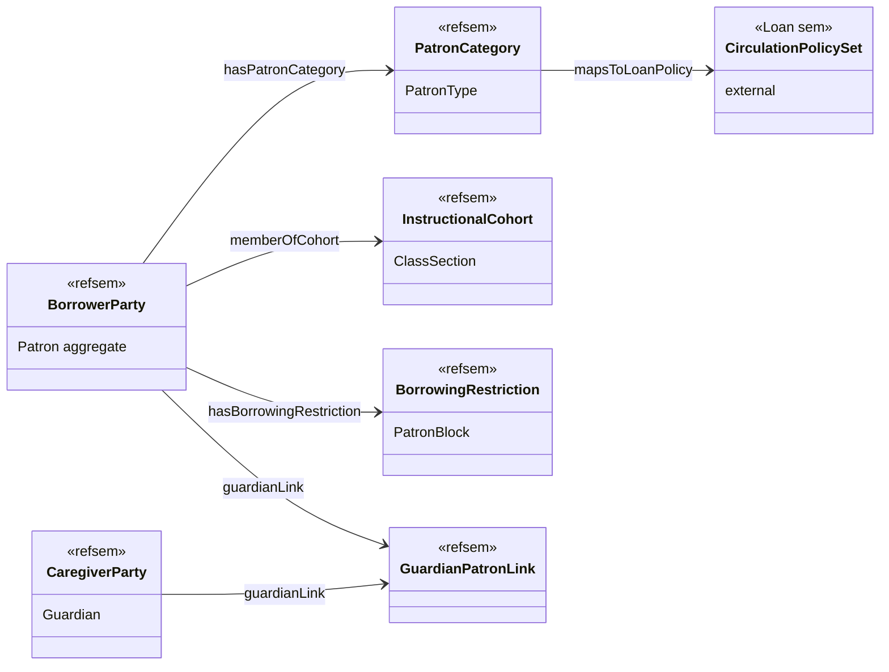
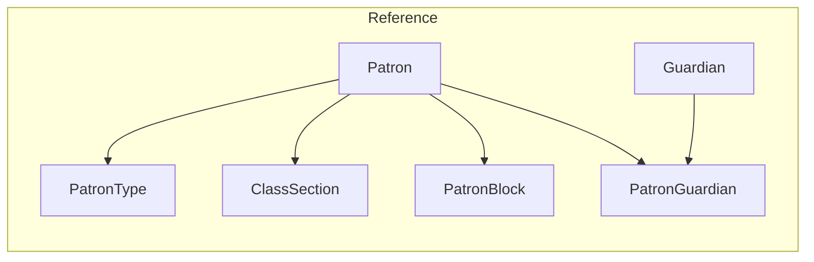
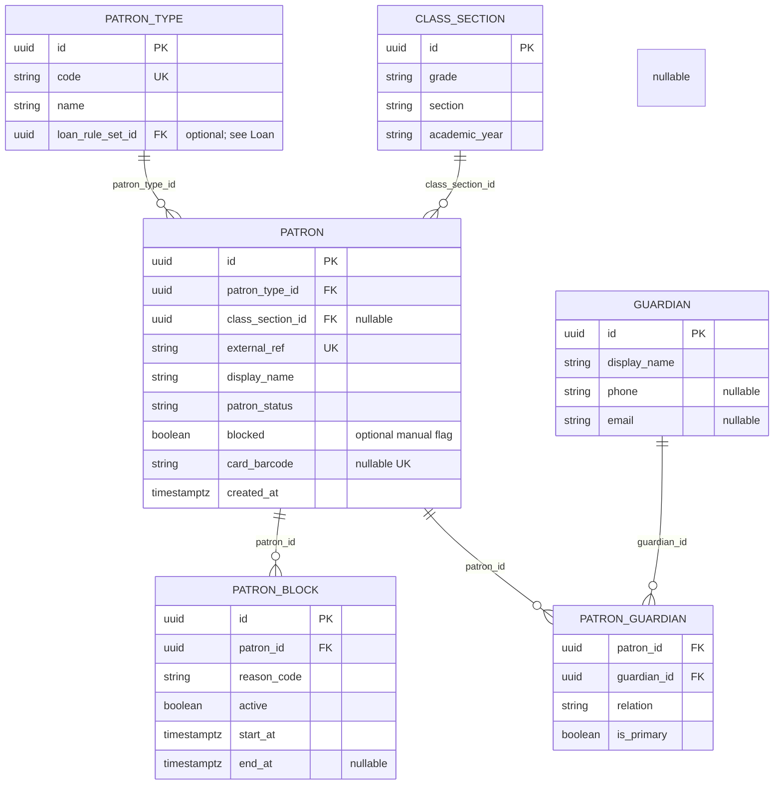

# Reference domain

_K-12 Library Management — **master data for borrowers**: `Patron`, **`PatronType`**, class/section, optional guardians/contacts, and **blocks**. Loan stores only **`patronId`**; eligibility is evaluated here._

---

## 1. Bounded context

**Purpose:** Single source of truth for **who may borrow**, **how they are classified** (student vs teacher vs parent), and **administrative eligibility** (active/suspended/exited, blocks). Supports K‑12 linkage to **class & section** and optional **guardian** communication.

**Owns**

- **`Patron`** aggregate (identity, status, type, school links).
- **`PatronType`** reference data (`STUDENT`, `TEACHER`, …).
- **`ClassSection`** (grade, section, academic year) where used.
- **`Guardian`** and optional links **`PatronGuardian`** (many-to-many).
- **`PatronBlock`** (temporary or dated bans from borrowing).
- Optional **`ContactPoint`** (normalized phone/email).

**Does not own**

- **`Loan`** rows → **Loan** domain (references `patronId`).
- **`Catalog` / `Holding`** → **Catalog** domain.

**Integration touchpoints**

- **Loan** resolves **`patronId`** at checkout and enforces: patron **`ACTIVE`**, **no active block**, **`PatronType`** maps to **`LoanRuleSet`** (configuration often lives in Loan or shared mapping table—pick one implementation).
- **OPAC / notices** (phase 2) may use guardian contact from Reference.

---

## 2. Workflows

### 2.1 Patron lifecycle

| Workflow | Goal | Typical steps |
|----------|------|----------------|
| **Register patron** | Create borrower identity | Capture name, type, external ref (admission/staff id), class/section for students |
| **Update patron** | Keep data current | Class promotion, section change, department for staff |
| **Suspend patron** | Temporary stop (discipline / fee hold) | Set status or activate **PatronBlock** |
| **Exit patron** | Leaver | Set **`EXITED`**; policy may require zero open loans (cross-domain check with Loan) |

### 2.2 Classification & policy hooks

| Workflow | Goal |
|----------|------|
| **Maintain patron types** | Codes used for loan rules (via mapping to **`LoanRuleSet`**) |
| **Manage class sections** | Academic year rollover; assign student patrons |

### 2.3 Contacts & compliance (optional MVP)

| Workflow | Goal |
|----------|------|
| **Link guardian** | Parent/guardian for minors; overdue notices (phase 2) |
| **Privacy / consent** | Minor consent for communication per school policy |

### 2.4 K‑12 India (typical)

| Workflow | Notes |
|----------|--------|
| **Admission / ERP sync** | `externalRef` aligns with school MIS |
| **Library card** | Optional **`cardBarcode`** for desk issue |

### 2.5 Semantic model

The **semantic model** is a stable vocabulary for **borrower identity**, **classification**, **guardians**, and **borrowing eligibility signals**—independent of administrative workflows. Workflows in §2 **assert or query** individuals and relationships in this model. Aggregates **`Patron`**, **`PatronType`**, **`ClassSection`**, **`Guardian`**, **`PatronGuardian`**, **`PatronBlock`** (§6) are projections of these concepts.

**Namespace (informative)**

| Prefix | Example IRI | Role |
|--------|-------------|------|
| `refsem` | `https://example.invalid/lms/reference/sem#` | Reference bounded-context **semantic** terms |
| `dcterms` | `http://purl.org/dc/terms/` | Generic metadata (title-like labels where reused) |
| `foaf` | `http://xmlns.com/foaf/0.1/` | **Agent** / naming hooks (optional alignment) |
| `xsd` | `http://www.w3.org/2001/XMLSchema#` | Literals |

#### 2.5.1 Classes (`owl:Class`)

| Semantic class | Local name | Maps to (§6) | Intuition |
|----------------|------------|----------------|-----------|
| **`refsem:BorrowerParty`** | School borrower identity | Aggregate **`Patron`** | Agent eligible to borrow; carries **`externalRef`**, **`cardBarcode`**, lifecycle **status**. |
| **`refsem:PatronCategory`** | Rule-selection bucket | **`PatronType`** | Code (`STUDENT`, …); may **`refsem:mapsToLoanPolicy`** → Loan **`LoanRuleSet`**. |
| **`refsem:InstructionalCohort`** | Class / section / year | **`ClassSection`** | Roster grouping for students. |
| **`refsem:CaregiverParty`** | Guardian contact | **`Guardian`** | Parent/guardian for minors and notices. |
| **`refsem:GuardianPatronLink`** | Associative record | **`PatronGuardian`** | **`patron`** + **`guardian`** + relation / primary flag. |
| **`refsem:BorrowingRestriction`** | Temporary lending ban | **`PatronBlock`** | Active window + reason; Loan must respect at checkout. |
| **`refsem:ConsentRecord`** | Communication consent (optional) | Policy store or **`Patron`** extension | Privacy workflow (§2.3). |

#### 2.5.2 Object properties (relationships)

| Property | Domain → range | Notes |
|----------|----------------|--------|
| **`refsem:hasPatronCategory`** | `BorrowerParty` → `PatronCategory` | Same as **`patronTypeId`**. |
| **`refsem:memberOfCohort`** | `BorrowerParty` → `InstructionalCohort` | Optional student link (**`classSectionId`**). |
| **`refsem:guardianLink`** | `BorrowerParty` ↔ `CaregiverParty` via link individual | Uses **`GuardianPatronLink`** reification or direct **N:M** per schema. |
| **`refsem:hasBorrowingRestriction`** | `BorrowerParty` → `BorrowingRestriction` | Active blocks; semantics aligned with **`PatronBlock`**. |
| **`refsem:mapsToLoanPolicy`** | `PatronCategory` → **Loan** `CirculationPolicySet` IRI | Cross-context; FK **`loanRuleSetId`** ([loan.md](loan.md) §2.4 / §6). |

#### 2.5.3 Data properties (literal attributes)

| Property | Attached to | Typical type | Aligns with §7 |
|----------|-------------|--------------|----------------|
| **`dcterms:identifier`** | `BorrowerParty` | `xsd:string` | `externalRef` (tenant-scoped) |
| **`foaf:name`** / **`refsem:displayName`** | `BorrowerParty`, `CaregiverParty` | `xsd:string` | `displayName` |
| **`refsem:patronLifecycleStatus`** | `BorrowerParty` | `xsd:string` | `ACTIVE` / `SUSPENDED` / `EXITED` |
| **`refsem:cardBarcode`** | `BorrowerParty` | `xsd:string` | **`cardBarcode`** |
| **`refsem:categoryCode`** | `PatronCategory` | `xsd:string` | **`PatronType.code`** |
| **`refsem:gradeLabel`** / **`sectionLabel`** | `InstructionalCohort` | `xsd:string` | **`grade`**, **`section`** |
| **`refsem:academicYearLabel`** | `InstructionalCohort` | `xsd:string` | **`academicYear`** |
| **`refsem:phoneE164`** | `CaregiverParty` | `xsd:string` | E.164 phone |
| **`refsem:emailAddress`** | `CaregiverParty` | `xsd:string` | Email |
| **`refsem:blockReasonCode`** | `BorrowingRestriction` | `xsd:string` | **`reasonCode`** |
| **`refsem:blockStarts`** / **`blockEnds`** | `BorrowingRestriction` | `xsd:dateTime` | **`startAt`**, **`endAt`** |

#### 2.5.4 Workflows → semantic model (connection)

| Workflow (§2) | § | Primary semantic subjects | Activity (on the model) |
|---------------|---|---------------------------|-------------------------|
| **Register patron** | §2.1 | `BorrowerParty`, `PatronCategory` | **Create** borrower; **assert** category and identifiers. |
| **Update patron** | §2.1 | `BorrowerParty`, `InstructionalCohort` | **Update** demographics, cohort link, department. |
| **Suspend patron** | §2.1 | `BorrowerParty` | **Assert** `patronLifecycleStatus` → suspended (and optional **`BorrowingRestriction`**). |
| **Exit patron** | §2.1 | `BorrowerParty` | **Assert** exited; cross-check loans (**Loan**). |
| **Maintain patron types** | §2.2 | `PatronCategory`, **`mapsToLoanPolicy`** | **Define** categories; **link** to **`CirculationPolicySet`**. |
| **Manage class sections** | §2.2 | `InstructionalCohort`, `BorrowerParty` | **Create** cohorts; **assign** **`memberOfCohort`**. |
| **Link guardian** | §2.3 | `CaregiverParty`, `GuardianPatronLink` | **Create** guardian; **assert** link to borrower. |
| **Privacy / consent** | §2.3 | `ConsentRecord`, `BorrowerParty` | **Record** consent decisions per policy. |
| **Admission / ERP sync** | §2.4 | `BorrowerParty` | **Upsert** from MIS **`dcterms:identifier`**. |
| **Library card** | §2.4 | `BorrowerParty` | **Assert** `cardBarcode`. |

**Summary:** Lifecycle workflows **mutate** **`BorrowerParty`** and related individuals; classification workflows **structure** **`PatronCategory`** and **`InstructionalCohort`**. Full chain → **§3.3**.

#### 2.5.5 Semantic model diagram



**Sample RDF/Turtle (informative)**

```turtle
@prefix refsem: <https://example.invalid/lms/reference/sem#> .
@prefix foaf:   <http://xmlns.com/foaf/0.1/> .
@prefix xsd:    <http://www.w3.org/2001/XMLSchema#> .

refsem:patron-uuid-001 a refsem:BorrowerParty ;
  foaf:name "Ada Student"@en ;
  refsem:hasPatronCategory refsem:category-STUDENT ;
  refsem:memberOfCohort refsem:cohort-7A-2026 .

refsem:category-STUDENT a refsem:PatronCategory ;
  refsem:categoryCode "STUDENT"^^xsd:string .
```

---

## 3. Use cases

### 3.0 Stakeholders and user roles (Reference)

| Role | Typical users | Interest in Reference |
|------|----------------|------------------------|
| **Library staff** | Librarian, library assistant | Register/update patrons, blocks, cards, guardian links |
| **School / tenant admin** | Admin officer, registrar-aligned role | Patron types, class sections, suspend/exit, compliance |
| **Patron** | Student, teacher, staff borrower | Own profile accuracy; borrowing eligibility |
| **Guardian / parent** | Parent, legal guardian | Contact data, consent (policy); may not log into LMS |
| **Class teacher / coordinator** | Homeroom teacher | Roster accuracy when bulk-assigned (integration or phase 2) |
| **IT / MIS** | Data steward | `externalRef` alignment with admission/HR systems |

**Primary actor** = who performs the use case. **Stakeholders** = who benefits, is affected, or must approve / be informed.

### 3.1 Reference use cases → rule sets

| ID | Use case | Primary actor | Stakeholders | Goal | Rule sets |
|----|----------|---------------|--------------|------|-----------|
| REF-UC01 | Register patron | Librarian, school admin | Patron, guardians (student), loan desk | Create borrower | **Patron identity**, **Uniqueness**, **Patron type validity** |
| REF-UC02 | Update patron profile | Librarian, school admin | Patron, class teacher (roster), notices (phase 2) | Class/section, contact | **Patron policy**, **Status transitions** |
| REF-UC03 | Configure patron types | School admin, library admin | Librarians, Loan configuration | Codes for loan behaviour | **PatronType catalog**, **LoanRuleSet mapping** (with Loan) |
| REF-UC04 | Suspend / exit patron | School admin, library admin | Patron, guardians, loan desk (open loans) | Lifecycle | **Open-loan guard** (with Loan), **Audit** |
| REF-UC05 | Block patron borrowing | Librarian, school admin | Patron, finance (fee hold), loan desk | Enforce block | **PatronBlock rules**, **Effective dates** |
| REF-UC06 | Manage class sections | School admin | Teachers, librarians (bulk ops), students | Structure for students | **Academic year**, **Uniqueness** |
| REF-UC07 | Link guardian | Librarian | Guardian, student, DPO / compliance officer | Contact for student | **Privacy / consent**, **PII** |
| REF-UC08 | Issue / replace library card | Librarian | Patron, circulation (barcode) | `cardBarcode` | **Barcode uniqueness** |

### 3.2 MVP scope

MVP Reference rows and enrollment ontology chain are documented in **[MVP.md](MVP.md)** (§3). This file keeps the full Reference use-case and rule catalog.

### 3.3 Reference domain ontology (workflow → use case → action type)

This view ties **workflows** (§2), **use cases** (§3.1), and **action types**—application **commands** (writes) and **queries** (reads)—into one table. Behavioral ontology: aggregates **`Patron`**, **`PatronType`**, **`ClassSection`**, **`Guardian`**, **`PatronGuardian`**, **`PatronBlock`** (see §6). **Semantic concepts** (`BorrowerParty`, `PatronCategory`, …) and **workflow → semantic model** mapping → **§2.5**. The same ontology as a **knowledge graph** (predicates, sample triples, Mermaid diagram) → **§3.4**.

**Layers**

| Layer | Meaning in this document |
|-------|---------------------------|
| **Workflow** | Named process from §2 (patron lifecycle, classification, contacts, K‑12). |
| **Use case** | `REF-UCxx` goal from §3.1. |
| **Action type** | Invocable operation: **Command** mutates Reference state; **Query** reads. Full list → §8. |

#### Ontology matrix (primary mappings)

| Workflow (§2) | Use case | Action type(s) | Target aggregate / entity |
|---------------|----------|----------------|---------------------------|
| **Register patron** | REF-UC01 | `RegisterPatron` | `Patron` |
| **Update patron** | REF-UC02 | `UpdatePatron` | `Patron` |
| **Suspend patron** | REF-UC04 | `SuspendPatron` | `Patron` |
| **Exit patron** | REF-UC04 | `ExitPatron` | `Patron` |
| **Maintain patron types** | REF-UC03 | `CreatePatronType`, `UpdatePatronType` | `PatronType` |
| **Manage class sections** | REF-UC06 | `CreateClassSection`, `UpdateClassSection`, `AssignPatronToClassSection` | `ClassSection`, `Patron` |
| **Link guardian** | REF-UC07 | `LinkGuardianToPatron`, `UnlinkGuardian` | `Guardian`, `PatronGuardian` |
| **Privacy / consent** | REF-UC07 (policy) | `UpdatePatron` / `RecordCommunicationConsent` (product-specific) | `Patron` or consent store |
| **Library card** | REF-UC08 | `IssueOrReplaceLibraryCard` or `UpdatePatron` (`cardBarcode`) | `Patron` |
| **Admission / ERP sync** | REF-UC01, REF-UC02 | `UpsertPatronFromExternalSystem` (integration) | `Patron` |
| **Block patron borrowing** | REF-UC05 | `SetPatronBlock`, `ClearPatronBlock` | `PatronBlock` |

#### Use case → action types (compact)

| Use case | Command action types | Query action types |
|----------|----------------------|--------------------|
| REF-UC01 | `RegisterPatron` | — |
| REF-UC02 | `UpdatePatron` | `GetPatronById`, `GetPatronByExternalRef` |
| REF-UC03 | `CreatePatronType`, `UpdatePatronType` | `ListPatronTypes`, `GetPatronType` |
| REF-UC04 | `SuspendPatron`, `ExitPatron` | `GetPatronById` |
| REF-UC05 | `SetPatronBlock`, `ClearPatronBlock` | `ListPatronBlocks` (optional) |
| REF-UC06 | `CreateClassSection`, `UpdateClassSection`, `AssignPatronToClassSection` | `ListClassSections`, `GetClassSection` |
| REF-UC07 | `LinkGuardianToPatron`, `UnlinkGuardian` | `ListGuardiansForPatron`, `GetGuardian` |
| REF-UC08 | `IssueOrReplaceLibraryCard`, `UpdatePatron` | `GetPatronByCardBarcode` |

### 3.4 Knowledge graph (ontology)

The **ontology** in §3.3 can be read as a small **knowledge graph**: **nodes** are workflows, use cases, action types, and aggregates (plus an optional **consent / policy** projection when **`RecordCommunicationConsent`** is modeled outside core **`Patron`** tables). Treat **`agg:Patron`** as **`refsem:BorrowerParty`**, **`agg:PatronType`** as **`refsem:PatronCategory`**, **`agg:ClassSection`** as **`refsem:InstructionalCohort`**, **`agg:Guardian`** as **`refsem:CaregiverParty`**, **`agg:PatronBlock`** as **`refsem:BorrowingRestriction`** when serializing to RDF (**§2.5**).

**Node kinds**

| Kind | Prefix / pattern | Examples |
|------|------------------|----------|
| **Workflow** | `wf:` | Patron lifecycle, classification, contacts, K‑12 from §2 |
| **Use case** | `uc:` | `REF-UC01` … `REF-UC08` |
| **Action type** | `act:` | Command or query from §8 |
| **Aggregate** | `agg:` | `Patron`, `PatronType`, `ClassSection`, `Guardian`, `PatronGuardian`, `PatronBlock` |

**Predicates (edge labels)**

| Predicate | Meaning |
|-----------|---------|
| **`maps_to`** | Workflow is operationalized by this use case (N:M allowed). |
| **`realized_by`** | Use case is implemented by this action type. |
| **`targets`** | Action type mutates or reads this aggregate / projection. |

**Sample triples** (informative; not a normative API contract):

```turtle
@prefix : <https://example.invalid/lms/reference#> .

:wf-register-patron :maps_to :uc-REF-UC01 .
:uc-REF-UC01 :realized_by :act-RegisterPatron .
:act-RegisterPatron :targets :agg-Patron .

:wf-block-patron-borrowing :maps_to :uc-REF-UC05 .
:uc-REF-UC05 :realized_by :act-SetPatronBlock .
:act-SetPatronBlock :targets :agg-PatronBlock .
```

**Graph visualization (Mermaid)** — **`-->`** = `maps_to`; **`-.->`** = `realized_by`; **`==>`** = `targets`. *Several commands touch **`Patron`** and a link aggregate (e.g. **`AssignPatronToClassSection`** → **`Patron`** + **`ClassSection`**).*

```mermaid
flowchart TB
  subgraph agg["Aggregates (agg:)"]
    APat[("Patron")]
    ATyp[("PatronType")]
    ACls[("ClassSection")]
    AGua[("Guardian")]
    APG[("PatronGuardian")]
    APB[("PatronBlock")]
    ACns[["Consent /\npolicy store"]]
  end

  subgraph actQ["Queries (act:)"]
    QPID[GetPatronById]
    QPEF[GetPatronByExternalRef]
    QPCB[GetPatronByCardBarcode]
    QPLS[ListPatronsByClassSection]
    QPTL[ListPatronTypes]
    QPTG[GetPatronType]
    QCSL[ListClassSections]
    QCSG[GetClassSection]
    QGLP[ListGuardiansForPatron]
    QGG[GetGuardian]
    QPB[ListPatronBlocks]
  end

  subgraph actC["Commands (act:)"]
    CReg[RegisterPatron]
    CUpd[UpdatePatron]
    CSus[SuspendPatron]
    CEx[ExitPatron]
    CBlkS[SetPatronBlock]
    CBlkC[ClearPatronBlock]
    CPTC[CreatePatronType]
    CPTU[UpdatePatronType]
    CCS[CreateClassSection]
    CCSU[UpdateClassSection]
    CAS[AssignPatronToClassSection]
    CLG[LinkGuardianToPatron]
    CUG[UnlinkGuardian]
    CCard[IssueOrReplaceLibraryCard]
    CUps[UpsertPatronFromExternalSystem]
    CRcc[RecordCommunicationConsent]
  end

  subgraph uc["Use cases (uc:)"]
    U01[REF-UC01]
    U02[REF-UC02]
    U03[REF-UC03]
    U04[REF-UC04]
    U05[REF-UC05]
    U06[REF-UC06]
    U07[REF-UC07]
    U08[REF-UC08]
  end

  subgraph wf["Workflows (wf:)"]
    Wreg[Register patron]
    Wupd[Update patron]
    Wsus[Suspend patron]
    Wex[Exit patron]
    Wtyp[Maintain patron types]
    Wcls[Manage class sections]
    Wgua[Link guardian]
    Wprv[Privacy / consent]
    Wcard[Library card]
    Werp[Admission / ERP sync]
    Wblk[Block patron borrowing]
  end

  Wreg --> U01
  Werp --> U01 & U02
  Wupd --> U02
  Wsus --> U04
  Wex --> U04
  Wtyp --> U03
  Wcls --> U06
  Wgua --> U07
  Wprv --> U07
  Wcard --> U08
  Wblk --> U05

  U01 -.-> CReg & CUps
  U02 -.-> CUpd & CUps
  U03 -.-> CPTC & CPTU
  U04 -.-> CSus & CEx
  U05 -.-> CBlkS & CBlkC
  U06 -.-> CCS & CCSU & CAS
  U07 -.-> CLG & CUG & CUpd & CRcc
  U08 -.-> CCard & CUpd

  CReg & CUpd & CSus & CEx & CCard & CUps ==> APat
  CAS ==> APat
  CAS ==> ACls
  CPTC & CPTU ==> ATyp
  CCS & CCSU ==> ACls
  CLG & CUG ==> APG
  CLG & CUG ==> AGua
  CLG & CUG ==> APat
  CBlkS & CBlkC ==> APB
  CBlkS & CBlkC ==> APat
  CRcc ==> ACns
  CRcc ==> APat

  QPID & QPEF & QPCB & QPLS ==> APat
  QPTL & QPTG ==> ATyp
  QCSL & QCSG ==> ACls
  QGLP & QGG ==> AGua
  QGLP ==> APat
  QPB ==> APB
```



*Notes:* **`UpdatePatron`** under REF-UC07 / REF-UC08 is shared; the graph shows multiple **`-.->`** edges. **`PatronType`** may carry **`loanRuleSetId`** toward Loan ([loan.md](loan.md))—an integration concern, not an extra node here unless you model **`LoanRuleSet`** as `ext:` in a unified graph.

---

## 4. Rule sets (named bundles)

| Rule set | Meaning |
|----------|---------|
| **Patron identity** | Required fields; display name; admission/staff reference (Unicode text per **[Unicode](https://www.unicode.org/versions/latest/)**). |
| **Surrogate identifiers** | All **`id`** fields use **[UUID](https://www.rfc-editor.org/rfc/rfc9562.html)** for global uniqueness in APIs and replication. |
| **Uniqueness** | `externalRef` per tenant; optional unique `cardBarcode` |
| **Patron type validity** | Every patron has valid **`patronTypeId`** |
| **Status transitions** | `ACTIVE` ↔ `SUSPENDED` ↔ `EXITED` with audit timestamps in **[ISO 8601](https://www.iso.org/iso-8601-date-and-time-format.html)** / **[RFC 3339](https://www.rfc-editor.org/rfc/rfc3339)**. |
| **PatronBlock** | Active block ⇒ not eligible to checkout (Loan enforces); block windows use unambiguous **timezone-aware** instants (IANA TZ database names per **[tz database](https://www.iana.org/time-zones)**). |
| **Student class link** | Students should have class/section |
| **Privacy / PII** | Guardian data; consent for minors — align processing with applicable law (e.g. **India DPDP Act** context for Indian schools; consent records are policy, not a single ISO). |
| **Contact formats** | Telephone numbers SHOULD conform to **[E.164](https://www.itu.int/rec/T-REC-E.164/)** for storage; email syntax constrained by **[RFC 5322](https://www.rfc-editor.org/rfc/rfc5322)** subset (or **[RFC 6531](https://www.rfc-editor.org/rfc/rfc6531.html)** for internationalized local-part). |
| **LoanRuleSet mapping** | How **`PatronType`** selects borrowing rules (shared config with Loan) |
| **Library card barcode** | When using printed cards, symbology may follow **[GS1](https://www.gs1.org/standards/barcodes)** or legacy **Codabar**—same as Catalog holding barcodes for interoperability. |

---

## 5. Rules (implementable)

### 5.1 `Patron`

| ID | Rule |
|----|------|
| REF-P1 | `externalRef` **unique** per tenant (unless policy allows duplicate with different scope); format is **tenant-defined** (often aligns with MIS admission id). |
| REF-P2 | `displayName` required (trimmed); MUST be valid **[Unicode](https://www.unicode.org/versions/latest/)** string; prefer **NFC** for stable equality ([TR15](https://www.unicode.org/reports/tr15/)). |
| REF-P3 | `patronTypeId` required and must reference existing **`PatronType`** |
| REF-P4 | `status` ∈ { `ACTIVE`, `SUSPENDED`, `EXITED` } |
| REF-P5 | `cardBarcode` **unique** when not null; SHOULD use charset compatible with chosen barcode symbology (**[GS1](https://www.gs1.org/standards/barcodes)** / Codabar). |
| REF-P6 | If `status != ACTIVE` → not eligible to borrow (Loan checks) |
| REF-P7 | **Exit** (`EXITED`): policy may require **no open loans** (integrate with Loan query) |
| REF-P8 | `createdAt` / `updatedAt` MUST be **[RFC 3339](https://www.rfc-editor.org/rfc/rfc3339)** timestamps (ISO 8601) in a defined timezone. |

### 5.2 `PatronBlock`

| ID | Rule |
|----|------|
| REF-B1 | At most one **active** block per patron for simple MVP *or* overlap rules defined |
| REF-B2 | Active block ⇒ Loan checkout **rejected** |
| REF-B3 | Block records audited (who/when/reason) |

### 5.3 `PatronType`

| ID | Rule |
|----|------|
| REF-T1 | `code` unique per tenant (e.g. `STUDENT`, `TEACHER`) |
| REF-T2 | Deleting a type blocked if patrons still reference it |

### 5.4 `ClassSection`

| ID | Rule |
|----|------|
| REF-C1 | Optional uniqueness: `(grade, section, academicYear)` per tenant |
| REF-C2 | `academicYear` label is **policy-defined** (e.g. `2025-26`); no single ISO enum—optional alignment with institution’s **[ISO 8601](https://www.iso.org/iso-8601-date-and-time-format.html)** **week-date** or fiscal year docs if reporting requires it. |

### 5.5 Cross-domain

| ID | Rule |
|----|------|
| REF-X1 | Loan **`CheckoutHolding`** must load patron from Reference and validate REF-P4 / REF-B2 |
| REF-X2 | Changing **`patronType`** with open loans: either **disallowed** or **re-run limit check** immediately |

---

## 6. Domain model

### 6.1 Aggregates

- **`Patron`** — aggregate root for borrower identity and school links.
- **`PatronType`**, **`ClassSection`** — usually reference data roots or child catalogs.

### 6.2 Relationships (conceptual)

| From | To | Cardinality |
|------|-----|-------------|
| **Patron** | **PatronType** | N : 1 |
| **Patron** | **ClassSection** | N : 1 optional (students) |
| **Patron** | **Guardian** | N : M via **PatronGuardian** |
| **Patron** | **PatronBlock** | 1 : N (history) |
| **PatronType** | **LoanRuleSet** | N : 1 typical FK on type (see Loan) |

### 6.3 Conceptual diagram (Reference only)



### 6.4 Logical ER (sketch)



---

## 7. Entities and attributes

Attribute notes include **usage** and **standards / references** where applicable.

### 7.1 `Patron`

| Attribute | Notes (usage · standards & references) |
|-----------|----------------------------------------|
| `id` | **Usage:** Primary key for **`patronId`** in Loan and APIs. **Standards:** **[UUID](https://www.rfc-editor.org/rfc/rfc9562.html)** (see RFC string format). |
| `externalRef` | **Usage:** Stable id from school MIS / HR for sync and support lookup. **Standards:** Tenant-defined string (often numeric or alphanumeric); uniqueness is contractual, not ISO. |
| `displayName` | **Usage:** Human-readable name on receipts and OPAC “your loans”. **Standards:** **[Unicode](https://www.unicode.org/versions/latest/)**; NFC normalization recommended for search. |
| `patronTypeId` | **Usage:** Drives loan rules via **`LoanRuleSet`** mapping. **Standards:** FK UUID → `PatronType`. |
| `classSectionId` | **Usage:** Links student to roster for bulk operations and reports. **Standards:** FK UUID → `ClassSection`. |
| `departmentId` | **Usage:** Staff grouping when distinct from class. **Standards:** Local FK or code list (no global standard). |
| `status` | **Usage:** Borrowing eligibility coarse control. **Standards:** LMS enumeration (`ACTIVE` / `SUSPENDED` / `EXITED`). |
| `blocked` | **Usage:** Quick manual deny-list flag (optional if **PatronBlock** covers all cases). **Standards:** Boolean. |
| `cardBarcode` | **Usage:** Physical library card scan at desk. **Standards:** Unique string; symbology compatible with **[GS1](https://www.gs1.org/standards/barcodes)** or **Codabar** as for holdings ([catalog.md](catalog.md)). |
| `createdAt`, `updatedAt` | **Usage:** Audit trail. **Standards:** **[ISO 8601](https://www.iso.org/iso-8601-date-and-time-format.html)** / **[RFC 3339](https://www.rfc-editor.org/rfc/rfc3339)** (`timestamptz`). |

### 7.2 `PatronType`

| Attribute | Notes (usage · standards & references) |
|-----------|----------------------------------------|
| `id` | **Usage:** FK target from **Patron**. **Standards:** **[UUID](https://www.rfc-editor.org/rfc/rfc9562.html)**. |
| `code` | **Usage:** Stable programme code for rules and reporting (`STUDENT`, `TEACHER`). **Standards:** ASCII **SHOULD** be uppercase snake-case locally; not an ISO code list unless you map to one intentionally. |
| `name` | **Usage:** Display label in admin UI. **Standards:** Unicode text. |
| `loanRuleSetId` | **Usage:** Default borrowing policy for this type. **Standards:** FK UUID → **`LoanRuleSet`** ([loan.md](loan.md)). |

### 7.3 `ClassSection`

| Attribute | Notes (usage · standards & references) |
|-----------|----------------------------------------|
| `id` | **Usage:** FK from student **Patron**. **Standards:** **[UUID](https://www.rfc-editor.org/rfc/rfc9562.html)**. |
| `grade`, `section` | **Usage:** K‑12 class identity (e.g. Grade 7, Section A). **Standards:** Institution-defined strings (national curriculum stage labels vary—no mandatory ISO for “grade”). |
| `academicYear` | **Usage:** Rollover boundary for sections. **Standards:** Policy label (e.g. `2025-26`); machine sorting MAY use **[ISO 8601](https://www.iso.org/iso-8601-date-and-time-format.html)** year ranges if normalized in reports. |

### 7.4 `Guardian` & `PatronGuardian`

| Attribute | Notes (usage · standards & references) |
|-----------|----------------------------------------|
| Guardian · `id` | **Standards:** **[UUID](https://www.rfc-editor.org/rfc/rfc9562.html)**. |
| Guardian · `displayName` | **Standards:** Unicode (same as patron names). |
| Guardian · `phone` | **Usage:** SMS/voice contact for notices (phase 2). **Standards:** Store **[E.164](https://www.itu.int/rec/T-REC-E.164/)** (+country code) where possible ([ITU-T E.164](https://www.itu.int/rec/T-REC-E.164/)). |
| Guardian · `email` | **Usage:** Email notices. **Standards:** Syntax per **[RFC 5322](https://www.rfc-editor.org/rfc/rfc5322)**; internationalized email **[RFC 6531](https://www.rfc-editor.org/rfc/rfc6531.html)** if needed. |
| PatronGuardian · keys | **Usage:** Many-to-many link with relation label (`MOTHER`, …) and primary flag. **Standards:** FK UUIDs; `relation` may align with local enumeration or **[FHIR Patient.contact relationship](https://hl7.org/fhir/patient.html)** codes when integrating health-adjacent systems (optional). |

### 7.5 `PatronBlock`

| Attribute | Notes (usage · standards & references) |
|-----------|----------------------------------------|
| `id` | **Standards:** **[UUID](https://www.rfc-editor.org/rfc/rfc9562.html)**. |
| `patronId` | **Usage:** Who is blocked. **Standards:** FK UUID. |
| `reasonCode` | **Usage:** Analytics and librarian messaging (`FEE_HOLD`, `CONDUCT`). **Standards:** Tenant-defined code list (ISO does not define library blocks). |
| `active` | **Usage:** Quick flag if not using only date window. **Standards:** Boolean. |
| `startAt`, `endAt` | **Usage:** Effective blocking window. **Standards:** **[RFC 3339](https://www.rfc-editor.org/rfc/rfc3339)** instants with timezone (**[IANA tz](https://www.iana.org/time-zones)** name per deployment, e.g. `Asia/Kolkata`). |
| `notes` | **Usage:** Staff-only justification. **Standards:** Unicode text; avoid storing unnecessary PII beyond policy. |

---

## 8. Action types (application API)

**Action types** realize the **use cases** in §3.1 and are reached from **workflows** in §2 via the **ontology matrix** in §3.3.

### 8.1 Commands (mutations)

| Action type | Aggregate / scope | Typical use cases |
|-------------|-------------------|-------------------|
| `RegisterPatron` | `Patron` | REF-UC01 |
| `UpdatePatron` | `Patron` | REF-UC02, REF-UC08 (card via field update) |
| `SuspendPatron` | `Patron` | REF-UC04 |
| `ExitPatron` | `Patron` | REF-UC04 |
| `SetPatronBlock` | `PatronBlock` | REF-UC05 |
| `ClearPatronBlock` | `PatronBlock` | REF-UC05 |
| `CreatePatronType` | `PatronType` | REF-UC03 |
| `UpdatePatronType` | `PatronType` | REF-UC03 |
| `CreateClassSection` | `ClassSection` | REF-UC06 |
| `UpdateClassSection` | `ClassSection` | REF-UC06 |
| `AssignPatronToClassSection` | `Patron` | REF-UC06 |
| `LinkGuardianToPatron` | `PatronGuardian` | REF-UC07 |
| `UnlinkGuardian` | `PatronGuardian` | REF-UC07 |
| `IssueOrReplaceLibraryCard` | `Patron` (`cardBarcode`) | REF-UC08 |
| `UpsertPatronFromExternalSystem` | `Patron` (integration) | REF-UC01, REF-UC02 |
| `RecordCommunicationConsent` | policy store / `Patron` extension | REF-UC07 (optional) |

### 8.2 Queries (reads)

| Action type | Returns / purpose | Typical use cases |
|-------------|-------------------|-------------------|
| `GetPatronById` | Single patron | REF-UC02, REF-UC04 |
| `GetPatronByExternalRef` | Patron by MIS id | REF-UC01, desk lookup |
| `GetPatronByCardBarcode` | Patron by card scan | REF-UC08, Loan checkout |
| `ListPatronsByClassSection` | Roster-style list | REF-UC02, REF-UC06 |
| `ListPatronTypes` | All types | REF-UC03 |
| `GetPatronType` | Single type | REF-UC03 |
| `ListClassSections` | Sections for academic year filter | REF-UC06 |
| `GetClassSection` | Single section | REF-UC06 |
| `ListGuardiansForPatron` | Linked guardians | REF-UC07 |
| `GetGuardian` | Single guardian | REF-UC07 |
| `ListPatronBlocks` | Block history / active | REF-UC05 (optional) |

**See also:** §3.3 **Reference domain ontology** (workflow ↔ use case ↔ action type).

---

## 9. Standards quick reference (Reference)

| Topic | Primary reference |
|-------|-------------------|
| UUIDs | [RFC 9562](https://www.rfc-editor.org/rfc/rfc9562.html) |
| Timestamps | [ISO 8601](https://www.iso.org/iso-8601-date-and-time-format.html), [RFC 3339](https://www.rfc-editor.org/rfc/rfc3339) |
| Telephone | [ITU-T E.164](https://www.itu.int/rec/T-REC-E.164/) |
| Email | [RFC 5322](https://www.rfc-editor.org/rfc/rfc5322), [RFC 6531](https://www.rfc-editor.org/rfc/rfc6531.html) (internationalized) |
| Timezones | [IANA Time Zone Database](https://www.iana.org/time-zones) |
| Text / names | [Unicode](https://www.unicode.org/versions/latest/), [UAX #15 NFC](https://www.unicode.org/reports/tr15/) |
| Card barcodes | [GS1 barcodes](https://www.gs1.org/standards/barcodes) (see also [catalog.md](catalog.md)) |

---

## 10. Related documents

- **[MVP.md](MVP.md)** — cross-domain minimal ship, including Reference MVP enrollment chain.
- **[loan.md](loan.md)** — uses **`patronId`**; checkout eligibility and **`LoanRuleSet`** mapping from **`PatronType`**.
- **[catalog.md](catalog.md)** — unrelated bibliographically; no patron data there.
- **[library_domain_model_final.md](library_domain_model_final.md)** — one-page cross-domain diagram.
