# Research — architecture & design discovery

This document preserves **conversation history and reasoning** for **LMS-AI** — the K‑12 Library Management system—including **prior Cursor sessions** (§3, sessions A–E) and the **architecture discovery session** (§4, session D) plus the **implementation & workflow session** (§13, session E). Use it to **rebuild context** after a break, onboard collaborators, or infer **user/product preferences** when extending the system.

**Canonical implementation spec:** [MVP.md](MVP.md) (requirements, architecture §8–§10, traceability §11, staff workflows §2.1, status §14).  
**Execution plan:** [plan-mvp.md](plan-mvp.md) (phased delivery, §0 implementation status).  
**Domain detail:** [reference.md](reference.md), [catalog.md](catalog.md), [loan.md](loan.md).

---

## 1. Purpose of this document

| Use | How |
|-----|-----|
| **Context recovery** | Read §3 (all sessions) + §4 (architecture log) + §13 (implementation log) + §5–§6 |
| **User profile** | §2 + §3.5 (early product intent) + §13 (locked tech + workflow decisions) |
| **Feeder for AI / docs** | Paste or reference sections when generating ADRs, code, or phase‑2 plans |
| **Avoid duplicate debate** | §6 lists resolved vs deferred; §3.6 / §13 note what landed in repo vs chat-only |
| **Implementation status** | [plan-mvp.md §0](plan-mvp.md) + [MVP.md §14](MVP.md) — **MVP phases 0–7 complete** |

---

## 2. User profile & working preferences (inferred)

Signals from the discovery conversation—not a formal persona, but useful for prioritization.

| Dimension | Observation |
|-----------|-------------|
| **Domain focus** | K‑12 library management; bounded contexts Reference, Catalog, Loan already modeled in markdown |
| **Delivery style** | Wants **minimal coherent ship** (MVP), not a big-bang platform |
| **Scope discipline** | Explicitly asked to **strictly limit to MVP.md** when architecture drifted toward SaaS, offline, bulk checkout |
| **Architecture literacy** | Comfortable with quality attributes, bounded contexts, ADRs, traceability tables, mermaid |
| **Strategic vs tactical** | Started strategic (quality attributes), then constrained, then asked for **extensibility / maintainability / configurability** as first-class design keys |
| **Documentation** | Expects decisions to land in repo docs (`MVP.md`, `plan-mvp.md`), not only in chat |
| **Implementation pace** | Moves from spec → Python scaffold → domain APIs → auth → workflows in same repo |
| **Delivery / pick-up** | **Confirmed in MVP scope** (optional per transaction; not mandatory for every issue/return) |
| **Rule visibility at desk** | Wants all domain rules validated and surfaced at workflow preview — **plain-language messages** for staff; `rule_id` retained in API for traceability, not shown in UI |
| **Desk UX** | **Names over IDs** — patron names, book titles, barcodes, type/section labels; avoid UUIDs and internal keys on workflow screens |
| **Patron lookup** | Card, admission no., **and display name**; ambiguous name → pick from candidate list |
| **Workflow rollback** | WF-01 must support **step back** before commit and **cancel issuance** after commit (reverse via orchestrator) |
| **Auth** | JWT Bearer on all domain APIs; Swagger token entry; seed users for local dev |
| **Ops** | Makefile for local deploy (with/without Docker), DDL + sample data, destroy scripts |
| **Product direction (stated, some post-MVP)** | Interest in multi-tenant SaaS, compliance-aware privacy, audit, group checkouts, offline—then **scoped out of MVP doc** when aligning to `MVP.md` |
| **Geography & pedagogy (early sessions)** | **India K‑12**; **CBSE**, bilingual; languages English, Hindi, Marathi, Sanskrit, French, German |
| **Deployment (early vs later)** | Early: **single school per deploy**, unique **rack** location; later chat: multi-tenant SaaS intent (deferred from MVP.md) |
| **Phase‑2 product ideas (early)** | Book **recommendation → procurement** with approval (librarian / principal, cost rules); **feedback** on books by age/class; e‑copies future scope |

**Implication for implementers:** Prefer **documented, traceable decisions**; honor **MVP.md as scope authority**; design the core so **phase‑2 capabilities** (§1 out-of-scope in MVP) plug in via commands/ports/events without rewriting circulation.

---

## 3. Prior LMS sessions (extracted from Cursor transcripts)

**Yes — extraction is possible.** Cursor stores agent transcripts under the project’s `.cursor` agent-transcripts folder. Five sessions are indexed for this LMS workspace. Summaries below; full JSONL logs are local to your machine (not in the git repo).

### 3.1 Session index

| Session | Transcript ID (Cursor) | Approx. focus | Primary repo outputs |
|---------|------------------------|---------------|----------------------|
| **A** | `fbb0f92b-4dd2-4746-9704-a0323a077c99` | Librarian-led **domain learning**; FR/NFR/DDD; India boards; procurement | *(chat only—no dedicated md in repo)* |
| **B** | `b4520868-19d6-4589-8e55-73287ddcb0eb` | Workflow **phases** (acquisition→transaction); Indian context; catalog MVP rules | *(superseded by later domain docs)* |
| **C** | `ac596fc5-a536-41d3-b987-99f609f872fd` | **Domain modeling** — Catalog, Loan, Reference; ontology; MVP.md; standards | `reference.md`, `catalog.md`, `loan.md`, `MVP.md`, `cursor_key_workflows_*.md`, `library_domain_model_final.md` |
| **D** | `713739d5-039d-4207-a855-56b40f272ebd` | **Architecture** — quality attributes, ADRs, traceability | `MVP.md` §8–§11, this `research.md` |
| **E** | `eaed8a2b-6ee7-49c8-a5d9-1b74a3a38da2` | **Implementation** — scaffold, domain APIs, JWT, workflows, staff UI, desk UX | `src/lms/`, `docs/plan-mvp.md`, `MVP.md` §2.1/§13–§14, ADR-012–024 |

*Full logs: `.cursor/projects/.../agent-transcripts/<uuid>/<uuid>.jsonl` on your machine. In Cursor chat, cite a parent session as [title ≤6 words](uuid).*

### 3.2 Session A — Domain exploration & procurement (fbb0f92b)

**User themes (chronological):**

- Role-play: school librarian helping define an LMS.
- **K‑12 only**; needs a **database**; model extensible for **e‑copies** (future).
- **Single school** per deployment; physical **rack number** unique per library.
- Summarize as **Functional / Non-functional requirements**, **Business services**, **Domain objects** aligned with **DDD**.
- **Recommendation service**: suggest books not in library; capture **feedback/comments**; tune by age/class.
- Procurement assist: internet-assisted suggestions, **classification by age/standard/genre**; **Indian boards**.
- **CBSE**, **bilingual**; languages: English, Hindi, Marathi, Sanskrit, French, German.
- Link recommendations to **procurement** with **approval workflow** (library vs librarian + principal; **cost** rules with flexibility for more rules).

**Captured in repo?** Partially reflected in domain richness and `MVP.md` §1 out-of-scope (**procurement integration**). Recommendation/approval workflows are **not** in MVP.md.

### 3.3 Session B — Phased workflows & catalog MVP (b4520868)

**User themes:**

- Key domain concepts and workflows for **K‑12 school**.
- Workflows with **input/output** in sequence: acquisition/creation → transformation → processing → publishing → transactions.
- **Reference data** sources per step; merged tables; **Indian context** alignment.
- Phase merge/optimize; key domain objects; **catalog** as core subdomain use cases.
- **MVP per use case**: steps, rule list, reference data required.
- Bibliographic record: **genre**, **patron type**, **age/class minimum validity** + rules.

**Captured in repo?** Evolved into Session C domain files. Genre/age-gating on bibliographic record may appear in catalog rules—verify in `catalog.md` if still required vs simplified MVP metadata (title, language, ISBN, tags).

### 3.4 Session C — Domain specs & MVP consolidation (ac596fc5)

**Major user requests (selected):**

| Topic | Outcome in repo |
|-------|-----------------|
| K‑12 India workflows; acquisition / manage / issue-return | `cursor_key_workflows_for_k_12_library_m.md` → later split |
| Use cases + rule sets; MVP use cases; domain model | Domain rules in per-context files |
| Focus **Catalog**; rename Work → **Catalog**; **Copy** → **Holding** | `catalog.md` terminology |
| **Loan** domain; use case lists | `loan.md` |
| Add **Reference** domain (Patron, etc.); align Catalog/Loan | `reference.md`, cross-domain updates |
| Split: `catalog.md`, `loan.md`, `reference.md` | Done |
| **Technology stack** / microservices vs monolith | Discussed in chat; **ADR-001 modular monolith** now in `MVP.md` §10 |
| Entity attributes + **standards** (ISO, RFC, etc.) | Attribute tables in domain md files |
| **Stakeholders** on use cases | §3.0 / §3.1 in domain files |
| Ontology tables + **knowledge graphs** + **semantic models** | §3.3–§3.4, §2.4–§2.5 per domain; `MVP.md` §7 |
| Consolidate **MVP.md** + knowledge graph | `MVP.md` |
| **Design constraints** doc | **Ask-mode outline only — never written to repo** |
| Architecture & design requirements (A1–A10) | Chat identification; largely superseded by `MVP.md` §8–§11 |

**Not captured in repo (chat only):**

- `DESIGN_CONSTRAINTS.md` (proposed outline: bounded contexts, identifiers, time, security, MVP deferrals).
- Explicit NFR targets (availability, RPO/RTO, offline desk).

### 3.5 Session D — Architecture discovery (713739d5)

Fully summarized in **§4** below. Canonical output: `MVP.md` §8–§11.

### 3.6 Session E — Implementation & staff workflows (eaed8a2b)

**Chronological summary** (full detail in **§13**):

| Phase | User ask | Outcome |
|-------|----------|---------|
| Requirements review | Librarian persona — review `.md` specs for India K‑12 gaps | Verdict: kernel is sound; gaps in desk realities (admission no., shelf location, lost/damaged, class delivery) — mostly deferred or noted for phase 2 |
| Architecture review | Solution architect — feedback on `MVP.md` architecture | 8/10; praised orchestrator + traceability; recommended guardrails |
| Guardrails | Add high-impact recommendations | `MVP.md` **§13** (SLO, concurrency, idempotency, RBAC matrix, observability, scale) |
| Technical ADRs | Build technical architecture decisions | `MVP.md` **§10.2–§10.6**, **ADR-012–020** (deployable shape, Postgres, migrations, idempotency, audit) |
| Execution plan | Create `plan-mvp.md` | Phased plan 0–7, locked D1–D6, G1–G6, REQ traceability |
| Python scaffold | Pick Python; production structure | `src/lms/` modular monolith, FastAPI, Alembic, docker-compose, import-linter |
| Docs layout | Move specs to `docs/` | All domain md + MVP + plan + research under `docs/` |
| Domain APIs | Regenerate all domain REST APIs | Reference, Catalog, Loan routers; migration `002`; orchestrator + ports |
| DDL & sample data | Generate DDL + fixtures | Alembic migrations; Makefile targets; destroy scripts |
| CI / local deploy | Build pipeline; make without Docker | Makefile: `deploy`, `deploy-local`, `diagram`, test targets |
| Tests | E2E, integration, unit | 37+ tests; circulation orchestrator integration; JWT E2E |
| Architecture diagram | tldraw diagram | `docs/diagrams/lms-architecture.tldr`; `make diagram` |
| Workflow identification | MVP business workflows | Mapped §2 journey + per-domain use cases; proposed desk workflows |
| Workflow design (DDD) | Search & issue + return; delivery/pick-up; rule validation | WF-01, WF-02, `CirculationFulfillment`, `ValidationReport`, custody policy (ADR-023) |
| JWT auth | Token auth before workflows | `POST /api/v1/auth/token`, `api_users` migration `003`, Bearer on all `/api/v1/*` |
| Swagger token | Enter JWT in OpenAPI UI | `HTTPBearer`, `BearerJWT` scheme, `persistAuthorization` |
| Workflow docs plan | Update `MVP.md` + `plan-mvp.md` | §2.1, §5.1, ADR-021–024, REQ-26–30, Phase 5A/5B, G7–G10 |
| WF-01 name + rollback | Patron by name; step back; cancel issuance | §E13; `issue/search-patrons`, `back`, `cancel` |
| Desk human labels | Names not UUIDs on all workflow UI | §E14; `LoanDetailResponse`, `PatronDetailResponse` |

**User scope decision (locked):** Delivery / pick-up **is in MVP scope** — optional per transaction, not required for every issue/return.

**Shipped in repo (Session E, through Jun 2026):** Phases **0–7 complete** — domain APIs, workflows, staff UI, hardening tests, [runbook.md](runbook.md), [go-live-checklist.md](go-live-checklist.md). **54+ tests** passing.

### 3.7 Extraction coverage matrix

| Topic | Session | In repo? | Where |
|-------|---------|----------|--------|
| Three bounded contexts | C | Yes | Domain md + `MVP.md` |
| Holding vs Copy, Catalog naming | C | Yes | `catalog.md` |
| Semantic / knowledge graph | C | Yes | Domain §3.4; `MVP.md` §7 |
| MVP scope & journey | C, D | Yes | `MVP.md` §1–§6 |
| Modular monolith + orchestrator | C, D | Yes | `MVP.md` §8–§10 |
| Modular monolith vs microservices analysis | C | Partial | Chat; ADR-001 in MVP |
| Design constraints document | C | **No** | Proposed only |
| Tech stack recommendation | C | **No** | Chat only (Postgres, etc. discussed) |
| Single-school + rack location | A | **No** | Not in current MVP/catalog holding model explicitly |
| Procurement + recommendation + approval | A | **No** | Out of MVP §1 |
| CBSE / bilingual / language list | A | Partial | `language` on catalog; full board matrix not in MVP |
| SaaS / offline / group / audit (later) | D | **Deferred** | `research.md` §6.2 |
| Architecture traceability REQ-* | D, E | Yes | `MVP.md` §11 (REQ-01–30) |
| Technical ADRs 012–020 | E | Yes | `MVP.md` §10.2–§10.6 |
| Implementation guardrails §13 | E | Yes | `MVP.md` §13 |
| Execution plan (phases 0–7) | E | Yes | `plan-mvp.md` |
| Python modular monolith code | E | Yes | `src/lms/` |
| JWT auth + api_users | E | Yes | ADR-024; migration `003` |
| Staff desk workflows (WF-01/02) | E | **Yes** | `src/lms/api/workflows/`; E2E `test_workflow_issue_return.py` |
| CirculationFulfillment aggregate | E | **Yes** | Migration `004`; `FulfillmentService`; G9 E2E |
| Staff desk UI (`/staff/`) | E | **Yes** | `src/lms/staff/static/`; smoke tests `test_staff_ui.py` |
| WF-01 name lookup + rollback | E | **Yes** | `search-patrons`, `back`, `cancel` endpoints; UI wizards |
| Enriched loan/patron read models | E | **Yes** | `LoanDetailResponse`, `PatronDetailResponse` for desk screens |
| Librarian gap list (shelf, lost, ERP) | E | Partial / deferred | Chat + librarian review; not in MVP §1 |
| tldraw architecture diagram | E | Yes | `docs/diagrams/lms-architecture.tldr` |

---

## 4. Architecture session log (May 2026, chronological)

### Turn 1 — Quality attributes from MVP

**User ask:** What are the must-have **quality attributes** to consider in design, based on MVP requirements? Collaborative list.

**Context used:** [MVP.md](MVP.md) §1–§7; cross-references to domain docs for rules (concurrency, idempotency, audit, PII) where relevant to MVP flows.

**Assistant output (summary):**

- Draft **P0 / P1 / P2** quality attributes tied to MVP journeys: correctness, concurrency, idempotency, durability, security/RBAC, privacy, auditability, temporal correctness (overdue), integration integrity, operability, performance, availability, evolvability, multi-tenancy.
- **Trade-off diagram** (correctness vs cost).
- **Open questions** for the user: deployment model, self-checkout, offline, compliance, peak concurrency, audit depth.

**Not yet in repo** — discussion only.

---

### Turn 2 — User constraints (product direction)

**User answers:**

| # | Answer |
|---|--------|
| 1 | **Multi-tenant SaaS** model |
| 2 | **Librarian-only** checkout (contrasts with MVP.md §5 listing patron self-checkout) |
| 3 | **Offline access** for a few use cases that need **strong consistency** |
| 4 | **Regional compliance** required; **design for privacy** |
| 5 | **Single and group** checkouts should be possible |
| 6 | **Audit records** should be maintained |

**Assistant output (summary):**

- Revised attribute set incorporating SaaS isolation, hybrid online/offline consistency, compliance/privacy, group checkout orchestration, mandatory audit.
- Recommended **fail-closed** offline for circulation writes; read caches for desk lookup.
- Flagged **tension:** group/bulk checkout is **out of scope** in MVP.md §1 (`bulk class issue`).

**Status:** Product **intent** captured; not yet reconciled with MVP.md authority.

---

### Turn 3 — Strict MVP scope

**User ask:** **Strictly limit to MVP scope**; drop requirements **not in MVP.md**.

**Assistant output (summary):**

- **Dropped from architecture commitments** (not in MVP.md): multi-tenant SaaS, offline, group/bulk checkout, regional compliance/DPDP as explicit attribute, mandatory audit trail, high-scale/HA SLAs.
- **Retained (MVP-derived):** correctness, integration integrity, single-item circulation safety, authorization per MVP actors (including **patron** on checkout/return per §5), read-model correctness, coherence, durability.
- **Shortlist of 7** MVP quality attributes.
- Noted user’s “librarian-only” from Turn 2 **conflicts** with MVP.md actors (patron self-checkout/return listed)—MVP text takes precedence in this pass.

**User preference signal:** **MVP.md is the scope contract** for documented architecture.

---

### Turn 4 — Design considerations (three key attributes)

**User ask:** What should **design considerations** be? Treat **extensibility, maintainability, configurability** as key attributes.

**Assistant output (summary):**

- Modular monolith, circulation orchestrator, command/query split, integration ports, policy resolver, data-driven `LoanRuleSet`, lifecycle state machines, optional domain events.
- Extension roadmap for §1 out-of-scope items (bulk issue, renewals, fines, OPAC, guardian/notices).
- Checklist mapping the three principles to checkout/return.
- **Still discussion** — not yet in MVP.md.

---

### Turn 5 — Encode in MVP.md

**User ask:** Add **architecture and design decisions** to MVP.md; **traceability table** from requirements → architecture → design.

**Action taken:** [MVP.md](MVP.md) extended with:

- **§8** Architecture overview (diagram)
- **§9** Quality attributes + extensibility / maintainability / configurability + extension roadmap
- **§10** ADR-001 … ADR-011 + design element map
- **§11** REQ-01 … REQ-25 traceability + command → handler table
- **§12** Related documents (renumbered)

**Canonical record:** MVP.md §8–§11 supersedes chat-only drafts for implementation.

---

### Turn 6 — This document

**User ask:** Keep **all communication** in `research.md` for context rebuild and user-profile feeder.

**Action:** This file.

---

## 5. Decision evolution

```mermaid
flowchart LR
  A[Quality attributes brainstorm] --> B[User: SaaS offline group audit compliance]
  B --> C[Strict MVP scope filter]
  C --> D[Design principles EMC]
  D --> E[MVP.md §8-11 canonical]
  E --> F[Session E: Python + domain APIs + JWT]
  F --> G[Staff workflows WF-01/02 + fulfillment in MVP]
  G --> H[MVP.md §2.1 + plan-mvp 5A/5B]
  H --> I[Ship WF-01/02 + fulfillment + staff UI]
  I --> J[WF-01 UX: name lookup, rollback, human labels]
  B -.deferred.-> I[research.md §6 phase-2 intent]
```



| Topic | Turn 2 / early (user intent) | Turn 3 / MVP strict | Session E (implementation) | Canonical today |
|-------|------------------------------|---------------------|----------------------------|-----------------|
| Multi-tenant SaaS | Yes | Dropped from MVP doc | Not implemented | Not in MVP; modular monolith |
| Librarian-only checkout | Yes | MVP lists patron too | **Locked D4:** PATRON read-only writes | `plan-mvp.md` D4; `roles.py` |
| Offline | Selective | Dropped | Not implemented | Not in MVP |
| Delivery / pick-up | — | — | **In MVP scope** (optional) | `MVP.md` §2.1, §5.1; Phase 5B |
| Staff desk workflows | — | — | WF-01, WF-02 **shipped** | `api/workflows/`; `MVP.md` §2.1 |
| Staff desk UI | — | — | **Shipped** Phase 6 | `/staff/` vanilla HTML/JS |
| WF-01 rollback / name lookup | — | — | **Shipped** | `issue/back`, `issue/cancel`, `issue/search-patrons` |
| JWT on all APIs | — | — | Shipped | ADR-024; migration `003` |
| Python / Postgres | Chat (Session C) | — | **Locked D1/D2** | `src/lms/`, Alembic |
| Extensibility / maintainability / configurability | Emphasized | Kept | Implemented via ports + orchestrator | §9.2, ADRs, traceability |
| Modular monolith + orchestrator | — | Adopted | Shipped | §8, ADR-001, ADR-002 |

---

## 6. Resolved vs deferred

### 6.1 Resolved (document in MVP.md / shipped in repo)

- Three bounded contexts; circulation orchestrator for checkout/return only.
- Command/query separation; handler per §7.2 action.
- Integration ports: `PatronEligibilityPort`, `HoldingCirculationPort`, `PolicyResolverPort`.
- Strong consistency on checkout/return; configurable `LoanRuleSet` + patron type mapping.
- MVP quality attributes and REQ-01 … REQ-30 traceability (REQ-26–30 = workflows + JWT).
- Extension roadmap for out-of-scope §1 features without touching circulation kernel.
- **Technical ADRs 012–020** — deployable monolith, Postgres, migrations, idempotency, audit (§10.2–§10.6).
- **Implementation guardrails** — SLO, concurrency, RBAC matrix (§13).
- **Locked stack:** Python 3.12+, FastAPI, PostgreSQL 16, JWT, `Asia/Kolkata` (`plan-mvp.md` D1–D6).
- **Domain REST APIs** under `/api/v1/reference`, `/api/v1/catalog`, `/api/v1/loan` (Phases 1–4).
- **JWT Bearer auth** on all domain routes; `POST /api/v1/auth/token`; seed users `admin`/`librarian`/`patron` (ADR-024).
- **Staff workflow design** — WF-01 Search & Issue, WF-02 Return, `ValidationReport`, custody policy (ADR-021, ADR-023); documented in §2.1.
- **Workflow APIs shipped** — `SearchAndIssueWorkflow`, `ReturnBookWorkflow`, `/api/v1/workflows/*` (Phase 5A); G7–G10 E2E.
- **Fulfillment model shipped** — `CirculationFulfillment` aggregate (ADR-022); migration `004`; delivery + pick-up paths (Phase 5B).
- **Staff desk UI** — `/staff/` issue/return/search/overdue/patron/admin views (Phase 6); uses workflow APIs only (no direct checkout bypass).
- **WF-01 desk UX extensions** — patron identify by **name**; **step back** before commit; **cancel issuance** after commit; human-readable labels on all workflow screens.
- **Enriched read models for desk** — `LoanDetailResponse` (patron name, title, barcode on open/overdue); `PatronDetailResponse` (type name, class section label).

### 6.2 Deferred (user intent — revisit in phase 2+)

| Item | Notes for future ADR |
|------|----------------------|
| **Multi-tenant SaaS** | `tenantId` on all rows, RLS, tenant in auth claims; may lift ADR-001 to multi-tenant deployment |
| **Librarian-only checkout** | **Resolved for implementation:** D4 locks PATRON to read-only circulation writes; domain doc actors unchanged |
| **Offline desk** | Read cache + fail-closed writes recommended; do not offline-write checkout without conflict strategy |
| **Compliance (e.g. DPDP)** | Data map, retention, export/delete APIs; guardian consent when notices ship |
| **Group / bulk checkout** | New command + batch orchestration; reuse ports (§9.3) |
| **Audit log** | Append-only store for checkout, blocks, admin changes; separate from optional `checkoutOperatorId` in domain docs |
| **Desk gap items (librarian review)** | Shelf/rack location on holding, lost/damaged workflow, ERP/admission sync, Hindi UI — revisit post-MVP |
| **Phase 5 query polish** | Lendable catalog filter + full G1 journey E2E — partial in repo |
| **Phase 7 hardening** | SLO/concurrency/idempotency tests, runbook, go-live checklist | **Done** — `make phase7` |

### 6.3 Open reconciliations

| ID | Question | Current canonical answer |
|----|----------|---------------------------|
| **OQ-1** | Patron self-checkout in MVP §5 vs librarian-only preference | **Implementation:** D4 librarian-only writes; PATRON JWT read-only. Domain doc actors may still list patron—confirm if docs should narrow |
| **OQ-2** | When to introduce SaaS multi-tenancy | After MVP ship or parallel “platform” track |
| **OQ-3** | Group checkout MVP shape | Multi-holding one patron vs class roster — both out of MVP §1 |
| **OQ-4** | Delivery checkout timing | **Locked ADR-023:** loan clock at library custody (desk immediate; delivery on dispatch) |
| **OQ-5** | Pick-up return loan close | **Locked:** two-phase — loan open until `ConfirmReturnReceived` |
| **OQ-6** | WF-01 rollback after commit | **Resolved:** `POST .../issue/cancel` calls orchestrator `ReturnHolding` + cancels open ISSUE fulfillments; idempotency required |
| **OQ-7** | WF-01 step back before commit | **Resolved:** stateless `POST .../issue/back`; client holds wizard state; blocked if open `loan_id` |
| **OQ-8** | Desk UI shows UUIDs vs names | **Resolved:** UI shows display names, titles, barcodes; APIs enriched with `LoanDetailResponse` / `PatronDetailResponse` |

---

## 7. Quality attributes — discussion archive

### 7.1 Initial brainstorm (pre–MVP strict) — reference only

Included for history; **not** committed to MVP.md unless also in §9.1.

| Attribute | Rationale discussed |
|-----------|---------------------|
| Tenant isolation | SaaS answer Turn 2 |
| Concurrency / idempotency | Checkout races, idempotent return (domain docs) |
| Auditability | Turn 2 mandatory audit |
| Privacy / compliance | K‑12, DPDP mentioned in reference.md |
| Offline / partition tolerance | Turn 2 |
| Performance at desk | Scan workflows |

### 7.2 MVP-strict shortlist (in MVP.md §9.1)

1. Correctness  
2. Integration integrity  
3. Single-item circulation safety  
4. Authorization (MVP actors)  
5. Read-model correctness  
6. Coherence (three contexts)  
7. Durability  

---

## 8. Design principles — discussion archive (Session D)

**Extensibility**

- New commands for new features; optional domain events; policy resolver hook; stable ports.

**Maintainability**

- One handler per MVP action; domain rules not in UI; single circulation orchestrator for cross-context writes; tests anchored to §2 journey.

**Configurability**

- `LoanRuleSet` + `PatronType` mapping as data; fail closed if unmapped; optional `loanRuleSetId` on `Loan` for later policy audit.

**Anti-patterns called out**

- Plugin framework for every rule; microservices for MVP; feature flags for core limits; offline checkout without conflict model.
- **Surfacing UUIDs / `rule_id` codes on staff desk UI** — use enriched read models and plain-language messages instead (§E14).

---

## 9. Architecture decisions index

Full text: [MVP.md §10](MVP.md#10-architecture--design-decisions).

| ADR | Title |
|-----|--------|
| ADR-001 | Modular monolith (Reference, Catalog, Loan) |
| ADR-002 | Circulation orchestrator |
| ADR-003 | Command/query separation |
| ADR-004 | Integration ports |
| ADR-005 | Policy resolver (PatronType → LoanRuleSet) |
| ADR-006 | Strong consistency on checkout/return |
| ADR-007 | Data-driven LoanRuleSet |
| ADR-008 | Lifecycle state machines in domain |
| ADR-009 | Optional domain events |
| ADR-010 | Role-based authorization (MVP actors) |
| ADR-011 | MVP scope guardrail (§1 out-of-scope) |
| ADR-012 | Single deployable service for MVP API |
| ADR-013 | PostgreSQL as system of record |
| ADR-014 | Alembic migrations, no manual DDL in prod |
| ADR-015 | REST API command/query routing |
| ADR-016 | Deterministic error envelope |
| ADR-017 | Idempotency keys on circulation writes |
| ADR-018 | Correlation id + audit metadata on writes |
| ADR-019 | Outbox-ready domain events (optional) |
| ADR-020 | No feature flags on circulation invariants |
| ADR-021 | Application workflow coordinators (WF-01, WF-02) |
| ADR-022 | CirculationFulfillment aggregate (delivery/pick-up) |
| ADR-023 | Custody-aligned loan clock |
| ADR-024 | JWT Bearer auth on all domain APIs |

---

## 10. Traceability pointer

Full tables: [MVP.md §11](MVP.md#11-traceability--requirements--architecture--design).

- **REQ-01 … REQ-30** — requirement → architecture (ADR) → design (handler/component)  
- **REQ-26–30** — staff workflows, fulfillment, validation report, JWT (Session E)  
- **§11.1** — extensibility / maintainability / configurability  
- **§11.2** — §7.2 action types → handlers (includes workflow commands when shipped)  

Success criteria **G1–G10:** [plan-mvp.md §1.2](plan-mvp.md).

---

## 11. Suggested prompts for context rebuild

When resuming work with an AI assistant or new developer, provide:

```
Read LMS/docs/research.md §2–§3 (all sessions), §4 (architecture), §13 (implementation).
Canonical spec: MVP.md §1–§14.
Execution plan: plan-mvp.md §0 (status) + Phase 7 (hardening next).
Domain: reference.md, catalog.md, loan.md.
Shipped: src/lms/api/workflows/ (WF-01/02), src/lms/staff/ (desk UI); JWT on all /api/v1/*.
Phase-2 / chat-only intent: research.md §6.2.
Open questions: research.md §6.3 (OQ-1–OQ-8).
Local auth: POST /api/v1/auth/token — admin/librarian/patron, password changeme.
```

**To pull more detail from a past session:** open the transcript JSONL for that session ID (§3.1) or ask the agent to “read research.md §3.x and expand.”

---

## 12. Related documents

| Document | Role |
|----------|------|
| [MVP.md](MVP.md) | Canonical MVP requirements + architecture + traceability + §2.1 workflows + §14 status |
| [plan-mvp.md](plan-mvp.md) | Phased implementation plan; §0 status; G7–G10; Phases 5A/5B |
| [research.md](research.md) | This file — discovery conversation & user intent |
| [reference.md](reference.md) | Reference domain spec |
| [catalog.md](catalog.md) | Catalog domain spec |
| [loan.md](loan.md) | Loan domain spec |
| [library_domain_model_final.md](library_domain_model_final.md) | Cross-domain overview |
| [cursor_key_workflows_for_k_12_library_m.md](cursor_key_workflows_for_k_12_library_m.md) | Consolidated index (points to domain docs) |
| [diagrams/lms-architecture.tldr](diagrams/lms-architecture.tldr) | tldraw architecture diagram (`make diagram`) |

---

## 13. Implementation session log (Session E, May–Jun 2026)

Chronological record of the **implementation and workflow design** conversation. Canonical specs supersede chat where they differ.

### E1 — Librarian requirements review

**User ask:** Review `.md` requirements as an experienced Indian K‑12 school librarian; suggest changes; be crisp.

**Assistant verdict:**

- **Keep:** Reference/Catalog/Loan split; barcode + accession; `PatronType` → rules; publish-before-lend; suspend/block/exit.
- **Gaps for go-live:** admission/card lookup ergonomics, shelf/rack on holdings, lost/damaged path, optional class delivery (later aligned to fulfillment), Hindi/regional labels, ERP sync — mostly **post-MVP** or domain-doc detail.
- **Scope discipline:** Do not expand MVP §1 out-of-scope (bulk, fines, renewals, procurement).

**Status:** Informed workflow design; shelf/ERP items remain deferred (§6.2).

---

### E2 — Solution architect review + guardrails

**User ask:** Review architecture in `MVP.md`; add high-impact recommendations.

**Assistant output:**

- Score **8/10** for MVP clarity; praised orchestrator, ports, REQ traceability.
- Risks: operational SLOs, concurrency proof, idempotency contract, RBAC matrix, observability, scale assumptions.
- **Action:** Added `MVP.md` **§13** guardrails (p95 SLOs, partial unique index, idempotency header, RBAC table, correlation id, scale baselines).

---

### E3 — Technical architecture ADRs

**User ask:** Build technical architecture / design decisions.

**Action:** Extended `MVP.md` §10 with **ADR-012–020** and §10.3–§10.6 (runtime blueprint, data architecture, API policy, delivery/release).

---

### E4 — Execution plan (`plan-mvp.md`)

**User ask:** Create phased MVP implementation plan.

**Action:** Created [plan-mvp.md](plan-mvp.md) — Phases 0–7, principles, locked decisions D1–D6, G1–G6, REQ table, testing, risks. Linked from `MVP.md`.

---

### E5 — Python production scaffold

**User ask:** Python runtime; recommendations for other decisions; standard production structure.

**Locked decisions:**

| ID | Choice |
|----|--------|
| D1 | Python 3.12+ / FastAPI |
| D2 | PostgreSQL 16 |
| D3 | JWT (`ADMIN` / `LIBRARIAN` / `PATRON`) |
| D4 | Librarian-only circulation **writes** |
| D5 | Structured `ClassSection` |
| D6 | `Asia/Kolkata` |

**Delivered:** `src/lms/` modular monolith, Alembic, docker-compose, pyproject.toml, import-linter contracts, health + correlation middleware.

---

### E6 — Domain APIs, DDL, deploy pipeline, tests

**User asks (sequence):** Regenerate domain APIs; DDL + sample data; Makefile integrate + destroy; local deploy without Docker; E2E/integration/unit tests; tldraw diagram.

**Delivered:**

| Area | Detail |
|------|--------|
| REST | `/api/v1/reference`, `/api/v1/catalog`, `/api/v1/loan` |
| Circulation | `CirculationOrchestrator`; ports; idempotency on checkout/return |
| Schema | Alembic `002_domain_tables`; partial unique index (one open loan per holding) |
| Ops | Makefile targets; sample seed; destroy scripts |
| Tests | Unit, integration (`test_circulation_orchestrator`), E2E API journeys |
| Diagram | `docs/diagrams/lms-architecture.tldr`; `make diagram` |

---

### E7 — JWT authentication

**User ask:** JWT on all API services before workflows; Swagger token entry.

**Delivered:**

- `POST /api/v1/auth/token`, `GET /api/v1/auth/me`
- Migration `003_api_users`; `ensure_default_api_users` (password `changeme`)
- `domain_api_router` + `HTTPBearer`; Swagger `BearerJWT`; `persistAuthorization`
- RBAC: staff vs admin per `MVP.md` §13.4
- **ADR-024** documents shipped auth
- Removed debug auth bypass; direct `bcrypt` (Py3.13 compat)

---

### E8 — Staff workflow design (DDD)

**User ask:** Design (1) Search and issue, (2) Return; optional delivery/pick-up; validate all rules in workflow.

**Design (canonical in `MVP.md` §2.1):**

| Workflow | Steps | Key rules |
|----------|-------|-----------|
| **WF-01** | Patron → eligibility preview → catalog search → copy select → fulfillment mode → commit → fulfillment follow-up | REF-P*, LN-R*, CAT-5, LN-X1 |
| **WF-02** | Resolve loan → context → desk vs pick-up → commit / confirm receipt | LN-X2, LN-T1 |

**New concepts:**

- **`ValidationReport`** — `{rule_id, message}` list at preview/commit (REQ-29)
- **`CirculationFulfillment`** — ISSUE/RETURN × DESK/DELIVERY/PICKUP_POINT (ADR-022)
- **Custody policy (ADR-023)** — loan clock follows library custody; pick-up return is two-phase (`ConfirmReturnReceived` closes loan)
- **ADR-021** — workflows compose queries + orchestrator only; no cross-context write bypass

**Code paths (shipped):** `src/lms/api/workflows/`, `loan/domain/validation.py`, migration `004` for fulfillment — see §E11.

---

### E9 — Workflow documentation plan

**User ask:** Update `MVP.md` and `plan-mvp.md` with workflow plan.

**Scope decision:** User chose **fulfillment in MVP** (optional per transaction), not post-MVP only.

**Action:** Updated both docs — §2.1, §5.1, §6.1, §7.2 graph, ADR-021–024, REQ-26–30, §14 status; `plan-mvp.md` §0, G7–G10, Phases 5A/5B, principles, risks.

---

### E10 — Current implementation snapshot (Jun 2026, mid-session)

| Phase | Status |
|-------|--------|
| 0–4 | **Done** — foundation, reference, policy, catalog, circulation |
| 5 | **Partial** — search/open/overdue APIs; lendable filter + full G1 E2E pending |
| 5A | **Done** — WF-01/WF-02 workflow coordinators + router; G7, G8, G10 E2E |
| 5B | **Done** — `CirculationFulfillment`, delivery issue + pick-up return; G9 E2E |
| 6 | **Done** — staff desk UI at `/staff/` (issue, return, search, overdue, patron, admin) |
| 7 | **Done** — concurrency, idempotency, SLO tests; [runbook.md](runbook.md), [go-live-checklist.md](go-live-checklist.md) |

**Test count at snapshot:** 45+ → **48** after WF-01 rollback/name tests.

---

### E11 — Phase 5A/5B workflow implementation

**Delivered:**

| Area | Detail |
|------|--------|
| Coordinators | `SearchAndIssueWorkflow`, `ReturnBookWorkflow` under `src/lms/api/workflows/` (ADR-021: not in `loan/` module — import-linter) |
| Validation | `IssueEligibilityValidator` → `ValidationReport` with REF-P*, LN-R*, CAT-*, HLD-* rule IDs |
| API | `POST /api/v1/workflows/issue/{start,validate,commit}`, `return/{start,commit,pickup/...}` |
| Fulfillment | Migration `004`; `FulfillmentService`; DESK / DELIVERY / PICKUP_POINT modes |
| Tests | `tests/e2e/test_workflow_issue_return.py` — desk issue/return, delivery, validation, lendable search |

**Design locked:** Cross-context writes **only** via `CirculationOrchestrator`; workflows compose queries + ports + orchestrator.

---

### E12 — Phase 6 staff desk UI

**User ask:** Staff-facing pages for issue, return, catalog search, overdue, patron lookup.

**Delivered:**

- Static SPA-style UI: `src/lms/staff/static/{index.html,app.js,styles.css}` served at `/staff/`
- Wizards call **workflow APIs only** (no direct `/loan/checkouts` from browser — verified in `test_staff_ui.py`)
- Views: Issue (4-step wizard), Return, Catalog search, Overdue, Patron lookup, Admin (rule sets, types, sections)

**Initial UX gap:** Screens showed patron/holding/loan UUIDs and internal rule codes — addressed in E14.

---

### E13 — WF-01 extensions (name lookup + rollback)

**User ask:** (1) Identify patron by **name** as well as card/admission; (2) **rollback** — cancel issuance if already done; step back if still in progress.

**Design decisions:**

| Concern | Decision |
|---------|----------|
| Name ambiguity | `POST .../issue/search-patrons` returns candidates; `start` with `display_name` auto-resolves only on **single** match else **409** with list |
| Step back (pre-commit) | Stateless `POST .../issue/back` with `target_step`; client holds wizard state; **422** if open `loan_id` (use cancel instead) |
| Cancel (post-commit) | `POST .../issue/cancel` + `Idempotency-Key` → orchestrator `ReturnHolding` + cancel open ISSUE fulfillments |
| Reverse path | No new domain command — reuse ADR-002 return path (same as mistaken issue at desk) |

**Canonical spec:** `MVP.md` §2.1 rollback paragraph; E2E tests `test_workflow_issue_search_patron_by_name`, `test_workflow_issue_back_and_cancel`, `test_workflow_issue_cancel_with_delivery_fulfillment`.

---

### E14 — Human-friendly desk labels (names over IDs)

**User ask:** Prefer **names** on all workflow UI pages — not reference IDs, UUIDs, or database keys.

**Approach:**

1. **Backend enrichment** — extend read APIs with display fields staff already know:
   - `LoanDetailResponse`: `patron_display_name`, `catalog_title`, `holding_barcode` on `/loans/open` and `/loans/overdue`
   - `PatronDetailResponse`: `patron_type_name`, `class_section_label` on patron GET/search
2. **UI presentation** — show titles, patron names, barcodes, shelf locations, fulfillment mode labels; validation list shows **message only** (hide `rule_id` from desk)
3. **Patron lookup** — added name search; open loans listed as *title · barcode · due date*

**User preference signal (locked for desk UX):** Staff screens are for **people and copies**, not for debugging primary keys. Keep UUIDs in API responses for integrators; do not surface them in workflow UI unless troubleshooting mode is added later.

**Implication:** Future workflow screens (renewals, notices, bulk issue) should follow the same pattern — enriched query DTOs + plain-language labels.

---

### E15 — Phase 7 hardening and go-live

**User ask:** Execute Phase 7 — production readiness per MVP.md §13.

**Delivered:**

| Area | Detail |
|------|--------|
| Concurrency (G2) | `tests/hardening/test_concurrency.py` — parallel checkout, one winner |
| Idempotency (G3) | `tests/hardening/test_idempotency_regression.py` — HTTP replay checkout/return/workflow commit |
| SLO baselines (G5) | `tests/performance/test_slo_baselines.py` — p95 ≤ 1200 ms writes, ≤ 1500 ms reads at seed scale |
| Runbook | [runbook.md](runbook.md) — deploy, backup/restore, migration policy, incidents |
| Go-live checklist | [go-live-checklist.md](go-live-checklist.md) — G1–G10 verification matrix |
| Makefile | `make phase7`, `make test-hardening`, `make test-performance`; included in `ci-native` |
| Bugfix | WF-01 `commit` skips re-validation on idempotency cache hit (safe replay) |

**Verify:** `make phase7` — 6 hardening/performance tests; full suite **54 passed**.

---

*Last updated: Jun 2026 — Session E extended with §E11–E15; MVP phases 0–7 complete. Amend when new sessions add decisions.*
