# Research — architecture & design discovery

This document preserves **conversation history and reasoning** for **LMS-AI** — the K‑12 Library Management system—including **prior Cursor sessions** (§3, sessions A–I) and the **architecture discovery session** (§4, session D) plus the **implementation & workflow session** (§13, session E), **ops/CI hardening** (§13 E17, session F), **agent desk spec** (§13 E18, session G), **Phase 8 implementation + quality pass** (§13 E19, session H), **agent desk UX / messages / refactor** (§13 E20, session I), **friendly query+intent desk copy** (§13 E21, session I cont.), **Langfuse validation + React staff UI MVC** (§13 E22, session I cont.), **agent return + catalog issue workflows + AI assist UI layout** (§13 E24, session I cont.), **guided desk flows + multi-provider LLM + comprehensive intent prompt** (§13 E25, session I cont.), **Twelve-Factor + IMDA governance skill alignment** (§13 E26, session I cont.), **governance audit + code hardening** (§13 E27, session I cont.), **LiteLLM native gateway + spend observability + bulk seed + staff cost UI** (§13 E28, session I cont.), and **circulation reporting module + CI ship workflow + Docker/CI test isolation** (§13 E29, session I cont.). **Context handoff** for the latest thread: [§0](#0-current-state-snapshot-jun-2026) + [§13 E29](#e29--session-i-cont-reporting-module-ci-ship--ops-fixes-jun-2026). Prior handoff: [§13 E28](#e28--session-i-cont-litellm-gateway-spend-ui--bulk-seed-jun-2026). Use it to **rebuild context** after a break, onboard collaborators, or infer **user/product preferences** when extending the system.

**Go-live gate (summary):** [§14](#14-go-live-checklist-summary) — full matrix in [go-live-checklist.md](go-live-checklist.md).  
**Agent governance (summary):** [§15](#15-agent-governance-imda-mgf--enterprise-charter) — IMDA MGF v1.5 + **Twelve-Factor App** deployment discipline; Langfuse observability.  
**Engineering craft (summary):** [§16](#16-clean-code-ddd--implementation-patterns) — Uncle Bob, Kent Beck, Vaughn Vernon for Python / FastAPI / LangGraph.

**Canonical implementation spec:** [MVP.md](MVP.md) (requirements, architecture §8–§10, traceability §11, staff workflows §2.1, status §14).  
**Execution plan:** [plan-mvp.md](plan-mvp.md) (phased delivery, §0 implementation status).  
**Domain detail:** [reference.md](reference.md), [catalog.md](catalog.md), [loan.md](loan.md).

---

## 0. Current state snapshot (Jun 2026)

**Phases 0–8 are code-complete.** A **post-MVP reporting slice** (Phase 9, E29) adds staff dashboard and custom reports. Circulation workflows, JWT auth, staff desk (React MVC), and the **agent circulation desk** (WF-01 issue + WF-02 return + catalog browse + patron lookup + **patron-at-desk loan inquiry**) ship behind `AGENT_ISSUE_ENABLED`.

| Area | Status | Key paths / commands |
|------|--------|----------------------|
| **Backend** | Done | `src/lms/` — Reference, Catalog, Loan, **Reporting**, workflows, agent |
| **Agent desk** | Done | `coordinator.py`, `tools.py`, `messages.py`, `tracing.py`, `llm.py`, `llm_intent_prompt.py` |
| **Agent WF-01** | Done | Guided + one-shot issue; catalog search → copy → patron → HITL commit → fulfillment |
| **Agent WF-02** | Done | Return by barcode / title / patron; multi-loan list; HITL select + commit; rollback on failure |
| **Patron desk** | Done | “What books are issued to [patron]?” → list loans → next action (return / issue / catalog / done) |
| **Guided flows** | Done | Issue, return, catalog browse, patron lookup — step-by-step with cancel (`decline_continue`) |
| **LLM routing** | Done | **`src/lms/shared/llm/`** — LiteLLM **Router**, native cache/RPM, Langfuse callbacks, Postgres spend |
| **LLM cost reporting** | Done | `llm_spend_logs` table; `GET /api/v1/llm-spend/*`; staff UI **LLM costs** panel |
| **Intent prompt** | Done | `llm_intent_prompt.py` — all 33 `IntentAction` values, 8 workflows, session_context table, 40+ examples |
| **Reporting** | Done | `src/lms/reporting/` — dashboard API, custom reports (JSON/CSV), presets; `HoldingStatus` **DAMAGED** / **LOST** |
| **Staff UI** | Done | `src/lms/staff/ui/` → `make staff-ui-build`; AI assist + **Administration → Dashboard** + **LLM costs** |
| **Desk copy** | Done | Intent-aware helpers in `messages.py`; UI renders API text verbatim |
| **Langfuse (G13)** | Wired + validated | `make validate-langfuse`; runs on `make build`; `LANGFUSE_HOST` or `LANGFUSE_BASE_URL` |
| **Governance skills** | Reorganized | Generic vs LMS-AI under `.cursor/rules/{generic,lms-ai}/` and `.cursor/skills/{generic,lms-ai}/` — see [.cursor/README.md](../.cursor/README.md) |
| **Code layout** | Refactored | `src/lms/platform/` — RBAC, API users, auth service, `library_today()`; `shared/` — reusable infra only |
| **Governance code** | Hardened | Production `Settings` validation; LLM input + session history redaction; HITL blocks new messages; sanitized approval `details`; `intent_span` / `hitl_event` audit |
| **Tests** | **211 collected** | `make ci-native`; `make test-agent` → **33**; reporting RBAC + dashboard (**17**); unit LLM gateway + spend |
| **CI ship** | Done | `make ci-ship` → `scripts/ci_commit_push.sh` (runs `ci-native`, then commit + push) |
| **Sample seed** | **~1,614 rows** | `make seed` — demo fixtures + bulk K-12 patrons/catalog/holdings/loans |
| **Go-live** | Pending | G1–G10 unchecked; **G13 charter sign-off** still operational |

**Session I arc (post-E19):** rules/skills → messages → intent-aware copy → React CRM → Playwright → Langfuse → WF-02 return → catalog-first issue → **guided desk flows** → **issued-books inquiry** → **multi-provider LLM** → **comprehensive intent prompt** → **Twelve-Factor + IMDA skill** → **governance audit + code hardening** → **LiteLLM Router gateway + Postgres spend + staff cost UI + bulk seed** → **reporting bounded context + ci-ship + Docker/CI fixes**. Detail: §3.11, §13 E20–E29.

**Open next:** G13 IMDA charter sign-off (§15.8); **durable agent session store** (Postgres/Redis for multi-worker); eval datasets; live LLM staging outside mock CI.

---

## 1. Purpose of this document

| Use | How |
|-----|-----|
| **Context recovery** | Start [§0](#0-current-state-snapshot-jun-2026); then §3 (A–I), §13 (E1–E29), §14–§16 |
| **User profile** | §2 + §3.5 (early product intent) + §13 (locked tech + workflow decisions) |
| **Feeder for AI / docs** | Paste or reference sections when generating ADRs, code, or phase‑2 plans |
| **Avoid duplicate debate** | §6 lists resolved vs deferred; §3.6 / §13 note what landed in repo vs chat-only |
| **Implementation status** | [plan-mvp.md §0](plan-mvp.md) + [MVP.md §14](MVP.md) — **phases 0–8 complete** |

---

## 2. User profile & working preferences (inferred)

Signals from the discovery conversation—not a formal persona, but useful for prioritization.

| Dimension | Observation |
|-----------|-------------|
| **Domain focus** | K‑12 library management; bounded contexts Reference, Catalog, Loan already modeled in markdown |
| **Delivery style** | Wants **minimal coherent ship** (MVP), not a big-bang platform |
| **Scope discipline** | Explicitly asked to **strictly limit to MVP.md** when architecture drifted toward SaaS, offline, bulk checkout |
| **Architecture literacy** | Comfortable with quality attributes, bounded contexts, ADRs, traceability tables, mermaid |
| **Strategic vs tactical** | Started strategic (quality attributes), then constrained, then asked for **extensibility / maintainability / configurability** as first-class design keys |
| **Documentation** | Expects decisions to land in repo docs (`MVP.md`, `plan-mvp.md`), not only in chat |
| **Implementation pace** | Moves from spec → Python scaffold → domain APIs → auth → workflows in same repo |
| **Delivery / pick-up** | **Confirmed in MVP scope** (optional per transaction; not mandatory for every issue/return) |
| **Rule visibility at desk** | Wants all domain rules validated and surfaced at workflow preview — **plain-language messages** for staff; `rule_id` retained in API for traceability, not shown in UI |
| **Desk UX** | **Names over IDs** — patron names, book titles, barcodes, type/section labels; avoid UUIDs and internal keys on workflow screens |
| **Patron lookup** | Card, admission no., **and display name**; ambiguous name → pick from candidate list |
| **Workflow rollback** | WF-01 must support **step back** before commit and **cancel issuance** after commit (reverse via orchestrator) |
| **Auth** | JWT Bearer on all domain APIs; Swagger token entry; seed users for local dev |
| **Ops** | Makefile for local deploy (with/without Docker), DDL + sample data, destroy scripts |
| **Desk UX evolution (Jun 2026)** | WF-01 as **conversational questions**; **agentic fulfillment** follow-up; **hosted LLM** (LiteLLM multi-provider) — **no local inference**; IMDA MGF governance |
| **Product direction (stated, some post-MVP)** | Interest in multi-tenant SaaS, compliance-aware privacy, audit, group checkouts, offline—then **scoped out of MVP doc** when aligning to `MVP.md` |
| **Geography & pedagogy (early sessions)** | **India K‑12**; **CBSE**, bilingual; languages English, Hindi, Marathi, Sanskrit, French, German |
| **Deployment (early vs later)** | Early: **single school per deploy**, unique **rack** location; later chat: multi-tenant SaaS intent (deferred from MVP.md) |
| **Phase‑2 product ideas (early)** | Book **recommendation → procurement** with approval (librarian / principal, cost rules); **feedback** on books by age/class; e‑copies future scope |

**Implication for implementers:** Prefer **documented, traceable decisions**; honor **MVP.md as scope authority**; design the core so **phase‑2 capabilities** (§1 out-of-scope in MVP) plug in via commands/ports/events without rewriting circulation.

---

## 3. Prior LMS sessions (extracted from Cursor transcripts)

**Yes — extraction is possible.** Cursor stores agent transcripts under the project’s `.cursor` agent-transcripts folder. Seven sessions are indexed for this LMS workspace. Summaries below; full JSONL logs are local to your machine (not in the git repo).

### 3.1 Session index

| Session | Transcript ID (Cursor) | Approx. focus | Primary repo outputs |
|---------|------------------------|---------------|----------------------|
| **A** | `fbb0f92b-4dd2-4746-9704-a0323a077c99` | Librarian-led **domain learning**; FR/NFR/DDD; India boards; procurement | *(chat only—no dedicated md in repo)* |
| **B** | `b4520868-19d6-4589-8e55-73287ddcb0eb` | Workflow **phases** (acquisition→transaction); Indian context; catalog MVP rules | *(superseded by later domain docs)* |
| **C** | `ac596fc5-a536-41d3-b987-99f609f872fd` | **Domain modeling** — Catalog, Loan, Reference; ontology; MVP.md; standards | `reference.md`, `catalog.md`, `loan.md`, `MVP.md`, `cursor_key_workflows_*.md`, `library_domain_model_final.md` |
| **D** | `713739d5-039d-4207-a855-56b40f272ebd` | **Architecture** — quality attributes, ADRs, traceability | `MVP.md` §8–§11, this `research.md` |
| **E** | `eaed8a2b-6ee7-49c8-a5d9-1b74a3a38da2` | **Implementation** — scaffold, domain APIs, JWT, workflows, staff UI, desk UX | `src/lms/`, `docs/plan-mvp.md`, `MVP.md` §2.1/§13–§14, ADR-012–024 |
| **F** | `3f82c968-9594-409a-9ef6-8e0201676ab4` | **Ops & CI** — destroy-native FK, Node 24, lint/import boundaries, CI Postgres, pytest smoke | `Makefile`, `package.json`, CI, `loan/application/service.py`, `tests/conftest.py` |
| **G** | *(spec session)* | **Agent desk spec** — conversational WF-01, agentic fulfillment, Groq/HF, IMDA charter (docs) | `MVP.md` §2.2, ADR-025–028, `plan-mvp.md` Phase 8 |
| **H** | `3f82c968-9594-409a-9ef6-8e0201676ab4` | **Phase 8 ship + quality** — agent module/API/UI, allowlist fixes, DDD refactor, mypy/lint, Cursor debug | `src/lms/agent/`, `tests/agent/`, `.vscode/`, §13 E19 |
| **I** | *(post-E19 thread)* | **Agent UX + frontend + ops** — messages, tracing, React MVC, Playwright, Langfuse validate | §13 E20–E23; `staff/ui/`, `messages.py`, `tracing.py` |

*Full logs: `.cursor/projects/.../agent-transcripts/<uuid>/<uuid>.jsonl` on your machine. In Cursor chat, cite a parent session as [title ≤6 words](uuid).*

### 3.2 Session A — Domain exploration & procurement (fbb0f92b)

**User themes (chronological):**

- Role-play: school librarian helping define an LMS.
- **K‑12 only**; needs a **database**; model extensible for **e‑copies** (future).
- **Single school** per deployment; physical **rack number** unique per library.
- Summarize as **Functional / Non-functional requirements**, **Business services**, **Domain objects** aligned with **DDD**.
- **Recommendation service**: suggest books not in library; capture **feedback/comments**; tune by age/class.
- Procurement assist: internet-assisted suggestions, **classification by age/standard/genre**; **Indian boards**.
- **CBSE**, **bilingual**; languages: English, Hindi, Marathi, Sanskrit, French, German.
- Link recommendations to **procurement** with **approval workflow** (library vs librarian + principal; **cost** rules with flexibility for more rules).

**Captured in repo?** Partially reflected in domain richness and `MVP.md` §1 out-of-scope (**procurement integration**). Recommendation/approval workflows are **not** in MVP.md.

### 3.3 Session B — Phased workflows & catalog MVP (b4520868)

**User themes:**

- Key domain concepts and workflows for **K‑12 school**.
- Workflows with **input/output** in sequence: acquisition/creation → transformation → processing → publishing → transactions.
- **Reference data** sources per step; merged tables; **Indian context** alignment.
- Phase merge/optimize; key domain objects; **catalog** as core subdomain use cases.
- **MVP per use case**: steps, rule list, reference data required.
- Bibliographic record: **genre**, **patron type**, **age/class minimum validity** + rules.

**Captured in repo?** Evolved into Session C domain files. Genre/age-gating on bibliographic record may appear in catalog rules—verify in `catalog.md` if still required vs simplified MVP metadata (title, language, ISBN, tags).

### 3.4 Session C — Domain specs & MVP consolidation (ac596fc5)

**Major user requests (selected):**

| Topic | Outcome in repo |
|-------|-----------------|
| K‑12 India workflows; acquisition / manage / issue-return | `cursor_key_workflows_for_k_12_library_m.md` → later split |
| Use cases + rule sets; MVP use cases; domain model | Domain rules in per-context files |
| Focus **Catalog**; rename Work → **Catalog**; **Copy** → **Holding** | `catalog.md` terminology |
| **Loan** domain; use case lists | `loan.md` |
| Add **Reference** domain (Patron, etc.); align Catalog/Loan | `reference.md`, cross-domain updates |
| Split: `catalog.md`, `loan.md`, `reference.md` | Done |
| **Technology stack** / microservices vs monolith | Discussed in chat; **ADR-001 modular monolith** now in `MVP.md` §10 |
| Entity attributes + **standards** (ISO, RFC, etc.) | Attribute tables in domain md files |
| **Stakeholders** on use cases | §3.0 / §3.1 in domain files |
| Ontology tables + **knowledge graphs** + **semantic models** | §3.3–§3.4, §2.4–§2.5 per domain; `MVP.md` §7 |
| Consolidate **MVP.md** + knowledge graph | `MVP.md` |
| **Design constraints** doc | **Ask-mode outline only — never written to repo** |
| Architecture & design requirements (A1–A10) | Chat identification; largely superseded by `MVP.md` §8–§11 |

**Not captured in repo (chat only):**

- `DESIGN_CONSTRAINTS.md` (proposed outline: bounded contexts, identifiers, time, security, MVP deferrals).
- Explicit NFR targets (availability, RPO/RTO, offline desk).

### 3.5 Session D — Architecture discovery (713739d5)

Fully summarized in **§4** below. Canonical output: `MVP.md` §8–§11.

### 3.6 Session E — Implementation & staff workflows (eaed8a2b)

**Chronological summary** (full detail in **§13**):

| Phase | User ask | Outcome |
|-------|----------|---------|
| Requirements review | Librarian persona — review `.md` specs for India K‑12 gaps | Verdict: kernel is sound; gaps in desk realities (admission no., shelf location, lost/damaged, class delivery) — mostly deferred or noted for phase 2 |
| Architecture review | Solution architect — feedback on `MVP.md` architecture | 8/10; praised orchestrator + traceability; recommended guardrails |
| Guardrails | Add high-impact recommendations | `MVP.md` **§13** (SLO, concurrency, idempotency, RBAC matrix, observability, scale) |
| Technical ADRs | Build technical architecture decisions | `MVP.md` **§10.2–§10.6**, **ADR-012–020** (deployable shape, Postgres, migrations, idempotency, audit) |
| Execution plan | Create `plan-mvp.md` | Phased plan 0–7, locked D1–D6, G1–G6, REQ traceability |
| Python scaffold | Pick Python; production structure | `src/lms/` modular monolith, FastAPI, Alembic, docker-compose, import-linter |
| Docs layout | Move specs to `docs/` | All domain md + MVP + plan + research under `docs/` |
| Domain APIs | Regenerate all domain REST APIs | Reference, Catalog, Loan routers; migration `002`; orchestrator + ports |
| DDL & sample data | Generate DDL + fixtures | Alembic migrations; Makefile targets; destroy scripts |
| CI / local deploy | Build pipeline; make without Docker | Makefile: `deploy`, `deploy-local`, `diagram`, test targets |
| Tests | E2E, integration, unit | 37+ tests; circulation orchestrator integration; JWT E2E |
| Architecture diagram | tldraw diagram | `docs/diagrams/lms-architecture.tldr`; `make diagram` |
| Workflow identification | MVP business workflows | Mapped §2 journey + per-domain use cases; proposed desk workflows |
| Workflow design (DDD) | Search & issue + return; delivery/pick-up; rule validation | WF-01, WF-02, `CirculationFulfillment`, `ValidationReport`, custody policy (ADR-023) |
| JWT auth | Token auth before workflows | `POST /api/v1/auth/token`, `api_users` migration `003`, Bearer on all `/api/v1/*` |
| Swagger token | Enter JWT in OpenAPI UI | `HTTPBearer`, `BearerJWT` scheme, `persistAuthorization` |
| Workflow docs plan | Update `MVP.md` + `plan-mvp.md` | §2.1, §5.1, ADR-021–024, REQ-26–30, Phase 5A/5B, G7–G10 |
| WF-01 name + rollback | Patron by name; step back; cancel issuance | §E13; `issue/search-patrons`, `back`, `cancel` |
| Desk human labels | Names not UUIDs on all workflow UI | §E14; `LoanDetailResponse`, `PatronDetailResponse` |

**User scope decision (locked):** Delivery / pick-up **is in MVP scope** — optional per transaction, not required for every issue/return.

**Shipped in repo (Session E, through Jun 2026):** Phases **0–7 complete** — domain APIs, workflows, staff UI, hardening + security tests, [runbook.md](runbook.md), [go-live-checklist.md](go-live-checklist.md). **61 tests** passing.

### 3.7 Session F — Ops, CI, and import-boundary fixes (3f82c968)

**Chronological summary** (full detail in **§13 E17**):

| Topic | User ask | Outcome |
|-------|----------|---------|
| `destroy-native` | FK error `loans_holding_id_fkey` when deleting seed holdings | Delete loans/fulfillments by `holding_id`/`patron_id` FK, not only seed loan IDs; drop `circulation_fulfillments` before `loans` in schema teardown |
| Native deploy/migrate | Stale venv after project path move | Recreate venv when path mismatch; `python -m alembic`; fix staff static force-include in `pyproject.toml` |
| Node.js 24 | Align diagram tooling and CI with Node 24 | `package.json`, `.nvmrc`, `.node-version`, `make install-node` / `ensure-node`, CI `node-version: 24` |
| Lint/format | Ruff + import-linter in CI | Repo-wide ruff format/imports; `lint-imports` CLI (import-linter 2.11 — subcommand removed) |
| Module boundaries | Loan service imported Catalog/Reference ORM | `loan/application/service.py` uses raw SQL + `_load_loan_details()` (same pattern as `PolicyResolver`) |
| Pytest smoke | `test_health_and_docs` failed without Postgres | Skip autouse DB seed for unit/smoke tests; CI runs Postgres 16 service + `alembic upgrade head` |

**Status:** Code shipped locally; **go-live sign-off still pending** (§14). Git push may require local `gh auth login` if HTTPS/SSH not configured.

### 3.8 Session G — Agent desk specification (Jun 2026)

**User asks (chronological):**

| Topic | Decision |
|-------|----------|
| WF-01 UX | **Conversational** — librarians ask questions, not only wizard steps |
| Fulfillment | **Agentic workflow** for post-commit delivery/pick-up transitions |
| LLM | **Hosted only** — **Groq** primary (`llama-3.3-70b-versatile`); **Hugging Face Inference** optional fallback (pinned provider); **no local LLM** |
| Framework | **LangGraph** SOP graph + **LiteLLM** + **Langfuse**; tools wrap existing workflow services |
| Governance | **IMDA MGF v1.5** skill — HITL before writes, PII masking, structural tool allowlist |
| Scope | **Docs only** in this session — no application code generated |

**Canonical spec:** [MVP.md §2.2](MVP.md), ADR-025–028, [plan-mvp.md Phase 8](plan-mvp.md), charter **§15.8** below.

### 3.10 Session H — Phase 8 implementation & quality pass (Jun 2026)

**Transcript:** [Phase 8 ship + quality](3f82c968-9594-409a-9ef6-8e0201676ab4) — continues after Session G spec; same JSONL also contains Session F ops/CI work.

**User asks (chronological):**

| Topic | Outcome |
|-------|---------|
| Execute Phase 8 | Shipped agent desk — not docs-only |
| Tool allowlist gaps | `select_barcode` added to read tools; `cancel_issue` wired with HITL |
| Barcode lookup bug | `SearchAndIssueWorkflow.find_lendable_copy_by_barcode()` — not title search |
| Spec alignment | `MVP.md`, `plan-mvp.md`, `go-live-checklist.md`, `runbook.md` updated |
| Cursor breakpoints | `DEBUG=1`, `run-dev-debug`, `.vscode/launch.json` (F5 → LMS API) |
| Clean Code / DDD | Coordinator DI, thin router, `agent_composition.py` split for import-linter |
| Static analysis | `make lint` = ruff + import-linter + **mypy strict** (110 files); 74 tests green |
| Full Sonar-style sweep | **Partial** — CI green; deeper smell pass not finished |

**Verify:** `make test-agent && make ci-native` — **74 passed** (11 agent tests).

**Open:** G13 charter sign-off; optional staff UI agent smoke; live Groq path outside CI. *(Langfuse wiring completed in Session I — §13 E20.)*

### 3.11 Session I — Agent desk UX, messages, and refactor (Jun 2026)

**Transcript:** Post-E19 follow-up thread (same workspace; no separate UUID indexed yet).

**User asks (chronological):**

| Topic | Outcome |
|-------|---------|
| Full rules/skills pass | Sonar fix in `intent_parser.py` (typed LLM exceptions + structlog); new `tracing.py` for G13 Langfuse; coordinator wired; skills/rules updated |
| Slot guard refactor | Composed Method: `_patron_id`, `_holding_id`, `_patron_and_holding` in `tools.py`; `IssueSlots.has_patron_and_holding` in `session.py` |
| Message clarity | New `messages.py` — issue statement + next action for desk staff on every response |
| Intent-specific messages | `IntentAction` / `ParsedIntent` in `schemas.py`; slot guards and helpers take `action=`; coordinator passes `intent.action` to tools and message helpers |
| Docs | Session summary appended as §13 E20–E21 in this file |
| Friendly query+intent copy | `messages.py` helpers echo patron/title/barcode queries; CHAT routing for help/greeting (no misroute to patron search); plain desk language only |
| Agent message tests | `tests/agent/test_intent_and_masking.py` — intent-specific guards, query echo, CHAT routing |
| React staff UI (MVC) | `src/lms/staff/ui/` — Vite + React 18 + TS; `models/` / `controllers/` / `views/`; CRM layout (`AppSidebar`, `AppHeader`, `PageShell`) |
| Playwright browser E2E | `tests/e2e/test_staff_playwright.py` — login, issue wizard, return wizard, agent HITL (5 tests); `make test-e2e-playwright` |
| Staff UI build strategy | Vite output **not committed** — `make staff-ui-build` in CI, Docker, `setup-native`, `deploy-native` |
| Langfuse validation | `LANGFUSE_BASE_URL` alias fix; `scripts/validate_langfuse.py`; `make validate-langfuse`; runs on **`make build`** (SKIP if keys unset) |
| Agent WF-02 return | Barcode / patron / title search; multi-loan `LOAN_N` list; HITL `select_return` + `commit_return`; idempotency + DB rollback on failure |
| Catalog-first issue | `search_catalog` without patron; `COPY_N` labels; `issue to [patron]` → HITL; delivery transitions unchanged |
| AI assist UI layout | Left compose panel; right single scrollable conversation (user + assistant + approvals); `overflow-y: scroll` |

**Verify:** `make lint && make test-agent && make ci-native` — **105 passed** (**17** with `-m agent`; **5** Playwright); `make validate-langfuse` — auth OK when US/EU host matches keys.

### 3.9 Extraction coverage matrix

| Topic | Session | In repo? | Where |
|-------|---------|----------|--------|
| Three bounded contexts | C | Yes | Domain md + `MVP.md` |
| Holding vs Copy, Catalog naming | C | Yes | `catalog.md` |
| Semantic / knowledge graph | C | Yes | Domain §3.4; `MVP.md` §7 |
| MVP scope & journey | C, D | Yes | `MVP.md` §1–§6 |
| Modular monolith + orchestrator | C, D | Yes | `MVP.md` §8–§10 |
| Modular monolith vs microservices analysis | C | Partial | Chat; ADR-001 in MVP |
| Design constraints document | C | **No** | Proposed only |
| Tech stack recommendation | C | **No** | Chat only (Postgres, etc. discussed) |
| Single-school + rack location | A | **No** | Not in current MVP/catalog holding model explicitly |
| Procurement + recommendation + approval | A | **No** | Out of MVP §1 |
| CBSE / bilingual / language list | A | Partial | `language` on catalog; full board matrix not in MVP |
| SaaS / offline / group / audit (later) | D | **Deferred** | `research.md` §6.2 |
| Architecture traceability REQ-* | D, E | Yes | `MVP.md` §11 (REQ-01–30) |
| Technical ADRs 012–020 | E | Yes | `MVP.md` §10.2–§10.6 |
| Implementation guardrails §13 | E | Yes | `MVP.md` §13 |
| Execution plan (phases 0–7) | E | Yes | `plan-mvp.md` |
| Python modular monolith code | E | Yes | `src/lms/` |
| JWT auth + api_users | E | Yes | ADR-024; migration `003` |
| Staff desk workflows (WF-01/02) | E | **Yes** | `src/lms/api/workflows/`; E2E `test_workflow_issue_return.py` |
| CirculationFulfillment aggregate | E | **Yes** | Migration `004`; `FulfillmentService`; G9 E2E |
| Staff desk UI (`/staff/`) | E | **Yes** | `src/lms/staff/static/`; smoke tests `test_staff_ui.py` |
| WF-01 name lookup + rollback | E | **Yes** | `search-patrons`, `back`, `cancel` endpoints; UI wizards |
| Enriched loan/patron read models | E | **Yes** | `LoanDetailResponse`, `PatronDetailResponse` for desk screens |
| Node 24 diagram tooling | F | **Yes** | `package.json`, `.nvmrc`, `make install-node`, CI |
| destroy-native FK teardown | F | **Yes** | `scripts/sql/003_*`, `004_*`, `seed_sample_data.py` |
| Loan import-linter boundary | F | **Yes** | `loan/application/service.py` raw SQL reads |
| CI Postgres + smoke pytest | F | **Yes** | `.github/workflows/ci.yml`, `tests/conftest.py` |
| Conversational WF-01 + agent fulfillment | G, H | **Done** | `src/lms/agent/`; `tests/agent/`; `AGENT_ISSUE_ENABLED` |
| Groq / HF hosted LLM (no local) | G, H | **Done (mock in CI)** | ADR-028; `AGENT_MOCK_LLM=true`; live Groq staging TBD |
| IMDA agent charter (desk issue) | G, H | **Template filled; sign-off pending** | research.md §15.8; G13 operational |
| Agent tool allowlist + HITL | H | **Done** | `tools.py` READ/WRITE/RESTRICTED; `pending_approval` + `/resume` |
| Cursor IDE debug / Makefile | H | **Done** | `.vscode/launch.json`; `DEBUG=1`; `make run-dev-debug` |
| Mypy strict in lint gate | H | **Done** | `make lint`; `types-python-jose`; agent tools/graph fixes |
| Agent desk staff messages module | I | **Done** | `src/lms/agent/messages.py` — issue + next action copy |
| Intent-aware slot / guard messages | I | **Done** | `IntentAction` in `schemas.py`; `missing_patron_for(action=)` etc.; coordinator passes `intent.action` |
| Langfuse / structlog agent tracing | I | **Done** | `src/lms/agent/tracing.py`; `AgentTracing` in coordinator (`turn_span`, `tool_span`) |
| Composed Method slot guards | I | **Done** | `tools.py` `_patron_id` / `_holding_id` / `_patron_and_holding`; `IssueSlots.has_patron_and_holding` |
| Sonar-style intent_parser fix | I | **Done** | Typed `LITELLM_EXCEPTION_TYPES`; structlog on parse failure |
| React staff desk UI (MVC) | I | **Done** | `src/lms/staff/ui/`; CRM layout; `make staff-ui-build` |
| Playwright staff E2E | I | **Done** | `test_staff_playwright.py`; in `make ci-native` |
| Langfuse ops validation | I | **Done** | `validate_langfuse.py`; `make build` prerequisite; `LANGFUSE_HOST` / `LANGFUSE_BASE_URL` |
| Staff static not in git | I | **Done** | `.gitignore`; CI/Docker always build |
| Librarian gap list (shelf, lost, ERP) | E | Partial / deferred | Chat + librarian review; not in MVP §1 |
| tldraw architecture diagram | E | Yes | `docs/diagrams/lms-architecture.tldr` |

---

## 4. Architecture session log (May 2026, chronological)

### Turn 1 — Quality attributes from MVP

**User ask:** What are the must-have **quality attributes** to consider in design, based on MVP requirements? Collaborative list.

**Context used:** [MVP.md](MVP.md) §1–§7; cross-references to domain docs for rules (concurrency, idempotency, audit, PII) where relevant to MVP flows.

**Assistant output (summary):**

- Draft **P0 / P1 / P2** quality attributes tied to MVP journeys: correctness, concurrency, idempotency, durability, security/RBAC, privacy, auditability, temporal correctness (overdue), integration integrity, operability, performance, availability, evolvability, multi-tenancy.
- **Trade-off diagram** (correctness vs cost).
- **Open questions** for the user: deployment model, self-checkout, offline, compliance, peak concurrency, audit depth.

**Not yet in repo** — discussion only.

---

### Turn 2 — User constraints (product direction)

**User answers:**

| # | Answer |
|---|--------|
| 1 | **Multi-tenant SaaS** model |
| 2 | **Librarian-only** checkout (contrasts with MVP.md §5 listing patron self-checkout) |
| 3 | **Offline access** for a few use cases that need **strong consistency** |
| 4 | **Regional compliance** required; **design for privacy** |
| 5 | **Single and group** checkouts should be possible |
| 6 | **Audit records** should be maintained |

**Assistant output (summary):**

- Revised attribute set incorporating SaaS isolation, hybrid online/offline consistency, compliance/privacy, group checkout orchestration, mandatory audit.
- Recommended **fail-closed** offline for circulation writes; read caches for desk lookup.
- Flagged **tension:** group/bulk checkout is **out of scope** in MVP.md §1 (`bulk class issue`).

**Status:** Product **intent** captured; not yet reconciled with MVP.md authority.

---

### Turn 3 — Strict MVP scope

**User ask:** **Strictly limit to MVP scope**; drop requirements **not in MVP.md**.

**Assistant output (summary):**

- **Dropped from architecture commitments** (not in MVP.md): multi-tenant SaaS, offline, group/bulk checkout, regional compliance/DPDP as explicit attribute, mandatory audit trail, high-scale/HA SLAs.
- **Retained (MVP-derived):** correctness, integration integrity, single-item circulation safety, authorization per MVP actors (including **patron** on checkout/return per §5), read-model correctness, coherence, durability.
- **Shortlist of 7** MVP quality attributes.
- Noted user’s “librarian-only” from Turn 2 **conflicts** with MVP.md actors (patron self-checkout/return listed)—MVP text takes precedence in this pass.

**User preference signal:** **MVP.md is the scope contract** for documented architecture.

---

### Turn 4 — Design considerations (three key attributes)

**User ask:** What should **design considerations** be? Treat **extensibility, maintainability, configurability** as key attributes.

**Assistant output (summary):**

- Modular monolith, circulation orchestrator, command/query split, integration ports, policy resolver, data-driven `LoanRuleSet`, lifecycle state machines, optional domain events.
- Extension roadmap for §1 out-of-scope items (bulk issue, renewals, fines, OPAC, guardian/notices).
- Checklist mapping the three principles to checkout/return.
- **Still discussion** — not yet in MVP.md.

---

### Turn 5 — Encode in MVP.md

**User ask:** Add **architecture and design decisions** to MVP.md; **traceability table** from requirements → architecture → design.

**Action taken:** [MVP.md](MVP.md) extended with:

- **§8** Architecture overview (diagram)
- **§9** Quality attributes + extensibility / maintainability / configurability + extension roadmap
- **§10** ADR-001 … ADR-011 + design element map
- **§11** REQ-01 … REQ-25 traceability + command → handler table
- **§12** Related documents (renumbered)

**Canonical record:** MVP.md §8–§11 supersedes chat-only drafts for implementation.

---

### Turn 6 — This document

**User ask:** Keep **all communication** in `research.md` for context rebuild and user-profile feeder.

**Action:** This file.

---

## 5. Decision evolution

```mermaid
flowchart LR
  A[Quality attributes brainstorm] --> B[User: SaaS offline group audit compliance]
  B --> C[Strict MVP scope filter]
  C --> D[Design principles EMC]
  D --> E[MVP.md §8-11 canonical]
  E --> F[Session E: Python + domain APIs + JWT]
  F --> G[Staff workflows WF-01/02 + fulfillment in MVP]
  G --> H[MVP.md §2.1 + plan-mvp 5A/5B]
  H --> I[Ship WF-01/02 + fulfillment + staff UI]
  I --> J[WF-01 UX: name lookup, rollback, human labels]
  B -.deferred.-> I[research.md §6 phase-2 intent]
```



| Topic | Turn 2 / early (user intent) | Turn 3 / MVP strict | Session E (implementation) | Canonical today |
|-------|------------------------------|---------------------|----------------------------|-----------------|
| Multi-tenant SaaS | Yes | Dropped from MVP doc | Not implemented | Not in MVP; modular monolith |
| Librarian-only checkout | Yes | MVP lists patron too | **Locked D4:** PATRON read-only writes | `plan-mvp.md` D4; `roles.py` |
| Offline | Selective | Dropped | Not implemented | Not in MVP |
| Delivery / pick-up | — | — | **In MVP scope** (optional) | `MVP.md` §2.1, §5.1; Phase 5B |
| Staff desk workflows | — | — | WF-01, WF-02 **shipped** | `api/workflows/`; `MVP.md` §2.1 |
| Staff desk UI | — | — | **Shipped** Phase 6 | `/staff/` vanilla HTML/JS |
| WF-01 rollback / name lookup | — | — | **Shipped** | `issue/back`, `issue/cancel`, `issue/search-patrons` |
| JWT on all APIs | — | — | Shipped | ADR-024; migration `003` |
| Python / Postgres | Chat (Session C) | — | **Locked D1/D2** | `src/lms/`, Alembic |
| Extensibility / maintainability / configurability | Emphasized | Kept | Implemented via ports + orchestrator | §9.2, ADRs, traceability |
| Modular monolith + orchestrator | — | Adopted | Shipped | §8, ADR-001, ADR-002 |

---

## 6. Resolved vs deferred

### 6.1 Resolved (document in MVP.md / shipped in repo)

- Three bounded contexts; circulation orchestrator for checkout/return only.
- Command/query separation; handler per §7.2 action.
- Integration ports: `PatronEligibilityPort`, `HoldingCirculationPort`, `PolicyResolverPort`.
- Strong consistency on checkout/return; configurable `LoanRuleSet` + patron type mapping.
- MVP quality attributes and REQ-01 … REQ-30 traceability (REQ-26–30 = workflows + JWT).
- Extension roadmap for out-of-scope §1 features without touching circulation kernel.
- **Technical ADRs 012–020** — deployable monolith, Postgres, migrations, idempotency, audit (§10.2–§10.6).
- **Implementation guardrails** — SLO, concurrency, RBAC matrix (§13).
- **Locked stack:** Python 3.12+, FastAPI, PostgreSQL 16, JWT, `Asia/Kolkata` (`plan-mvp.md` D1–D6).
- **Domain REST APIs** under `/api/v1/reference`, `/api/v1/catalog`, `/api/v1/loan` (Phases 1–4).
- **JWT Bearer auth** on all domain routes; `POST /api/v1/auth/token`; seed users `admin`/`librarian`/`patron` (ADR-024).
- **Staff workflow design** — WF-01 Search & Issue, WF-02 Return, `ValidationReport`, custody policy (ADR-021, ADR-023); documented in §2.1.
- **Workflow APIs shipped** — `SearchAndIssueWorkflow`, `ReturnBookWorkflow`, `/api/v1/workflows/*` (Phase 5A); G7–G10 E2E.
- **Fulfillment model shipped** — `CirculationFulfillment` aggregate (ADR-022); migration `004`; delivery + pick-up paths (Phase 5B).
- **Staff desk UI** — `/staff/` issue/return/search/overdue/patron/admin views (Phase 6); uses workflow APIs only (no direct checkout bypass).
- **WF-01 desk UX extensions** — patron identify by **name**; **step back** before commit; **cancel issuance** after commit; human-readable labels on all workflow screens.
- **Enriched read models for desk** — `LoanDetailResponse` (patron name, title, barcode on open/overdue); `PatronDetailResponse` (type name, class section label).

### 6.2 Deferred (user intent — revisit in phase 2+)

| Item | Notes for future ADR |
|------|----------------------|
| **Multi-tenant SaaS** | `tenantId` on all rows, RLS, tenant in auth claims; may lift ADR-001 to multi-tenant deployment |
| **Librarian-only checkout** | **Resolved for implementation:** D4 locks PATRON to read-only circulation writes; domain doc actors unchanged |
| **Offline desk** | Read cache + fail-closed writes recommended; do not offline-write checkout without conflict strategy |
| **Compliance (e.g. DPDP)** | Data map, retention, export/delete APIs; guardian consent when notices ship |
| **Group / bulk checkout** | New command + batch orchestration; reuse ports (§9.3) |
| **Audit log** | Append-only store for checkout, blocks, admin changes; separate from optional `checkoutOperatorId` in domain docs |
| **Desk gap items (librarian review)** | Shelf/rack location on holding, lost/damaged workflow, ERP/admission sync, Hindi UI — revisit post-MVP |
| **Phase 5 query polish** | Lendable catalog filter + full G1 journey E2E | **Done** — see `plan-mvp.md` §0 |
| **Phase 7 hardening** | SLO/concurrency/idempotency/security tests, runbook, go-live checklist | **Done** — `make phase7` |
| **Go-live sign-off (Phases 0–7)** | G1–G10 + ops/security checklist checked and signed | **Pending** — matrix in [go-live-checklist.md](go-live-checklist.md); summary §14 |
| **Agent desk (Phase 8)** | Conversational WF-01 + agentic fulfillment + IMDA charter | **Done** — `tests/agent/` (G11–G12); G13 operational |

### 6.3 Open reconciliations

| ID | Question | Current canonical answer |
|----|----------|---------------------------|
| **OQ-1** | Patron self-checkout in MVP §5 vs librarian-only preference | **Implementation:** D4 librarian-only writes; PATRON JWT read-only. Domain doc actors may still list patron—confirm if docs should narrow |
| **OQ-2** | When to introduce SaaS multi-tenancy | After MVP ship or parallel “platform” track |
| **OQ-3** | Group checkout MVP shape | Multi-holding one patron vs class roster — both out of MVP §1 |
| **OQ-4** | Delivery checkout timing | **Locked ADR-023:** loan clock at library custody (desk immediate; delivery on dispatch) |
| **OQ-5** | Pick-up return loan close | **Locked:** two-phase — loan open until `ConfirmReturnReceived` |
| **OQ-6** | WF-01 rollback after commit | **Resolved:** `POST .../issue/cancel` calls orchestrator `ReturnHolding` + cancels open ISSUE fulfillments; idempotency required |
| **OQ-7** | WF-01 step back before commit | **Resolved:** stateless `POST .../issue/back`; client holds wizard state; blocked if open `loan_id` |
| **OQ-8** | Desk UI shows UUIDs vs names | **Resolved:** UI shows display names, titles, barcodes; APIs enriched with `LoanDetailResponse` / `PatronDetailResponse` |

---

## 7. Quality attributes — discussion archive

### 7.1 Initial brainstorm (pre–MVP strict) — reference only

Included for history; **not** committed to MVP.md unless also in §9.1.

| Attribute | Rationale discussed |
|-----------|---------------------|
| Tenant isolation | SaaS answer Turn 2 |
| Concurrency / idempotency | Checkout races, idempotent return (domain docs) |
| Auditability | Turn 2 mandatory audit |
| Privacy / compliance | K‑12, DPDP mentioned in reference.md |
| Offline / partition tolerance | Turn 2 |
| Performance at desk | Scan workflows |

### 7.2 MVP-strict shortlist (in MVP.md §9.1)

1. Correctness  
2. Integration integrity  
3. Single-item circulation safety  
4. Authorization (MVP actors)  
5. Read-model correctness  
6. Coherence (three contexts)  
7. Durability  

---

## 8. Design principles — discussion archive (Session D)

**Extensibility**

- New commands for new features; optional domain events; policy resolver hook; stable ports.

**Maintainability**

- One handler per MVP action; domain rules not in UI; single circulation orchestrator for cross-context writes; tests anchored to §2 journey.

**Configurability**

- `LoanRuleSet` + `PatronType` mapping as data; fail closed if unmapped; optional `loanRuleSetId` on `Loan` for later policy audit.

**Anti-patterns called out**

- Plugin framework for every rule; microservices for MVP; feature flags for core limits; offline checkout without conflict model.
- **Surfacing UUIDs / `rule_id` codes on staff desk UI** — use enriched read models and plain-language messages instead (§E14).

---

## 9. Architecture decisions index

Full text: [MVP.md §10](MVP.md#10-architecture--design-decisions).

| ADR | Title |
|-----|--------|
| ADR-001 | Modular monolith (Reference, Catalog, Loan) |
| ADR-002 | Circulation orchestrator |
| ADR-003 | Command/query separation |
| ADR-004 | Integration ports |
| ADR-005 | Policy resolver (PatronType → LoanRuleSet) |
| ADR-006 | Strong consistency on checkout/return |
| ADR-007 | Data-driven LoanRuleSet |
| ADR-008 | Lifecycle state machines in domain |
| ADR-009 | Optional domain events |
| ADR-010 | Role-based authorization (MVP actors) |
| ADR-011 | MVP scope guardrail (§1 out-of-scope) |
| ADR-012 | Single deployable service for MVP API |
| ADR-013 | PostgreSQL as system of record |
| ADR-014 | Alembic migrations, no manual DDL in prod |
| ADR-015 | REST API command/query routing |
| ADR-016 | Deterministic error envelope |
| ADR-017 | Idempotency keys on circulation writes |
| ADR-018 | Correlation id + audit metadata on writes |
| ADR-019 | Outbox-ready domain events (optional) |
| ADR-020 | No feature flags on circulation invariants |
| ADR-021 | Application workflow coordinators (WF-01, WF-02) |
| ADR-022 | CirculationFulfillment aggregate (delivery/pick-up) |
| ADR-023 | Custody-aligned loan clock |
| ADR-024 | JWT Bearer auth on all domain APIs |
| ADR-025 | Agent edge module (LLM never writes directly) |
| ADR-026 | PII pseudonymization & token-minimized prompts |
| ADR-027 | Mandatory HITL on agent writes |
| ADR-028 | Hosted LLM — LiteLLM multi-provider; no local inference |

---

## 10. Traceability pointer

Full tables: [MVP.md §11](MVP.md#11-traceability--requirements--architecture--design).

- **REQ-01 … REQ-30** — requirement → architecture (ADR) → design (handler/component)  
- **REQ-26–30** — staff workflows, fulfillment, validation report, JWT (Session E)  
- **§11.1** — extensibility / maintainability / configurability  
- **§11.2** — §7.2 action types → handlers (includes workflow commands when shipped)  

Success criteria **G1–G10:** [plan-mvp.md §1.2](plan-mvp.md).

---

## 11. Suggested prompts for context rebuild

When resuming work with an AI assistant or new developer, provide:

```
Read LMS/docs/research.md §0 (snapshot) + §13 E24 (latest handoff) + §3.11 (Session I).
Canonical spec: MVP.md §1–§14; plan-mvp.md §0 — phases 0–8 complete.
Verify: make ci-native (105 tests); make test-agent (17); G13: make validate-langfuse.
Agent: src/lms/agent/ — WF-01 catalog issue + WF-02 return + HITL via pending_approval/resume.
Staff UI: src/lms/staff/ui/ — AI assist left compose / right conversation scroll.
Langfuse US: LANGFUSE_BASE_URL=https://us.cloud.langfuse.com
HITL: pending_approval + POST .../resume — not LangGraph interrupt().
Governance: research.md §15; craft: §16 + clean-code-ddd-lms-ai skill.
```

**To pull more detail from a past session:** open the transcript JSONL for that session ID (§3.1) or ask the agent to “read research.md §3.x and expand.”

---

## 12. Related documents

| Document | Role |
|----------|------|
| [MVP.md](MVP.md) | Canonical MVP requirements + architecture + traceability + §2.1 workflows + §14 status |
| [plan-mvp.md](plan-mvp.md) | Phased implementation plan; §0 status; G7–G10; Phases 5A/5B |
| [runbook.md](runbook.md) | Deploy, backup, migration policy, production config |
| [go-live-checklist.md](go-live-checklist.md) | Pre-production verification matrix (G1–G10, ops, security); summary in §14 |
| [research.md](research.md) | This file — discovery conversation & user intent |
| [reference.md](reference.md) | Reference domain spec |
| [catalog.md](catalog.md) | Catalog domain spec |
| [loan.md](loan.md) | Loan domain spec |
| [library_domain_model_final.md](library_domain_model_final.md) | Cross-domain overview |
| [cursor_key_workflows_for_k_12_library_m.md](cursor_key_workflows_for_k_12_library_m.md) | Consolidated index (points to domain docs) |
| [diagrams/lms-architecture.tldr](diagrams/lms-architecture.tldr) | tldraw architecture diagram (`make diagram`) |
| [.cursor/README.md](../.cursor/README.md) | Cursor layout — generic vs lms-ai folders and symlink discovery |
| [.cursor/skills/imda-agentic-ai-governance/SKILL.md](../.cursor/skills/imda-agentic-ai-governance/SKILL.md) | IMDA MGF v1.5 + Twelve-Factor App + enterprise agent charter (generic) |
| [.cursor/skills/lms-ai/imda-agentic-ai-governance-lms-ai.md](../.cursor/skills/lms-ai/imda-agentic-ai-governance-lms-ai.md) | LMS-AI Twelve-Factor conventions addendum |
| [.cursor/skills/imda-agentic-ai-governance/reference.md](../.cursor/skills/imda-agentic-ai-governance/reference.md) | Risk factors, multi-agent risks, Twelve-Factor appendix, Langfuse mapping |
| [.cursor/skills/clean-code-ddd-python/SKILL.md](../.cursor/skills/clean-code-ddd-python/SKILL.md) | Clean Code, Kent Beck patterns, Vernon DDD — Python / FastAPI / LangGraph |
| [.cursor/skills/clean-code-ddd-lms-ai/SKILL.md](../.cursor/skills/clean-code-ddd-lms-ai/SKILL.md) | LMS-AI addendum — module map, import-linter, workflows, agent desk |
| [.cursor/skills/clean-code-ddd-python/reference.md](../.cursor/skills/clean-code-ddd-python/reference.md) | Entity vs value object, module placement |
| [.cursor/skills/generic/python-code-analysis/SKILL.md](../.cursor/skills/generic/python-code-analysis/SKILL.md) | Static & dynamic analysis — ruff, mypy, import-linter, pytest |
| [.cursor/skills/lms-ai/python-code-analysis-lms-ai.md](../.cursor/skills/lms-ai/python-code-analysis-lms-ai.md) | LMS-AI Makefile targets, markers, CI gates |
| [.cursor/rules/generic/sonarqube-quality.md](../.cursor/rules/generic/sonarqube-quality.md) | SonarQube-aligned bugs, smells, security, complexity (generic) |
| [.cursor/rules/lms-ai/sonarqube-quality-lms-ai.md](../.cursor/rules/lms-ai/sonarqube-quality-lms-ai.md) | LMS-AI Sonar addendum — AppError, agent desk smells |

---

## 13. Implementation session log (Session E, May–Jun 2026)

Chronological record of the **implementation and workflow design** conversation. Canonical specs supersede chat where they differ.

### E1 — Librarian requirements review

**User ask:** Review `.md` requirements as an experienced Indian K‑12 school librarian; suggest changes; be crisp.

**Assistant verdict:**

- **Keep:** Reference/Catalog/Loan split; barcode + accession; `PatronType` → rules; publish-before-lend; suspend/block/exit.
- **Gaps for go-live:** admission/card lookup ergonomics, shelf/rack on holdings, lost/damaged path, optional class delivery (later aligned to fulfillment), Hindi/regional labels, ERP sync — mostly **post-MVP** or domain-doc detail.
- **Scope discipline:** Do not expand MVP §1 out-of-scope (bulk, fines, renewals, procurement).

**Status:** Informed workflow design; shelf/ERP items remain deferred (§6.2).

---

### E2 — Solution architect review + guardrails

**User ask:** Review architecture in `MVP.md`; add high-impact recommendations.

**Assistant output:**

- Score **8/10** for MVP clarity; praised orchestrator, ports, REQ traceability.
- Risks: operational SLOs, concurrency proof, idempotency contract, RBAC matrix, observability, scale assumptions.
- **Action:** Added `MVP.md` **§13** guardrails (p95 SLOs, partial unique index, idempotency header, RBAC table, correlation id, scale baselines).

---

### E3 — Technical architecture ADRs

**User ask:** Build technical architecture / design decisions.

**Action:** Extended `MVP.md` §10 with **ADR-012–020** and §10.3–§10.6 (runtime blueprint, data architecture, API policy, delivery/release).

---

### E4 — Execution plan (`plan-mvp.md`)

**User ask:** Create phased MVP implementation plan.

**Action:** Created [plan-mvp.md](plan-mvp.md) — Phases 0–7, principles, locked decisions D1–D6, G1–G6, REQ table, testing, risks. Linked from `MVP.md`.

---

### E5 — Python production scaffold

**User ask:** Python runtime; recommendations for other decisions; standard production structure.

**Locked decisions:**

| ID | Choice |
|----|--------|
| D1 | Python 3.12+ / FastAPI |
| D2 | PostgreSQL 16 |
| D3 | JWT (`ADMIN` / `LIBRARIAN` / `PATRON`) |
| D4 | Librarian-only circulation **writes** |
| D5 | Structured `ClassSection` |
| D6 | `Asia/Kolkata` |

**Delivered:** `src/lms/` modular monolith, Alembic, docker-compose, pyproject.toml, import-linter contracts, health + correlation middleware.

---

### E6 — Domain APIs, DDL, deploy pipeline, tests

**User asks (sequence):** Regenerate domain APIs; DDL + sample data; Makefile integrate + destroy; local deploy without Docker; E2E/integration/unit tests; tldraw diagram.

**Delivered:**

| Area | Detail |
|------|--------|
| REST | `/api/v1/reference`, `/api/v1/catalog`, `/api/v1/loan` |
| Circulation | `CirculationOrchestrator`; ports; idempotency on checkout/return |
| Schema | Alembic `002_domain_tables`; partial unique index (one open loan per holding) |
| Ops | Makefile targets; sample seed; destroy scripts |
| Tests | Unit, integration (`test_circulation_orchestrator`), E2E API journeys |
| Diagram | `docs/diagrams/lms-architecture.tldr`; `make diagram` |

---

### E7 — JWT authentication

**User ask:** JWT on all API services before workflows; Swagger token entry.

**Delivered:**

- `POST /api/v1/auth/token`, `GET /api/v1/auth/me`
- Migration `003_api_users`; `ensure_default_api_users` (password `changeme`)
- `domain_api_router` + `HTTPBearer`; Swagger `BearerJWT`; `persistAuthorization`
- RBAC: staff vs admin per `MVP.md` §13.4
- **ADR-024** documents shipped auth
- Removed debug auth bypass; direct `bcrypt` (Py3.13 compat)

---

### E8 — Staff workflow design (DDD)

**User ask:** Design (1) Search and issue, (2) Return; optional delivery/pick-up; validate all rules in workflow.

**Design (canonical in `MVP.md` §2.1):**

| Workflow | Steps | Key rules |
|----------|-------|-----------|
| **WF-01** | Patron → eligibility preview → catalog search → copy select → fulfillment mode → commit → fulfillment follow-up | REF-P*, LN-R*, CAT-5, LN-X1 |
| **WF-02** | Resolve loan → context → desk vs pick-up → commit / confirm receipt | LN-X2, LN-T1 |

**New concepts:**

- **`ValidationReport`** — `{rule_id, message}` list at preview/commit (REQ-29)
- **`CirculationFulfillment`** — ISSUE/RETURN × DESK/DELIVERY/PICKUP_POINT (ADR-022)
- **Custody policy (ADR-023)** — loan clock follows library custody; pick-up return is two-phase (`ConfirmReturnReceived` closes loan)
- **ADR-021** — workflows compose queries + orchestrator only; no cross-context write bypass

**Code paths (shipped):** `src/lms/api/workflows/`, `loan/domain/validation.py`, migration `004` for fulfillment — see §E11.

---

### E9 — Workflow documentation plan

**User ask:** Update `MVP.md` and `plan-mvp.md` with workflow plan.

**Scope decision:** User chose **fulfillment in MVP** (optional per transaction), not post-MVP only.

**Action:** Updated both docs — §2.1, §5.1, §6.1, §7.2 graph, ADR-021–024, REQ-26–30, §14 status; `plan-mvp.md` §0, G7–G10, Phases 5A/5B, principles, risks.

---

### E10 — Current implementation snapshot (Jun 2026, mid-session)

| Phase | Status |
|-------|--------|
| 0–4 | **Done** — foundation, reference, policy, catalog, circulation |
| 5 | **Done** — lendable search, open/overdue with display labels; G1 E2E |
| 5A | **Done** — WF-01/WF-02 workflow coordinators + router; G7, G8, G10 E2E |
| 5B | **Done** — `CirculationFulfillment`, delivery issue + pick-up return; G9 E2E |
| 6 | **Done** — staff desk UI at `/staff/` (issue, return, search, overdue, patron, admin) |
| 7 | **Done** — concurrency, idempotency, SLO tests; [runbook.md](runbook.md), [go-live-checklist.md](go-live-checklist.md) |

**Test count at snapshot:** 45+ → **48** after WF-01 rollback/name tests.

---

### E11 — Phase 5A/5B workflow implementation

**Delivered:**

| Area | Detail |
|------|--------|
| Coordinators | `SearchAndIssueWorkflow`, `ReturnBookWorkflow` under `src/lms/api/workflows/` (ADR-021: not in `loan/` module — import-linter) |
| Validation | `IssueEligibilityValidator` → `ValidationReport` with REF-P*, LN-R*, CAT-*, HLD-* rule IDs |
| API | `POST /api/v1/workflows/issue/{start,validate,commit}`, `return/{start,commit,pickup/...}` |
| Fulfillment | Migration `004`; `FulfillmentService`; DESK / DELIVERY / PICKUP_POINT modes |
| Tests | `tests/e2e/test_workflow_issue_return.py` — desk issue/return, delivery, validation, lendable search |

**Design locked:** Cross-context writes **only** via `CirculationOrchestrator`; workflows compose queries + ports + orchestrator.

---

### E12 — Phase 6 staff desk UI

**User ask:** Staff-facing pages for issue, return, catalog search, overdue, patron lookup.

**Delivered:**

- Static SPA-style UI: `src/lms/staff/static/{index.html,app.js,styles.css}` served at `/staff/`
- Wizards call **workflow APIs only** (no direct `/loan/checkouts` from browser — verified in `test_staff_ui.py`)
- Views: Issue (4-step wizard), Return, Catalog search, Overdue, Patron lookup, Admin (rule sets, types, sections)

**Initial UX gap:** Screens showed patron/holding/loan UUIDs and internal rule codes — addressed in E14.

---

### E13 — WF-01 extensions (name lookup + rollback)

**User ask:** (1) Identify patron by **name** as well as card/admission; (2) **rollback** — cancel issuance if already done; step back if still in progress.

**Design decisions:**

| Concern | Decision |
|---------|----------|
| Name ambiguity | `POST .../issue/search-patrons` returns candidates; `start` with `display_name` auto-resolves only on **single** match else **409** with list |
| Step back (pre-commit) | Stateless `POST .../issue/back` with `target_step`; client holds wizard state; **422** if open `loan_id` (use cancel instead) |
| Cancel (post-commit) | `POST .../issue/cancel` + `Idempotency-Key` → orchestrator `ReturnHolding` + cancel open ISSUE fulfillments |
| Reverse path | No new domain command — reuse ADR-002 return path (same as mistaken issue at desk) |

**Canonical spec:** `MVP.md` §2.1 rollback paragraph; E2E tests `test_workflow_issue_search_patron_by_name`, `test_workflow_issue_back_and_cancel`, `test_workflow_issue_cancel_with_delivery_fulfillment`.

---

### E14 — Human-friendly desk labels (names over IDs)

**User ask:** Prefer **names** on all workflow UI pages — not reference IDs, UUIDs, or database keys.

**Approach:**

1. **Backend enrichment** — extend read APIs with display fields staff already know:
   - `LoanDetailResponse`: `patron_display_name`, `catalog_title`, `holding_barcode` on `/loans/open` and `/loans/overdue`
   - `PatronDetailResponse`: `patron_type_name`, `class_section_label` on patron GET/search
2. **UI presentation** — show titles, patron names, barcodes, shelf locations, fulfillment mode labels; validation list shows **message only** (hide `rule_id` from desk)
3. **Patron lookup** — added name search; open loans listed as *title · barcode · due date*

**User preference signal (locked for desk UX):** Staff screens are for **people and copies**, not for debugging primary keys. Keep UUIDs in API responses for integrators; do not surface them in workflow UI unless troubleshooting mode is added later.

**Implication:** Future workflow screens (renewals, notices, bulk issue) should follow the same pattern — enriched query DTOs + plain-language labels.

---

### E15 — Phase 7 hardening and go-live

**User ask:** Execute Phase 7 — production readiness per MVP.md §13.

**Delivered:**

| Area | Detail |
|------|--------|
| Concurrency (G2) | `tests/hardening/test_concurrency.py` — parallel checkout, one winner |
| Idempotency (G3) | `tests/hardening/test_idempotency_regression.py` — HTTP replay checkout/return/workflow commit |
| SLO baselines (G5) | `tests/performance/test_slo_baselines.py` — p95 ≤ 1200 ms writes, ≤ 1500 ms reads at seed scale |
| Runbook | [runbook.md](runbook.md) — deploy, backup/restore, migration policy, incidents |
| Go-live checklist | [go-live-checklist.md](go-live-checklist.md) — G1–G10 verification matrix |
| Makefile | `make phase7`, `make test-hardening`, `make test-performance`; included in `ci-native` |
| Bugfix | WF-01 `commit` skips re-validation on idempotency cache hit (safe replay) |

**Verify:** `make phase7` — hardening/performance tests; full suite **54 passed** at E15 delivery.

---

### E16 — Security hardening (API + docs)

**User ask:** Harden application security per `.cursor/rules/security-and-hardening.md`; align `docs/*.md` with shipped controls.

**Delivered:**

| Area | Detail |
|------|--------|
| Middleware | `api/security_middleware.py` — security headers (CSP, X-Frame-Options, etc.), per-IP rate limits on auth + API |
| Errors | Generic validation/500 responses when `APP_DEBUG=false`; flat `{code, message, retriable, details}` envelope |
| Config | Production guards: reject default `APP_SECRET_KEY` and `CORS_ORIGINS=*` when `APP_ENV=production` |
| Tests | `tests/hardening/test_security.py` — headers, rate limit, error disclosure, production config |
| CI | `npm audit --audit-level=high` |
| Docs | MVP.md §13.7, §10.5 error envelope; [runbook.md](runbook.md) §9; [go-live-checklist.md](go-live-checklist.md) security matrix |

**Verify:** `pytest tests/hardening/test_security.py`; full suite **61 passed**.

---

### E17 — Session F: native ops, Node 24, CI, and import boundaries (Jun 2026)

**User asks (sequence):** Fix `destroy-native` FK teardown; repair stale venv/migrate after repo move; adopt Node.js 24 for diagram tooling; pass lint/import-linter in CI; fix loan module boundary violation; fix health smoke tests without Postgres.

**Delivered:**

| Area | Detail |
|------|--------|
| Destroy scripts | `003_destroy_sample_data.sql`, `004_destroy_schema.sql`, `seed_sample_data.py` — FK-ordered deletes for API-created loans on seed holdings |
| Native deploy | Makefile `ensure-venv` path check; `python -m alembic`; `pyproject.toml` staff static include |
| Node 24 | `package.json`, `package-lock.json`, `.nvmrc`, `.node-version`; `make install-node`, CI Node 24 |
| Lint | Ruff format/check repo-wide; `lint-imports` (no subcommand); loan service raw SQL for cross-context reads |
| Pytest / CI | `conftest.py` skips DB seed for smoke/unit; PostgreSQL 16 service in `.github/workflows/ci.yml`; `test_health_and_docs` uses `bare_client` |

**Verify:** `make lint` (3 import-linter contracts); `make ci-native`; health smoke without Postgres; full suite **61 passed** with Postgres.

**Next gate:** Operational go-live sign-off per [go-live-checklist.md](go-live-checklist.md) — see **§14**.

---

## 14. Go-live checklist summary

Canonical matrix: [go-live-checklist.md](go-live-checklist.md). Sign-off maps to [plan-mvp.md §1.2](plan-mvp.md) (**G1–G10**) and [MVP.md §13](MVP.md) guardrails.

**Run verification:** `make phase7 && make ci-native`

**Overall status:** Phases **0–8** implementation and tests are **complete**; G1–G10 checklist items **unchecked (☐)**. **G11–G12** covered by `tests/agent/`; **G13** (charter sign-off + Langfuse) remains operational.

### 14.1 Product criteria (G1–G10)

| Area | What must pass |
|------|----------------|
| **G1** | Full circulation journey (steps 1–8), including search and overdue |
| **G2–G3** | Concurrency (one checkout winner) and idempotent checkout/return |
| **G4** | RBAC + JWT on protected APIs |
| **G5** | Performance SLO baselines at seed scale |
| **G6** | All REQ-01–34 traced to shipped/spec’d code (code review + plan-mvp §5) |
| **G7–G9** | Desk issue/return workflows and delivery/pick-up paths |
| **G10** | `ValidationReport` with multiple violations |

Each row has a concrete `pytest` command in [go-live-checklist.md](go-live-checklist.md).

### 14.2 Operational readiness

Before production:

- Run migrations (`alembic upgrade head`)
- Document and test backups ([runbook.md §4](runbook.md))
- Change default passwords; rotate `APP_SECRET_KEY`
- Set `APP_ENV=production`, explicit `CORS_ORIGINS` (not `*`), `APP_DEBUG=false`
- Monitor `GET /health`; confirm `X-Correlation-Id` and security headers on responses
- Confirm auth rate limiting (`POST /api/v1/auth/token` → 429 after threshold)
- Staff desk at `/staff/`; pilot seed via `make seed`

### 14.3 Security hardening

Covers bcrypt (cost ≥ 12), JWT on all domain APIs, generic errors when not in debug, production config guards (default secret / wildcard CORS rejected), auth + API rate limits, security response headers, `npm audit --audit-level=high` in CI, and HTTPS/HSTS at the reverse proxy (`SECURITY_HSTS_ENABLED=true` only behind TLS).

Verified by `tests/hardening/test_security.py` and code review of `shared/auth/password.py` and `platform/auth/roles.py`.

### 14.4 SLO targets (seed scale)

| Endpoint class | p95 target | Test |
|----------------|------------|------|
| Checkout / return | ≤ 1200 ms | `test_checkout_return_p95_within_slo` |
| Staff search / overdue | ≤ 1500 ms | `test_staff_search_p95_within_slo` |

If production load exceeds MVP baselines (100k catalogs, 250k holdings, 25 concurrent desk users), re-run performance tests and revise SLOs before rollout ([MVP.md §13.6](MVP.md)).

### 14.5 Agent criteria (G11–G13) — Phase 8

| Area | What must pass |
|------|----------------|
| **G11** | Conversational issue via agent with mandatory HITL commit (incl. barcode select, issue cancel) |
| **G12** | Agentic fulfillment transitions with HITL |
| **G13** | IMDA charter signed; Langfuse audit; Twelve-Factor ops (config in env, `make ci-native`, stdout logs); runtime controls (§15.10); adversarial tests |

See [go-live-checklist.md](go-live-checklist.md) §Agent desk criteria.

### 14.6 Sign-off

Blank table in [go-live-checklist.md](go-live-checklist.md) for **Engineering**, **Library operations**, and **School IT** (name + date). Agent charter (§15.8) requires separate residual-risk acceptance.

---

## 15. Agent governance — IMDA MGF + enterprise charter

**Session focus (Jun 2026):** Codify responsible agent deployment guidance for future LangChain/LangGraph work in this repo — aligned with Singapore IMDA **Model AI Governance Framework for Agentic AI (MGF v1.5, May 2026)** and enterprise security guardrails.

**Canonical skill:** [.cursor/skills/imda-agentic-ai-governance/SKILL.md](../.cursor/skills/imda-agentic-ai-governance/SKILL.md) — IMDA MGF v1.5 **and Twelve-Factor App** deployment checklist for agent services  
**Supplement:** [.cursor/skills/imda-agentic-ai-governance/reference.md](../.cursor/skills/imda-agentic-ai-governance/reference.md) — risk factors, multi-agent risks, **Twelve-Factor factor-by-factor notes**, Langfuse mapping  
**Cross-reference:** [.cursor/rules/security-and-hardening.md](../.cursor/rules/security-and-hardening.md) (Factors II, XI); [.cursor/rules/api-and-interface-design.md](../.cursor/rules/api-and-interface-design.md) (Factor IV backing services)

**Status:** Phase 8 agent desk **implemented** in `lms/agent/` and `/api/v1/agent/issue/*`. Charter in §15.8 remains the governance authority for go-live.

### 15.1 Framework overview

IMDA MGF organizes agent governance into four iterative dimensions:

| Dimension | Intent |
|-----------|--------|
| **1. Assess and bound risks** | Risk tiering; least-privilege tools; SOP-bound graphs vs open ReAct |
| **2. Human accountability** | Named owners; meaningful HITL; audit override rate / approval latency |
| **3. Technical controls** | Structural > rule-based > prompt-layer; governance nodes; lifecycle testing |
| **4. End-user responsibility** | Transparency; training; preserve professional judgment |

**LangGraph mapping:** model, tools, `interrupt()`, checkpointer, graph topology, middleware — controls enforced structurally, not prompt-only.

### 15.2 Enterprise agent charter (required before production)

Every deployed agent must document and enforce a charter with five pillars:

| Pillar | Key requirements | LangGraph enforcement |
|--------|------------------|----------------------|
| **1. Scope & authorization** | Agent identity, authority level (read-only vs read/write), authorized vs restricted tools/APIs | Per-agent `tools=` allowlist; MCP whitelist; governance node blocks restricted tool names |
| **2. Operational SOPs** | Defined trigger, sequential steps, halt-on-error (no recursive self-troubleshooting) | Fixed `StateGraph` edges; `interrupt()` on failure; notify with `thread_id` + Langfuse `trace_id` |
| **3. Human-in-the-loop** | Approval for financial thresholds, external comms, PII access/sharing | `interrupt()` before irreversible actions → approval channel → `Command(resume=...)`; deny-by-default |
| **4. Guardrails & security** | PII redaction; ethics/AUP refusal; safe output sandbox | Redact before traces/UI; governance node; write artifacts to `/output` before prod deploy |
| **5. Observability & auditing** | Log every tool call, data access, model decision | **Langfuse** traces, scores, datasets; weekly/monthly compliance review |

### 15.3 Data and app security guardrails

Agent-specific controls layered on standard app security:

| Area | Control |
|------|---------|
| **Data privacy** | Mask SSNs, cards, account numbers in logs, Langfuse spans, and HITL payloads; no secrets/raw PII in checkpoints without encryption + retention |
| **Injection** | Strict tool input schemas; never pass raw LLM output to SQL/shell |
| **Privilege escalation** | Agent service identity ≠ human admin credentials; least-privilege tool binding |
| **Information disclosure** | Generic errors to users; redacted trace export |
| **Supply chain (MCP)** | Server whitelist; sandbox execution; scoped OAuth tokens |
| **Safe output** | Generated code/content lands in restricted `/output` directory; HITL before promote to production |

### 15.4 Observability — Langfuse (not LangSmith)

Observability stack standardized on **Langfuse**:

- **Integration:** `langfuse.langchain.CallbackHandler` or `@observe` decorator on tool spans
- **Env:** `LANGFUSE_PUBLIC_KEY`, `LANGFUSE_SECRET_KEY`, `LANGFUSE_HOST`
- **Metadata:** `agent_id`, `thread_id`, `risk_tier` on every trace
- **Metrics:** execution time (ms), tool success/failure rate, human override count, policy blocks, PII access count
- **Evals:** Langfuse datasets + scores for regression on tool selection and policy adherence
- **Audit:** Correlate `trace_id` with application audit tables; retention aligned to data classification

### 15.5 Control hierarchy (preference order)

1. **Structural** — graph topology, tool allowlists, separate environments  
2. **Rule-based** — governance nodes, input validation, rate limits  
3. **Model / prompt-layer** — output filters, LLM judges (last resort)

**Anti-patterns called out:** prompt-only "don't use tool X"; approve after irreversible action; unredacted PII in traces; infinite tool retries; direct prod deploy from agent output; secrets or feature flags in prompts/graph state; dev-only graph forks; HITL tied to one server instance.

### 15.9 Twelve-Factor deployment (operational baseline)

Governance controls must survive production operations. The IMDA skill integrates [Twelve-Factor App](https://12factor.net/) discipline alongside MGF §3 lifecycle controls.

| Factor | LMS-AI agent pattern |
|--------|----------------------|
| **II. Config** | `src/lms/config.py` (`Settings`) — `AGENT_*`, `LLM_*`, `LANGFUSE_*`; never in prompts or checkpoints |
| **IV. Backing services** | Postgres (circulation DB), LiteLLM providers, Langfuse — attached via env URLs/keys |
| **V. Build, release, run** | `make ci-native` (build+test) → deploy artifact → `make deploy-native` / run only |
| **VI. Processes** | Stateless API workers; agent session/HITL in **in-process `SessionStore` (MVP)** — single worker per desk until Postgres/Redis store |
| **X. Dev/prod parity** | Same graph/coordinator code; `AGENT_MOCK_LLM=true` in CI only |
| **XI. Logs** | `tracing.py` → structlog stdout + optional Langfuse spans (redacted args) |
| **XII. Admin** | `make migrate`, `make seed`, `make validate-langfuse` — not agent tools |

Full factor map and anti-patterns: IMDA skill §“12-Factor agent deployment”; reference.md §“Twelve-Factor App (agentic AI)”.

### 15.10 Runtime governance controls (code-enforced)

Structural controls shipped in `src/lms/agent/` and `config.py` (E27 audit):

| Control | Implementation |
|---------|----------------|
| Production config | `Settings.validate_production_security()` — default DB URL forbidden; agent enabled requires live LLM key + Langfuse + `AGENT_MOCK_LLM=false` |
| LLM input privacy | `redact_for_audit()` on message before LiteLLM intent JSON (`intent_parser.py`) |
| Session history | User turns stored redacted (`coordinator.py`) |
| HITL exclusivity | New `/message` blocked while `pending_approval`; staff use Approve/Deny (`pending_approval_blocks_message`) |
| API detail hygiene | `sanitize_approval_details()` strips UUIDs from HITL `details` exposed on API |
| Audit spans | `AgentTracing.intent_span`, `hitl_event`; tool logs mark `args_redacted=True` |
| Session durability | **MVP gap:** in-process `SessionStore` — single API worker per desk; Postgres/Redis store deferred |

### 15.6 Relevance to LMS-AI

| Topic | Phases 0–7 (shipped) | Phase 8 (shipped) |
|-------|----------------------|-------------------|
| Desk circulation | Wizard + WF-01/WF-02 coordinators (deterministic APIs) | **Conversational WF-01** via `IssueAgentCoordinator`; wizard remains |
| Fulfillment | `FulfillmentService` state machine via workflow API | **Agent subgraph** proposes transitions; HITL before write |
| Patron PII | JWT RBAC, enriched read models (§E16) | Pseudonyms in Groq/HF prompts; redacted Langfuse spans |
| LLM | None | LiteLLM multi-provider; rule-based parser in CI (`AGENT_MOCK_LLM`) |
| Procurement / recommendations | Out of MVP §1 (Session A) | Future — separate charter; higher risk tier |
| Audit | Correlation id on writes (ADR-018) | Langfuse + HITL events correlated to `X-Correlation-Id` |

### 15.7 Implementation checklist (Phase 8 gate — G13)

- [ ] Enterprise charter signed (§15.8)
- [x] Langfuse wired with redacted tool args and `agent_id` metadata (`tracing.py`; optional when keys unset)
- [x] Langfuse ops validation — `make validate-langfuse` / `make build` (auth + test span; SKIP when keys unset)
- [x] Governance node on tool path (`_run_tool` allowlist); restricted tools never bound
- [x] HITL before `commit_issue`, `cancel_issue`, `transition_fulfillment` (`pending_approval` + `/resume`)
- [x] SOP error path halts and notifies — no unbounded retry loops (`AGENT_MAX_TOOL_CALLS_PER_TURN`)
- [x] Groq API key + optional HF fallback documented in runbook §10
- [x] Twelve-Factor config: secrets/flags in `Settings` only; structlog + Langfuse (§15.9)
- [x] Production `Settings` rejects default DB URL; agent enabled requires live LLM + Langfuse keys (§15.10)
- [x] LLM intent input redacted; user turns stored redacted; HITL blocks new messages while pending (§15.10)
- [x] API-facing approval `details` strip internal UUIDs (`sanitize_approval_details`)
- [x] CI gate before run — `make ci-native` passes (lint + full pytest)
- [ ] Eval datasets for policy adherence; audit cadence defined
- [ ] Wizard G7–G10 regression passes with `AGENT_ISSUE_ENABLED=true`

### 15.8 Enterprise charter — LMS Desk Issue & Fulfillment Agent

Filled per IMDA skill §“Enterprise agent charter”. Canonical copy for sign-off.

```
Agent Identity: LMS Desk Issue & Fulfillment Agent (WF-01 / ADR-022)
Owning team: [Engineering] + [Library operations]
Risk tier: Medium–High (student PII; irreversible desk writes)

System Authority Level: Read/Write with mandatory human approval on all writes

LLM Provider (MVP):
  Primary: Groq API — llama-3.3-70b-versatile (via LiteLLM)
  Fallback (optional, off by default): Hugging Face Inference — pinned model + provider
  Excluded: local inference, Groq Compound remote MCP, HF arbitrary MCP

Authorized Actions (implemented in `src/lms/agent/tools.py`):
  - search_patrons, resolve_patron (read)
  - search_lendable, select_barcode (read — barcode via find_lendable_copy_by_barcode)
  - validate_issue (read)
  - get_fulfillment_status (read)
  - commit_issue (write — HITL required)
  - cancel_issue (write — HITL required)
  - transition_fulfillment (write — HITL required)

Planned / not separate tools yet:
  - validate_patron (patron check runs inside resolve_patron)
  - list_pending_fulfillments (read)

Restricted Actions (strictly prohibited):
  - Direct CirculationOrchestrator or database access from LLM path
  - Patron admin, catalog publish, loan rule changes
  - Bulk checkout, external HTTP, shell/SQL from model output
  - Groq Compound / remote MCP tools for circulation
  - Unbounded tool retry loops

Trigger/Input: Librarian natural-language message at /staff/ chat (LIBRARIAN JWT)

Execution Steps (SOP-bound LangGraph):
  1. Parse intent → fill slots (patron, title/barcode, fulfillment mode)
  2. Read tools only until validation passes
  3. pending_approval — show approval card (patron, title, barcode, mode, violations)
  4. On approve via POST .../resume: commit_issue with server-issued Idempotency-Key
  5. If mode != DESK: fulfillment subgraph — read status → pending_approval → transition
  6. Cancel open session loan: pending_approval → cancel_issue (HITL)

Error Handling: Halt on tool failure; notify librarian with correlation_id;
  no recursive self-troubleshooting; fall back to wizard UI

HITL thresholds (approval required):
  - All commit_issue, cancel_issue, transition_fulfillment
  - Ambiguous patron match (multiple candidates)
  - ValidationReport with any violation (human decides)

Data privacy:
  - Pseudonyms in LLM prompts; IDs in server session only
  - Redact traces before Langfuse export
  - Document residual risk: pseudonymized patron/book text sent to Groq/HF (US-hosted)

Observability: Langfuse traces; weekly engineering review of override rate
Residual risk acceptance: _________________ Date: _______
```

---

### E18 — Session G: agent desk specification → implementation

**User ask:** Modify MVP — conversational search/issue; agentic fulfillment; Groq or Hugging Face (no local LLM); token optimization, security, data masking; IMDA governance.

**Delivered (docs, then code):**

| Document / code | Changes |
|-----------------|---------|
| [MVP.md](MVP.md) | §2.2 conversational + agentic fulfillment; ADR-025–028; REQ-31–34; §13.8 |
| [plan-mvp.md](plan-mvp.md) | Phase 8; D7–D9; G11–G13; risks |
| [go-live-checklist.md](go-live-checklist.md) | G11–G13; agent operational rows |
| [runbook.md](runbook.md) | §10 LLM/agent env vars and incidents |
| [research.md](research.md) | Session G; §15.8 filled charter |
| `src/lms/agent/` | Coordinator, tools (incl. `select_barcode`, `cancel_issue`), API, staff UI |
| `tests/agent/` | 11 tests — G11–G12 automated; G13 operational |

**Next:** Enable agent desk in staging (`AGENT_ISSUE_ENABLED`); complete G13 charter sign-off and Langfuse wiring for production.

---

### E19 — Session H: Phase 8 implementation, refactor, and quality gate (Jun 2026)

**Transcript:** [Phase 8 ship + quality](3f82c968-9594-409a-9ef6-8e0201676ab4)

**User asks (sequence):** Execute Phase 8 (code, not docs); explain tool authorization; fix `select_barcode` + HITL `cancel_issue`; sync specs; add Makefile/Cursor debug for breakpoints; apply `clean-code-ddd-lms-ai` + `clean-code-ddd-python`; run `python-code-analysis` repo-wide; validate against rules/skills; summarize session in this file for context recovery.

#### E19.1 Agent module shipped

| Component | Path | Role |
|-----------|------|------|
| Coordinator | `src/lms/agent/coordinator.py` | Session lifecycle, intent dispatch, HITL `pending_approval`, tool execution |
| Tools + allowlist | `src/lms/agent/tools.py` | Delegates to workflows; deny-by-default `RESTRICTED_TOOL_NAMES` |
| Intent parser | `src/lms/agent/intent_parser.py` | NL → `ParsedIntent` (rule-based when `AGENT_MOCK_LLM=true`) |
| Masking | `src/lms/agent/masking.py` | Pseudonyms for LLM prompts; server holds real IDs |
| Graph | `src/lms/agent/graph.py` | Structural SOP (`enter → parse → govern`) — not business rules |
| Session store | `src/lms/agent/session.py` | In-memory session state per operator |
| API | `src/lms/api/agent/router.py` | `POST/GET .../sessions`, `.../message`, `.../resume` |
| Composition | `src/lms/api/agent_composition.py` | `get_issue_agent_coordinator()` — avoids loan→workflow import-linter violation |
| Staff UI | `src/lms/staff/static/` | AI assist tab at `/staff/` |

**Feature flag:** `AGENT_ISSUE_ENABLED=true` (staff JWT required). **CI default:** `AGENT_MOCK_LLM=true`.

#### E19.2 Tool governance (allowlist)

| Class | Tools | Authorization |
|-------|-------|---------------|
| **Read** | `search_patrons`, `resolve_patron`, `search_lendable`, `select_barcode`, `validate_issue`, `get_fulfillment_status` | Auto — no HITL |
| **Write (HITL)** | `commit_issue`, `cancel_issue`, `transition_fulfillment` | `pending_approval` → staff approves via `POST .../resume?approved=true` |
| **Restricted** | `direct_checkout`, `direct_db`, `admin_api`, `remote_mcp` | Never bound — deny-by-default |

**Fixes in this session:**

- `select_barcode` was missing from read allowlist — added; barcode path uses `find_lendable_copy_by_barcode()` not title search.
- `cancel_issue` wired with same HITL pattern as `commit_issue`.
- `get_fulfillment_status` routed through allowlist (was bypassing governance).

**Design note:** Not every conceivable tool is authorized — only workflow-backed, auditable operations. Writes always require human approval; ambiguous patron match and any `ValidationReport` violation also surface approval cards.

#### E19.3 HITL implementation

Production path uses **coordinator state**, not LangGraph `interrupt()`:

1. Write tool or ambiguous validation → `_set_pending_approval(...)` with patron/title/barcode/mode/violations.
2. API returns session with `pending_approval` payload.
3. Staff calls `POST /api/v1/agent/issue/sessions/{id}/resume` with `approved=true|false`.
4. On approve: server issues idempotency key and runs `commit_issue` / `cancel_issue` / `transition_fulfillment`.

Fulfillment subgraph (post-commit, non-DESK mode): read status → HITL transition.

#### E19.4 Clean Code / DDD refactor

| Change | Rationale |
|--------|-----------|
| `IssueAgentCoordinator` DI | `workflow`, `fulfillment`, `parser` from composition root — testable, no hidden globals |
| Intent dispatch | `match intent.action` → `_handle_search_patron`, `_handle_request_commit`, etc. |
| Thin router | `_session_response`, `_message_response`; ownership in coordinator |
| `agent_composition.py` split | `composition.py` stays circulation-only; satisfies import-linter contract |
| `IssueTools` union guards | `_patron_id()` / `_patron_and_holding()` for mypy-safe optional slot IDs |
| Skills updated | `.cursor/skills/clean-code-ddd-lms-ai/SKILL.md` documents composition split |

#### E19.5 Static analysis & CI

| Gate | Status |
|------|--------|
| `ruff check` | Pass |
| `import-linter` | 4/4 contracts (agent ignore list for workflow/application imports) |
| `mypy --strict` | Pass — 110 files; `types-python-jose` + `jose.*` override |
| `make lint` | ruff + lint-imports + mypy |
| `make ci-native` | **74 tests** (11 in `tests/agent/`) |
| `make test-agent` / `make phase8` | Agent-focused targets added |

**Fixes during analysis:** Makefile tab-indent on lint help line; mypy on agent `tools.py` / `graph.py` optional narrowing.

#### E19.6 Developer ergonomics

| Item | Detail |
|------|--------|
| `DEBUG=1` | Enables debug-friendly server reload |
| `make run-dev-debug` | Dev server with debug env |
| `.vscode/launch.json` | F5 → **LMS API (breakpoints)** |
| `.vscode/tasks.json`, `settings.json`, `extensions.json` | Committed (`.gitignore` allows `.vscode` configs) |

#### E19.7 Docs synced (Phase 8 → Done)

- [plan-mvp.md](plan-mvp.md) §0 — Phase 8 complete
- [MVP.md](MVP.md) §2.2, §14 — tool list, HITL, API paths
- [go-live-checklist.md](go-live-checklist.md) — G11–G12 automated; G13 operational
- [runbook.md](runbook.md) §10 — LLM/agent env vars

#### E19.8 Remaining / deferred

| Item | Status |
|------|--------|
| **G13** Langfuse traces in coordinator | Not wired — operational sign-off pending |
| **G13** IMDA charter sign-off (§15.8) | Template filled; residual risk line blank |
| Eval datasets / override-rate review | Not started |
| Full Sonar-style smell sweep | Interrupted — e.g. bare `except` in `intent_parser.py` not addressed |
| Staff UI agent smoke tests | Optional |
| Live Groq path (non-mock LLM) | Staging validation TBD |

#### E19.9 Local enablement

```bash
export AGENT_ISSUE_ENABLED=true
export AGENT_MOCK_LLM=true   # rule-based parser; CI default
make test-agent
make ci-native
# Cursor: F5 → "LMS API (breakpoints)"
```

**Verify:** `make phase8 && make ci-native` — 74 passed at last run.

**Next gate:** Staging with `AGENT_ISSUE_ENABLED`; G13 Langfuse + charter; wizard regression with agent enabled.

---

### E20 — Session I: Agent desk UX, messages, tracing, and rules/skills pass (Jun 2026)

**Transcript:** Post-E19 follow-up thread (Session I — §3.11).

**User asks (sequence):** Run full rules/skills validation pass; refactor slot guards (Composed Method); centralize staff-facing copy; tie messages to parsed intent (not generic guards); wire Langfuse tracing for G13; update clean-code and SonarQube skills/rules; summarize in this file.

#### E20.1 Files and patterns

| Component | Path | Change |
|-----------|------|--------|
| Staff messages | `src/lms/agent/messages.py` | Centralized desk copy — **issue + next action** on every helper (e.g. `ready_to_issue`, `missing_patron_for`, approval prompts) |
| Intent schema | `src/lms/agent/schemas.py` | `IntentAction` enum + frozen `ParsedIntent` dataclass — single source for dispatch and message context |
| Slot model | `src/lms/agent/session.py` | `IssueSlots.has_patron_and_holding` property — coordinator guard without duplicating null checks |
| Tool guards | `src/lms/agent/tools.py` | Composed Method: `_patron_id`, `_holding_id`, `_patron_and_holding(slots, action)` — each returns `UUID \| ToolResult` with intent-specific message |
| Coordinator | `src/lms/agent/coordinator.py` | Passes `intent.action` into tools (`search_lendable`, `select_barcode`, `validate_issue`) and uses `messages.*` for responses |
| Intent parser | `src/lms/agent/intent_parser.py` | Sonar fix: catch typed `LITELLM_EXCEPTION_TYPES`; structlog on failure; imports desk copy from `messages` |
| Tracing (G13) | `src/lms/agent/tracing.py` | `AgentTracing` — structlog audit always; optional Langfuse `tool_span` / `turn_span` when keys configured |
| Tests | `tests/agent/` | Intent messages, masking, graph, CHAT routing, query echo — **28 tests** in agent package |

#### E20.2 Message design (desk staff UX)

**Principles locked in Session I (see also §13 E21):**

1. **Issue + next action** — every staff message states what happened (or what is missing) and what to do next (search patron, scan barcode, approve, use wizard).
2. **Intent-aware slot guards** — `missing_patron_for(action=IntentAction.REQUEST_COMMIT)` differs from catalog search or barcode select; no generic “missing patron” string.
3. **Query echo** — search and not-found helpers wrap the librarian’s query in quotes (`'Riya'`, `'Harry Potter'`).
4. **Names over IDs** — patron display names, titles, barcodes in copy; UUIDs, pseudonyms, and tool names stay server-side (extends §E14).
5. **Plain language** — no “slots”, “HITL”, or internal field names in `assistant_message`.
6. **CHAT routing** — greetings and help questions return `IntentAction.CHAT` with `greeting_reply()` / `help_reply()`; must not misroute to patron search.
7. **Approval clarity** — `commit_approval_prompt`, `cancel_approval_prompt`, `fulfillment_transition_prompt` pair summary with approve/deny consequence.

**Example helpers:** `DEFAULT_HELP`, `patron_eligible`, `copy_selected`, `issue_blocked_for_commit`, `approval_denied(kind)`.

#### E20.3 Slot guard refactor (Composed Method)

Before E20, tools used monolithic `_patron_and_holding()` only. After:

```text
_patron_id(slots, action)     → UUID | ToolResult(missing_patron_for(action))
_holding_id(slots, action)    → UUID | ToolResult(missing_copy_for(action))
_patron_and_holding(...)      → tuple | ToolResult (compose the two)
```

Coordinator uses `slots.has_patron_and_holding` before commit path; tools accept `action: IntentAction` defaulting per method.

Documented in `.cursor/skills/clean-code-ddd-lms-ai/SKILL.md` and `.cursor/rules/code-simplification.md` as Composed Method + guard clause pattern.

#### E20.4 Langfuse tracing (G13 operational step)

| Span | When | Metadata |
|------|------|----------|
| `turn_span` | `create_session`, `handle_message` | `session_id`, `operator_id`, `agent_id` |
| `tool_span` | Each allowlisted tool execution | `tool_name`, session/operator/agent |

Graceful degradation: structlog `agent_tool_call` always; Langfuse client only when `LANGFUSE_PUBLIC_KEY` + `LANGFUSE_SECRET_KEY` set. Init failures logged via structlog (typed exceptions).

**Host config:** `Settings.langfuse_host` accepts **`LANGFUSE_HOST`** or **`LANGFUSE_BASE_URL`** (default `https://cloud.langfuse.com`). US projects must set `https://us.cloud.langfuse.com` — wrong region causes `auth_check` failure.

**Ops validation:** `scripts/validate_langfuse.py` → `make validate-langfuse`; also runs before **`make build`** (Docker). Exits 0 with SKIP when keys absent (CI-safe). `AgentTracing.flush()` after each `turn_span`; `auth_ok()` for credential check.

**Tests:** `tests/agent/test_tracing.py` (4 unit tests — mock client, flush, env alias).

**Remaining G13:** charter sign-off (§15.8 residual risk line); eval datasets; production key rotation.

#### E20.5 Rules and skills updated

| Artifact | Update |
|----------|--------|
| `.cursor/skills/clean-code-ddd-lms-ai/SKILL.md` | Agent module map: `messages.py`, `tracing.py`, intent-aware guards, desk copy guidelines |
| `.cursor/skills/clean-code-ddd-python/SKILL.md` | Composed Method + message builder pattern on agent tools |
| `.cursor/rules/code-simplification.md` | Slot guard decomposition; centralize scattered desk copy |
| `.cursor/rules/sonarqube-quality.md` | Typed exceptions; agent desk copy smells |
| `.cursor/rules/api-and-interface-design.md` | Agent API response fields (`assistant_message`, approvals) |
| `.cursor/rules/frontend-ui-engineering.md` | Staff UI renders backend messages verbatim |
| `.cursor/skills/python-code-analysis/lms-ai.md` | Makefile targets; agent + `test_intent_and_masking.py` scope |
| `.cursor/skills/imda-agentic-ai-governance/SKILL.md` | Plain-language approval payloads (MGF meaningful oversight) |

#### E20.6 Static analysis & verification

| Gate | Status |
|------|--------|
| `make lint` | Pass — ruff + import-linter (4/4) + mypy strict **112 files** |
| `make test-agent` | **7 passed** (pytest `-m agent` — G11/G12 E2E subset) |
| `pytest tests/agent/` | **28 passed** |
| `make ci-native` / full suite | **91 passed** (was 74 at E19) |

#### E20.7 Local enablement

```bash
export AGENT_ISSUE_ENABLED=true
export AGENT_MOCK_LLM=true
# Optional G13:
# export LANGFUSE_PUBLIC_KEY=... LANGFUSE_SECRET_KEY=...
# export LANGFUSE_HOST=https://us.cloud.langfuse.com   # or LANGFUSE_BASE_URL
make lint && make test-agent && make validate-langfuse
```

**Verify:** `make lint && make ci-native` — 100 passed at last run.

**Next gate:** G13 charter sign-off; staging with live Groq; Playwright E2E in CI.

---

### E21 — Session I (cont.): Friendly query+intent desk copy (Jun 2026)

**Transcript:** Same Session I thread — follow-up on staff-facing message quality and test coverage.

**User asks:** Centralize desk copy; tie messages to `IntentAction`; echo what the librarian typed; distinguish help/greeting from patron search; no technical jargon in `assistant_message`.

#### E21.1 Guidelines (locked)

| # | Rule | Implementation |
|---|------|----------------|
| 1 | **Plain desk language** | No UUIDs, pseudonyms, tool names, "slots", "HITL", or `holding_id` in staff messages — use patron names, titles, barcodes |
| 2 | **Intent-specific** | Slot guards and helpers take `IntentAction` — e.g. `missing_patron_for(REQUEST_COMMIT)` vs `SELECT_BARCODE` |
| 3 | **Query echo** | Success and empty-state replies reference what the user typed — `patron_search_results(query, ...)`, `no_patron_found(query)`, `issue_committed(...)` |
| 4 | **Issue + next action** | Every message states what is wrong/missing **and** what to do next (search, scan, approve, wizard) |
| 5 | **Composed Method guards** | `_patron_id`, `_holding_id`, `_patron_and_holding(action)` in `tools.py`; propagate the specific guard message |
| 6 | **CHAT vs search** | `_GREETING_RE` / `_HELP_RE` → `IntentAction.CHAT` with `greeting_reply()` / `help_reply()` — must not fall through to patron search |
| 7 | **Centralization** | All staff-facing strings in `src/lms/agent/messages.py`; coordinator and tools import `messages as desk` |

#### E21.2 Key helpers

`missing_patron_for`, `missing_copy_for`, `missing_slots_for_commit`, `patron_search_results`, `catalog_search_results`, `issue_ready`, `issue_committed`, `help_reply`, `greeting_reply`, `help_for_unknown_intent`, `EMPTY_MESSAGE`, approval prompts (`commit_approval_prompt`, etc.).

#### E21.3 Verification

| Gate | Result |
|------|--------|
| `pytest tests/agent/` | **28 passed** |
| `make test-agent` | **7 passed** (`-m agent` E2E subset) |
| `make ci-native` | **100 passed** (full suite) |

Primary regression files: `tests/agent/test_intent_and_masking.py` (copy); `tests/agent/test_tracing.py` (Langfuse); `tests/e2e/test_staff_playwright.py` (browser).

---

### E22 — Session I (cont.): Langfuse validation, React staff UI MVC, Playwright E2E (Jun 2026)

**Transcript:** Post-E21 follow-up — ops validation, frontend architecture, browser E2E.

#### E22.1 Langfuse validation (G13 ops)

| Issue | Fix |
|-------|-----|
| `.env` had `LANGFUSE_BASE_URL` but Settings only read `LANGFUSE_HOST` | `Settings.langfuse_host` now accepts **`LANGFUSE_HOST`** or **`LANGFUSE_BASE_URL`** via `AliasChoices` |
| Wrong default region | Default host `https://cloud.langfuse.com`; US keys require `https://us.cloud.langfuse.com` |
| No ops check | `scripts/validate_langfuse.py` — `auth_ok()` + test `turn:validate` / `tool:search_patrons` span |
| Build gate | **`make build`** runs `validate-langfuse` first (SKIP exit 0 when keys unset — CI-safe) |
| Buffered events | `AgentTracing.flush()` at end of each `turn_span` |

**Makefile targets:** `validate-langfuse`, `test-e2e-playwright` (in `ci-native`).

#### E22.2 React staff desk — MVC + CRM layout

| Layer | Path | Role |
|-------|------|------|
| Model | `src/lms/staff/ui/src/models/` | Re-exports `@/api/*` types and HTTP clients |
| Controller | `src/lms/staff/ui/src/controllers/` | `useIssueWizardController`, `useReturnWizardController`, `useAgentChatController` |
| View | `src/lms/staff/ui/src/views/*/*View.tsx` | Presentation; `PageShell` content panel |
| Config | `src/config/navigation.ts` | Grouped nav (Circulation, Catalog, Patrons, Admin) + `VIEW_META` |
| Layout | `src/layout/` | `AppSidebar`, `AppHeader`, `ShellContext`, `AppLayout` |

**CRM patterns adopted:** grouped sidebar, sticky header with breadcrumb, collapsible nav, mobile drawer, split-panel login hero.

**Build:** `src/lms/staff/ui/` (Vite 8) → `src/lms/staff/static/` — **not committed**; built in CI, Docker, `setup-native`, `deploy-native`.

#### E22.3 Playwright browser E2E

| Test | Flow |
|------|------|
| `test_staff_login_flow` | Sign in → desk nav |
| `test_issue_wizard_desk_commit` | Patron → catalog → copy → commit |
| `test_return_wizard_desk_return` | Barcode lookup → desk return |
| `test_agent_assist_pending_approval` | Agent message → approval card |
| `test_agent_assist_hitl_approve_commit` | Approve → issued confirmation |

**Run:** `make test-e2e-playwright` (includes `ensure-staff-ui` + Chromium install). Fixtures in `tests/e2e/conftest.py`.

#### E22.4 Verification

| Gate | Result |
|------|--------|
| `make validate-langfuse` | Pass (with keys + correct US host) |
| `make staff-ui-build` / `staff-ui-typecheck` | Pass |
| `make test-e2e-playwright` | **5 passed** |
| `tests/agent/test_tracing.py` | **4 passed** |
| Full suite | **100 passed** |

**Open:** G13 charter sign-off; Langfuse eval datasets; remove legacy tracked `static/app.js` from git if still present.

---

### E23 — Session I handoff: context summary (Jun 2026)

**Purpose:** Single entry point for resuming work after clearing chat context. Superseded for latest state by [§13 E24](#e24--session-i-cont-agent-return-catalog-issue--ai-assist-ui-jun-2026); retained for E20–E22 chronology.

#### E23.1 What was built (chronological)

| Phase | User intent | Delivered |
|-------|-------------|-----------|
| **Quality pass** | Run all rules/skills; fix gaps | `tracing.py`, Sonar fix in `intent_parser.py`, skills/rules updated; mypy strict green |
| **Slot guards** | Composed Method; specific messages | `_patron_id`, `_holding_id`, `_patron_and_holding(action)`; `IssueSlots.has_patron_and_holding` |
| **Desk copy** | Issue + next action; not generic | `messages.py` — centralized staff strings |
| **Intent-aware** | Tie messages to `IntentAction` | `schemas.py` `IntentAction`/`ParsedIntent`; coordinator passes `intent.action` |
| **Friendly responses** | Query echo; no jargon; CHAT routing | `greeting_reply`, `help_reply`, `patron_search_results(query)`, etc. |
| **Docs/skills** | Encode guidelines | `MVP.md` §2.2, skills, `frontend-ui-engineering.md`, runbook |
| **Staff UI** | React + TS; CRM layout; MVC | `src/lms/staff/ui/` — models/controllers/views; `AppSidebar`, `AppHeader`, `PageShell` |
| **E2E** | Beyond smoke | Playwright: login, issue, return, agent HITL (5 tests) |
| **Build strategy** | Don't commit static | `.gitignore` assets; `staff-ui-build` in CI/Docker/deploy |
| **Langfuse** | Validate integration | `LANGFUSE_BASE_URL` alias; `validate_langfuse.py`; `make build` gate |

#### E23.2 Architecture locked in

```
Staff browser → /staff/ (React MVC) → /api/v1/* (FastAPI)
Agent tab → coordinator → intent_parser → tools (allowlist) → workflows
Writes → pending_approval → POST .../resume (HITL)
Observability → structlog always; Langfuse when LANGFUSE_* set
Desk copy → messages.py only (never duplicate in frontend)
```

#### E23.3 Verification commands

```bash
make lint                    # ruff + import-linter + mypy
make ci-native               # full suite (105 tests)
make test-agent              # agent subset (17)
make test-e2e-playwright     # browser desk (5)
make validate-langfuse       # G13 auth + test span (SKIP if no keys)
make staff-ui-build          # React → static/
make build                   # validate-langfuse + Docker image
```

#### E23.4 Still open (do not re-debate)

| Item | Owner / gate |
|------|----------------|
| G13 IMDA charter sign-off | §15.8 residual risk line |
| Langfuse eval datasets + override review | Operational |
| Live Groq path (non-mock) | Staging with `AGENT_MOCK_LLM=false` |
| G1–G10 go-live sign-off | [go-live-checklist.md](go-live-checklist.md) |

---

### E24 — Session I (cont.): Agent return, catalog issue, AI assist UI (Jun 2026)

**Transcript:** [Phase 8 ship + quality](3f82c968-9594-409a-9ef6-8e0201676ab4) — continuation of Session I after E23.

**User asks (sequence):** Extend agentic AI for **WF-02 return book**; support return by patron/title with multi-loan selection and HITL; maintain idempotency and rollback on failure; incorporate **catalog search** into issue flow (find lendable copies → confirm issue → patron name → fulfillment); refine **AI assist staff UI** (split panels, scrollable conversation).

#### E24.1 Agent desk scope (renamed mentally to “circulation agent”)

| Flow | API surface | Coordinator |
|------|-------------|-------------|
| WF-01 Issue | Same `/api/v1/agent/issue/sessions/*` | `IssueAgentCoordinator` (`AGENT_ID = "LMS Desk Circulation Agent"`) |
| WF-02 Return | Same endpoints | `ReturnTools` + return intents |
| Catalog browse | Same endpoints | `search_catalog` / `select_catalog_copy` when no patron |

HITL pattern unchanged: `pending_approval` on message response → `POST .../resume` with `{ "approved": true|false }`. Staff UI `ApprovalCard` renders `summary` verbatim from `messages.py`.

#### E24.2 WF-02 — Agent return book

**Workflow delegation:** `ReturnBookWorkflow` (`api/workflows/return_book.py`) — agent tools must not import domain infrastructure (import-linter ignore for workflow imports only).

| Step | Staff says (examples) | Intent / tool | HITL |
|------|----------------------|---------------|------|
| Barcode lookup | `Return barcode RBC-123` | `LOOKUP_RETURN` → `lookup_return` | — |
| Search by patron | `Return from Riya Sharma` | `SEARCH_RETURN` → `search_return_loans` | — |
| Search by title + patron | `Return Harry Potter from Riya` | `SEARCH_RETURN` (filters) | — |
| Multi-loan list | *(2+ open loans)* | Lists title, barcode, patron, due, `LOAN_N` | — |
| Pick copy | `barcode ABC-123` / `LOAN_1` / title snippet | `SELECT_RETURN_LOAN` → `select_return_loan` | `select_return` |
| Desk check-in | `Complete return` / `Desk return` | `REQUEST_COMMIT_RETURN` | `commit_return` |
| Class pick-up | `Schedule pickup` | `REQUEST_RETURN_PICKUP` | `initiate_return_pickup` |

**Session state:** `IssueSlots.return_candidates` (list of dict snapshots); `active_flow: return`; `catalog_candidate_count` / `return_candidate_count` in `session_summary`.

**Idempotency & rollback:** `commit_desk_return` and `initiate_return_pickup` use workflow/orchestrator idempotency keys from `PendingApproval.idempotency_key`. On `AppError`, tools call `session.rollback()` and `_restore_selection()` so slots are unchanged — staff see `return_workflow_rolled_back(reason)`.

**Tests:** `tests/agent/test_agent_return.py` (6 tests) — barcode HITL, multi-loan select, title+patron single match, parser, allowlist.

#### E24.3 WF-01 — Catalog-first issue (new)

Previously `search_lendable` required a resolved patron. Session I added **patron-independent catalog browse** then **patron confirmation**.

| Step | Staff says | Intent / tool | HITL |
|------|------------|---------------|------|
| Search catalog | `Search Harry Potter` / `Find book …` | `SEARCH_CATALOG` → `search_catalog` | — |
| List copies | *(0 / 1 / N lendable)* | Shows barcode, shelf, `COPY_N` | — |
| Select copy | `barcode ABC-123` / `COPY_1` | `SELECT_CATALOG_COPY` | — |
| Issue to patron | `Issue to Riya Sharma, desk pickup` | `ISSUE_TO_PATRON` → resolve + validate | `commit_issue` |
| Patron only (copy selected) | `Riya Sharma` | `ISSUE_TO_PATRON` → ready message | — |
| Proceed | `issue` / `yes issue` | `REQUEST_COMMIT` when `ready_to_issue` | `commit_issue` |
| Delivery follow-up | `Mark ready` / `in transit` / `complete` | `REQUEST_FULFILLMENT_TRANSITION` | `transition_fulfillment` |

**Workflow:** `SearchAndIssueWorkflow.search_catalog_lendable(query)` wraps `CatalogService.search_lendable` — no patron required.

**Session state:** `IssueSlots.catalog_candidates`; single-match auto-select clears list and prompts for patron.

**Tools added:** `search_catalog`, `select_catalog_copy` (READ); existing `resolve_patron`, `validate_issue`, `commit_issue` (WRITE + HITL).

**Intents added:** `SELECT_CATALOG_COPY`, `ISSUE_TO_PATRON`; parser context flags: `has_catalog_candidates`, `has_selected_copy_no_patron`, `ready_to_issue`.

**Tests:** `tests/agent/test_agent_catalog_issue.py` (4 tests) — search→issue HITL, multi-copy select, parser, allowlist.

#### E24.4 Intent parser context (multi-flow desk)

`LLMIntentParser.parse_with_context()` passes session flags so rule parser disambiguates:

| Flag | Effect |
|------|--------|
| `has_return_candidates` | Bare text → `SELECT_RETURN_LOAN`; barcode / `LOAN_N` selection |
| `has_catalog_candidates` | Bare text → `SELECT_CATALOG_COPY`; barcode / `COPY_N` selection |
| `has_selected_copy_no_patron` | Short name or `issue to …` → `ISSUE_TO_PATRON` |
| `ready_to_issue` | `issue` / `yes issue` → `REQUEST_COMMIT` |
| `has_pending_approval` | `yes`/`no` routed to resume endpoint only (not inline parse) |

Rule order matters: return-by-name patterns before generic barcode; `Search [title]` before default patron search on short strings.

#### E24.5 Staff messages (`messages.py`)

New helpers for return: `return_candidates_list`, `return_select_approval_*`, `return_workflow_rolled_back`, `no_open_loans_for_return_search`, etc.

New helpers for catalog: `catalog_candidates_list`, `catalog_single_copy_ask_issue`, `catalog_copy_selected_ask_patron`, `issue_patron_resolved_ready`.

`DEFAULT_HELP` and `help_reply` updated for catalog-first and return phrases.

#### E24.6 AI assist UI layout (`AgentChatView`)

**User preference (Session I):** Input on the **left**; **one framed, scrollable conversation** on the **right** containing **both** user and assistant messages **plus** pending approval cards. Scrollbar always visible (`overflow-y: scroll`, `scrollbar-gutter: stable`).

| Panel | Content |
|-------|---------|
| Left — “Your message” | Textarea (`Type here`), Send, New session |
| Right — “Conversation” | Chronological user + assistant bubbles; `ApprovalCard` inside scroll area |

**Controller:** single `conversationRef` with auto-scroll on new messages / approvals.

**E2E:** `tests/e2e/test_staff_playwright.py` — `get_by_role("log", name="Agent conversation")`; label `Type here` for compose field.

#### E24.7 File map (changed in E24)

| Area | Paths |
|------|-------|
| Agent coordinator | `src/lms/agent/coordinator.py` — return/catalog handlers, `parse_with_context` flags |
| Agent tools | `src/lms/agent/tools.py` — `ReturnTools`, `search_catalog`, `select_catalog_copy` |
| Agent session | `src/lms/agent/session.py` — `catalog_candidates`, `SELECT_RETURN` pending kind |
| Agent schemas | `src/lms/agent/schemas.py` — `SELECT_CATALOG_COPY`, `ISSUE_TO_PATRON`, `copy_pseudonym` |
| Agent parser | `src/lms/agent/intent_parser.py` — return + catalog patterns, context-aware routing |
| Agent messages | `src/lms/agent/messages.py` — return + catalog desk copy |
| Workflows | `search_and_issue.py` (`search_catalog_lendable`), `return_book.py` (`search_candidates`) |
| Loan service | `loan/application/service.py` — `search_open_loan_details` |
| Staff UI | `staff/ui/src/views/AgentChat/*`, `useAgentChatController.ts` |
| Tests | `tests/agent/test_agent_return.py`, `test_agent_catalog_issue.py` |

#### E24.8 Verification

| Gate | Result |
|------|--------|
| `make test-agent` | **17 passed** (`-m agent`) |
| `pytest tests/agent/` | **32+** (issue, return, catalog, intent, tracing) |
| `make ci-native` | **105 passed** |
| `make staff-ui-build` | Pass |
| `make lint` (agent paths) | Pass |

#### E24.9 Example end-to-end transcripts

**Return (multi-loan):**

```text
Staff: Return from Catalog Patron
Agent: I found 2 open loans: … [LOAN_1] [LOAN_2] …
Staff: barcode RBC-abc
Agent: Confirm return of … [select_return HITL]
Staff: [Approve]
Agent: Selected … Say 'complete return' …
Staff: Complete return
Agent: Return … [commit_return HITL]
Staff: [Approve]
Agent: Done — … is checked in from …
```

**Catalog issue:**

```text
Staff: Search Harry Potter
Agent: Found N lendable copies … [COPY_1] …
Staff: barcode ABC-123
Agent: Selected … Say 'issue to [patron name]' …
Staff: Issue to Riya Sharma, desk pickup
Agent: Issue … [commit_issue HITL]
Staff: [Approve]
Agent: Done — … is now issued to …
```

#### E24.10 Still open (unchanged from E23)

| Item | Notes |
|------|-------|
| G13 charter sign-off | §15.8 — agent covers issue **and** return + desk inquiry; charter text may need scope update |
| Agent Playwright for catalog/return NL paths | Issue HITL covered; return/catalog agent browser tests optional |
| Live LLM (`AGENT_MOCK_LLM=false`) | Staging validation with chosen provider chain |

---

### E25 — Session I (cont.): Guided desk flows, multi-provider LLM, intent prompt (Jun 2026)

**Transcript:** [Phase 8 ship + quality](3f82c968-9594-409a-9ef6-8e0201676ab4) — continuation after E24.

**User asks (sequence):** Generic conversational **guided issue** (patron → book criteria → search → select); **no-patron** and **cancel** paths; similar guided flows for **return**, **catalog browse**, and **patron lookup**; **patron-at-desk** view (“what books are issued to …?”) with next-action menu; return-intent fast path; **multi-provider LLM** (Groq + others via LiteLLM); **comprehensive LLM system prompt** documenting all workflows, actions, and examples.

#### E25.1 Guided conversational flows (coordinator + session flags)

All flows use `IssueAgentCoordinator._apply_intent` with `parse_with_context()` session flags. Staff can say **cancel / stop / never mind** → `decline_continue` when a guided context flag is active.

| Flow | Opener (examples) | Session flags | Steps |
|------|-------------------|---------------|-------|
| **Guided issue** | “I want to issue a book”, “checkout a book to Riya” | `guided_issue_active`, `awaiting_patron`, `awaiting_book_criteria` | Patron → book criteria (subject/title/DDC) → catalog search → copy select → HITL commit |
| **Guided return** | “I want to return a book” | `guided_return_active`, `desk_return_intent` | Patron → list/pick loan → HITL select → HITL commit |
| **Patron desk / issued books** | “What books are issued to Riya?”, “List open loans for Sharma” | `guided_return_active`, `desk_return_intent=false` | List loans → next action: return / issue / catalog / done |
| **Catalog browse** | “Browse catalog”, “Find a book” | `guided_catalog_active`, `awaiting_catalog_criteria` | Criteria → search → copy list (no issue until patron chosen) |
| **Patron lookup** | “Lookup patron”, “Who is the patron” | `guided_patron_lookup_active`, `awaiting_patron_lookup` | Name/card/adm → eligibility display |

**Key intents added:** `START_ISSUE_TO_PATRON`, `PROVIDE_PATRON_FOR_ISSUE`, `PROVIDE_BOOK_CRITERIA`, `START_PATRON_DESK`, `PROVIDE_PATRON_FOR_DESK`, `DESK_START_RETURN`, `DESK_START_ISSUE`, `DESK_START_CATALOG`, `DESK_SESSION_DONE`, `START_CATALOG_SEARCH`, `PROVIDE_CATALOG_CRITERIA`, `START_PATRON_LOOKUP`, `PROVIDE_PATRON_LOOKUP`, `DECLINE_CONTINUE`.

**Tool:** `list_patron_loans_at_desk` (READ) — lists open loans for patron at desk; on return intent with single loan, auto-selects and prompts `complete return`.

**Tests:** `tests/agent/test_agent_guided_issue.py`, `test_agent_guided_flows.py`.

#### E25.2 Issued-books inquiry vs return vs catalog (intent disambiguation)

| Staff question | Correct action | Wrong action to avoid |
|----------------|----------------|----------------------|
| “What books are issued to Riya?” | `start_patron_desk` + `patron_query` | `search_catalog`, `start_return` |
| “Which books are checked out to me?” | `start_patron_desk` (then ask patron) | `search_patron` |
| “List open loans for Sharma” | `start_patron_desk` | `search_return` |
| “I want to return a book” | `start_return` | `start_patron_desk` |
| “Search Harry Potter” | `search_catalog` | `start_patron_desk` |

Rule parser patterns in `intent_parser.py`; LLM guidance in `llm_intent_prompt.py` § workflows C + disambiguation + examples.

#### E25.3 Multi-provider LLM routing (`llm.py`, ADR-028 extended)

**Module:** `src/lms/agent/llm.py` — `completion_with_fallback()`, `iter_llm_endpoints()`, `llm_live_enabled()`.

| Config | Purpose |
|--------|---------|
| `LLM_PROVIDER` | Primary: `groq`, `openai`, `anthropic`, `together`, `huggingface` |
| `LLM_PROVIDERS` | Optional chain, e.g. `groq,openai` or `groq:llama-3.3-70b-versatile,openai:gpt-4o-mini` |
| `LLM_FALLBACK_ENABLED` + `LLM_FALLBACK_PROVIDER` | Legacy fallback when `LLM_PROVIDERS` unset |
| `GROQ_API_KEY`, `OPENAI_API_KEY`, `ANTHROPIC_API_KEY`, `TOGETHER_API_KEY`, `HF_TOKEN` | Per-provider keys (set only what you use) |
| `AGENT_MOCK_LLM` | `true` in CI → rule-based `IntentParser` only |

`LLMIntentParser` calls `completion_with_fallback()` — tries each configured endpoint in order on failure.

**Tests:** `tests/unit/test_llm_providers.py`.

#### E25.4 Comprehensive intent system prompt (`llm_intent_prompt.py`)

**Module:** `src/lms/agent/llm_intent_prompt.py` — `LLM_INTENT_SYSTEM` constant.

| Section | Content |
|---------|---------|
| Output schema | All JSON keys the parser expects |
| Session context table | 15+ flags → preferred continuation action |
| Workflows A–I | Guided issue, one-shot issue, patron desk, return, catalog, patron lookup, fulfillment, HITL, chat |
| Disambiguation rules | Issued vs catalog vs return |
| Examples | 40+ message → JSON mappings, including context-conditioned turns |

`parse_with_context()` passes full `session_context` dict to the LLM user payload (not only `has_pending_approval`).

**Tests:** `tests/unit/test_llm_intent_prompt.py` — every `IntentAction` documented in prompt.

#### E25.5 File map (E25)

| Area | Paths |
|------|-------|
| LLM router | `src/lms/agent/llm.py` |
| Intent prompt | `src/lms/agent/llm_intent_prompt.py` |
| Intent parser | `src/lms/agent/intent_parser.py` — `LLMIntentParser`, rule patterns for issued-books phrases |
| Coordinator | `src/lms/agent/coordinator.py` — desk handlers, guided flow resume |
| Session | `src/lms/agent/session.py` — desk flags (`awaiting_desk_*`, `desk_return_intent`) |
| Config | `src/lms/config.py` — `llm_provider`, `llm_providers`, provider API keys |
| Env template | `.env.example` — multi-provider examples |
| Tests | `test_agent_guided_issue.py`, `test_agent_guided_flows.py`, `test_llm_providers.py`, `test_llm_intent_prompt.py` |

#### E25.6 Verification

| Gate | Result |
|------|--------|
| `make test-agent` | **32 passed** |
| `pytest tests/agent/` | **58** collected |
| `make ci-native` | **171** tests collected |
| `tests/unit/test_llm_intent_prompt.py` | All 33 actions in prompt |

#### E25.7 Example: patron desk → return

```text
Staff: What books are issued to Riya Sharma?
Agent: [lists open loans] … What would you like to do next? (return / issue / catalog / done)
Staff: return
Agent: [return pick or single-loan ready] … Say 'complete return' …
Staff: Complete return
Agent: [commit_return HITL]
Staff: [Approve]
Agent: Done — … checked in. [refreshed desk list or next actions]
```

---

### E26 — Session I (cont.): Twelve-Factor + IMDA governance skill (Jun 2026)

**User ask:** Incorporate **Twelve-Factor App** design guidelines into the IMDA agent governance Cursor skill; upgrade related rules.

#### E26.1 Skill updates

| File | Change |
|------|--------|
| `.cursor/skills/imda-agentic-ai-governance/SKILL.md` | New §“12-Factor agent deployment” — 12-item checklist, factor map (IMDA ↔ 12-factor), LMS-AI conventions table, anti-patterns; extended implementation checklist and lifecycle §3 |
| `.cursor/skills/imda-agentic-ai-governance/reference.md` | Full appendix §“Twelve-Factor App (agentic AI)” — all 12 factors with agent-specific guidance |

**Rationale:** IMDA covers **governance and accountability**; Twelve-Factor covers **operational discipline** (config in env, stateless workers, build/release/run separation, stdout logs). Together they prevent governance controls from eroding under deploy drift.

#### E26.2 Rule cross-references

| Rule | Update |
|------|--------|
| `security-and-hardening.md` | Twelve-Factor Config in Secrets Management; AI section Factors II, X, XI |
| `api-and-interface-design.md` | §6 Backing Services as Attached Resources (Factor IV) |
| `sonarqube-quality.md` | Agent smells: secrets in prompts, dev graph forks, container log files |
| `clean-code-ddd-lms-ai/SKILL.md` | Governance overlap mentions Twelve-Factor |
| `python-code-analysis/SKILL.md` | Observability points to Factor XI |

#### E26.3 LMS-AI mapping (authoritative paths)

| Twelve-Factor concern | Implementation |
|-----------------------|----------------|
| Config (II) | `src/lms/config.py` — Pydantic `Settings`; production validator rejects default secret / wildcard CORS |
| Backing services (IV) | `DATABASE_URL`, provider API keys, `LANGFUSE_*` |
| Build / release / run (V) | `make ci-native` → deploy → `make deploy-native` / `run-dev` |
| Stateless processes (VI) | `session.py` in-process store (MVP); HITL resume via `session_id` on same worker |
| Dev/prod parity (X) | `AGENT_MOCK_LLM=true` in CI; same coordinator/graph in all envs |
| Logs (XI) | `tracing.py` — structlog + optional Langfuse |
| Admin (XII) | `make migrate`, `make seed`, `make validate-langfuse` |

#### E26.4 Docs updated (this session)

`research.md` §0, §15.9, E26; `MVP.md` §13.8; `runbook.md` §10; `go-live-checklist.md`; `plan-mvp.md`.

#### E26.5 Still open

| Item | Notes |
|------|-------|
| G13 charter sign-off | §15.8 residual risk line |
| Live LLM staging | `AGENT_MOCK_LLM=false` with chosen `LLM_PROVIDERS` chain |
| Eval datasets | Langfuse regression on tool selection / policy adherence |

---

### E27 — Session I (cont.): Governance audit + code hardening (Jun 2026)

**User ask:** Verify the codebase against updated IMDA + Twelve-Factor skills/rules; modify accordingly; then summarize context and update docs.

#### E27.1 Audit scope

Applied: `.cursor/skills/imda-agentic-ai-governance/SKILL.md`, `clean-code-ddd-lms-ai`, `security-and-hardening.md`, `api-and-interface-design.md`. Focus: `src/lms/agent/`, `config.py`, `tracing.py`, agent API.

**Already compliant:** tool allowlist, HITL on writes, RESTRICTED tools never bound, secrets via `Settings`, import-linter boundaries, stdout structlog, centralized `messages.py`, bounded tool calls.

#### E27.2 Code changes (shipped)

| Area | File(s) | Change |
|------|---------|--------|
| Production config (Factor II) | `config.py` | Reject default `DATABASE_URL`; when `agent_issue_enabled` in prod: require `agent_mock_llm=false`, LLM API key, Langfuse keys |
| PII to LLM (IMDA §4) | `intent_parser.py` | `redact_for_audit()` on message before LiteLLM JSON payload; `intent_span` tracing |
| Session history | `coordinator.py` | User turns stored redacted |
| HITL integrity | `coordinator.py`, `messages.py` | Block new `/message` while `pending_approval`; `pending_approval_blocks_message()` |
| API leakage | `masking.py`, `coordinator.py` | `sanitize_approval_details()` strips UUIDs from HITL `details` on API |
| Observability (Factor XI) | `tracing.py` | `intent_span`, `hitl_event`, `args_redacted=True` on tool logs |
| Composition | `agent_composition.py` | Shared `AgentTracing` for coordinator + parser |
| Desk copy | `messages.py` | Plain language — no `LOAN_N` / `COPY_N` / `PATRON_N` in staff strings |
| Session store doc | `session.py` | Documented in-process MVP limit (Factor VI gap) |
| Tests | `test_security.py`, `test_agent_issue.py`, `test_intent_and_masking.py` | Production config, pending block, redaction/sanitize |

#### E27.3 Known gap (documented, not implemented)

**Durable session store:** `SessionStore` remains in-process RAM. Restart or horizontal scale loses sessions and pending approvals. Next structural step: Postgres/Redis-backed store with TTL for multi-worker production.

#### E27.4 Verification

| Gate | Result |
|------|--------|
| `make ci-native` | **pass** |
| `make test-agent` | **33** tests |
| `tests/hardening/test_security.py` | production agent config guards |

#### E27.5 Docs updated

`research.md` §0, §15.7, §15.9–§15.10, E27; `MVP.md` §13.8; `runbook.md` §10; `go-live-checklist.md`; `plan-mvp.md`; [README.md](../README.md).

---

### E28 — Session I (cont.): LiteLLM gateway, spend UI & bulk seed (Jun 2026)

**User asks (sequence):** Replace custom LLM gateway with **LiteLLM native Router** (cost tracking, guardrails, budgets, rate limiting, observability); persist spend to **Postgres**; integrate **Langfuse**; pass **session_id / operator_id** into spend rows; add **staff/admin cost API + UI panel**; expand **sample seed** to 500+ then **+1,000** more records; fix **CI** after gateway changes.

#### E28.1 LiteLLM native gateway

Replaced manual `litellm.completion()` loop with **`litellm.Router`** and idempotent global setup.

| Component | Path | Role |
|-----------|------|------|
| Router config | `shared/llm/routing.py` | `build_router_config()` — model_list, fallbacks, deployment RPM |
| Gateway | `shared/llm/gateway.py` | `LlmGateway.complete()` — guardrails → Router or optional `LLM_PROXY_URL` pass-through |
| Setup | `shared/llm/setup.py` | `configure_litellm()` — `litellm.cache`, Langfuse callbacks, spend logger |
| Spend ORM + callback | `shared/llm/spend.py` | `LlmSpendLog`, `LlmSpendLogger(CustomLogger)` → Postgres |
| Migration | `alembic/versions/005_llm_spend_logs.py` | Table `llm_spend_logs` |
| Agent facade | `agent/llm.py` | Re-exports from `shared.llm` |

**Removed:** custom `cache.py`, `rate_limit.py` (replaced by LiteLLM cache + Router RPM). **Kept:** `guardrails.py` (pre-call validation), `cost.py` (result extraction).

**Langfuse:** when `LANGFUSE_*` set, LiteLLM `success_callback` / `failure_callback` include `"langfuse"`; agent HITL/tool spans remain in `tracing.py`.

**New env vars:** `LLM_PROXY_URL`, `LLM_PROXY_API_KEY`, `LLM_CACHE_TYPE` (`local`|`redis`), `LLM_CACHE_REDIS_URL`.

#### E28.2 Spend metadata + reporting

| Layer | Change |
|-------|--------|
| Agent | `intent_parser.py` passes `trace_session_id` / `trace_operator_id` into `LlmGateway.complete()` |
| API | `api/llm_spend/` — `GET /api/v1/llm-spend/logs`, `GET /api/v1/llm-spend/summary` (staff RBAC) |
| Staff UI | `views/LlmSpendPanel/` — summary cards, aggregates table, paginated logs, date/purpose filters |

#### E28.3 Bulk sample seed

`scripts/seed_sample_data.py` — clears seed UUID namespace, reloads **demo fixtures** (desk hints unchanged) plus **bulk K-12 data**:

| Table | ~Count |
|-------|--------|
| Patrons | 405 (5 demo + 400 bulk) |
| Catalogs | 204 |
| Holdings | 606 (3 copies per bulk catalog) |
| Loans | 353 (closed / open / overdue mix) |
| Class sections | 42 (grades 6–12, A–F) |
| **Total domain rows** | **~1,614** |

Constants: `BULK_PATRON_COUNT=400`, `BULK_CATALOG_COUNT=200`, `BULK_HOLDINGS_PER_CATALOG=3`, `BULK_LOAN_COUNT=350`. Optional target: `SEED_MIN_RECORDS=1500`. Demo barcodes (`LIB-7001`, `BC-MATH7-*`) preserved.

#### E28.4 CI / test fixes

| Fix | Path |
|-----|------|
| Unit tests isolated from `.env` LLM keys | `tests/helpers.py` — `isolated_settings()` |
| Spend summary integration test | filters by unique `session_id` (avoids committed rows) |
| Playwright | use project `.playwright-browsers` path (`Makefile` default) |

#### E28.5 Verification

| Gate | Result |
|------|--------|
| `make ci-native` | **pass** (194 tests collected) |
| `make seed` | **1,614** domain rows inserted |
| Staff UI | `npm run typecheck` + build pass |

#### E28.6 Docs updated

`research.md` §0, E28; `runbook.md` §5, §10; `README.md`; `plan-mvp.md`.

#### E28.7 Still open

- **Durable agent session store** (Postgres/Redis) — unchanged from E27
- **G13** IMDA charter sign-off
- **Spend dashboard charts** — API + table UI only; no charts yet
- **Redis cache** for multi-worker LLM cache — opt-in via `LLM_CACHE_TYPE=redis`

---

### E29 — Session I (cont.): Reporting module, ci-ship & ops fixes (Jun 2026)

**User asks (sequence):** Add a **circulation reporting** bounded context (dashboard + customizable reports); ship **staff Dashboard UI**; add **`make ci-ship`** for local commit/push gate; fix **Docker** staff static path; bump **GitHub Actions** `setup-python@v6`; harden **test settings isolation** (LLM keys from `.env` leaking into unit tests).

#### E29.1 Reporting bounded context

New module **`src/lms/reporting/`** — read-only queries over existing circulation/catalog tables; no writes; registered on `domain_api_router` at `/api/v1/reporting/*`.

| Layer | Path | Role |
|-------|------|------|
| API | `reporting/api/router.py` | `GET /dashboard`, `POST /reports/generate`, `GET /reports/presets` (staff RBAC) |
| Application | `reporting/application/dashboard_service.py`, `report_service.py` | Snapshot aggregation; preset + ad-hoc report generation |
| Domain | `reporting/domain/enums.py`, `report_spec.py` | `ReportMetric`, `ReportFormat` (JSON/CSV), `ReportGroupBy`, `ReportSpec` |
| Infrastructure | `reporting/infrastructure/queries.py` | SQL read models — holdings by status, active/overdue loans, daily issue/return series |

**Catalog extension:** `HoldingStatus` gains **`DAMAGED`** and **`LOST`** (`catalog/domain/enums.py`); bulk seed assigns a small mix for dashboard realism.

**Staff UI:** `views/DashboardPanel/` — **Administration → Dashboard**; holdings breakdown, circulation summary, daily series, custom report builder (presets + date range + CSV download).

#### E29.2 CI / ops

| Change | Path | Notes |
|--------|------|-------|
| **ci-ship** | `Makefile`, `scripts/ci_commit_push.sh` | `make ci-ship` runs `make ci-native`, prompts for commit message, `git add -A`, commit, push |
| **Docker static path** | `Dockerfile` | `COPY --from=staff-ui /build/static ./src/lms/staff/static` (Vite output dir; was wrong path) |
| **CI workflow** | `.github/workflows/ci.yml` | `actions/setup-python@v6` |
| **Settings isolation** | `tests/helpers.py` | `isolated_settings(**overrides)` — `_env_file=None` + safe defaults for LLM unit tests |
| **Tracing tests** | `tests/agent/test_tracing.py` | `Settings(_env_file=None)` in fixtures so local `.env` Langfuse keys do not affect assertions |

#### E29.3 Tests

| Suite | Count | Focus |
|-------|-------|-------|
| `tests/unit/test_reporting_rbac.py` | 4 | JWT required; patron forbidden |
| `tests/unit/test_reporting_schemas.py` | 5 | Request/spec validation |
| `tests/integration/test_reporting_service.py` | 8 | Dashboard HTTP, presets, JSON/CSV generate, isolated counts |
| **Reporting total** | **17** | |

Full suite: **211** collected (`make ci-native`).

#### E29.4 API examples (reporting)

Staff JWT required. Dashboard: `days` (7–90) **or** paired `from_date` + `to_date`. Generate body: `metrics[]`, `from_date`, `to_date`, optional `format` (`json`|`csv`).

```bash
curl -H "Authorization: Bearer <token>" \
  "http://127.0.0.1:8000/api/v1/reporting/dashboard?days=30"

curl -H "Authorization: Bearer <token>" -H "Content-Type: application/json" \
  -d '{"metrics":["holdings_by_status","overdue_loans"],"from_date":"2026-06-01","to_date":"2026-06-13","format":"csv"}' \
  -o report.csv "http://127.0.0.1:8000/api/v1/reporting/reports/generate"
```

Response includes `holdings_by_status` (incl. **DAMAGED** / **LOST**), `circulation`, `today`, and `daily_series[]`.

#### E29.5 Verification

| Gate | Result |
|------|--------|
| `make ci-native` | **pass** (211 tests collected) |
| `make ci-ship` | runs `ci-native` then interactive commit/push |
| Docker build | staff static copied from `/build/static` |
| Staff UI | `DashboardPanel` typecheck + build pass |

#### E29.6 Docs updated

`research.md` §0, E29; `runbook.md` §2, §11–§12; `README.md`; `plan-mvp.md`; `MVP.md` §14.

#### E29.7 Still open

- **Durable agent session store** (Postgres/Redis) — unchanged from E27/E28
- **G13** IMDA charter sign-off
- **Advanced reporting** — scheduled exports, charts, leadership aggregates (§9.3 roadmap)
- **Redis cache** for multi-worker LLM cache — opt-in via `LLM_CACHE_TYPE=redis`

---

## 16. Clean Code, DDD & implementation patterns

**Session focus (Jun 2026):** Codify engineering craft for this repo — **Clean Code** (Robert C. Martin), **Implementation Patterns** (Kent Beck), **Implementing DDD** (Vaughn Vernon) — applied to **Python 3.12**, **FastAPI**, **SQLAlchemy**, **LangChain / LangGraph**, and **Langfuse**.

**Canonical skills (full detail):** `.cursor/rules/{generic,lms-ai}/` and `.cursor/skills/{generic,lms-ai}/` — see [.cursor/README.md](../.cursor/README.md).

| Skill | Path | Role |
|-------|------|------|
| General principles | [.cursor/skills/clean-code-ddd-python/SKILL.md](../.cursor/skills/clean-code-ddd-python/SKILL.md) | Uncle Bob + Beck + Vernon for the stack |
| LMS-AI addendum | [.cursor/skills/clean-code-ddd-lms-ai/SKILL.md](../.cursor/skills/clean-code-ddd-lms-ai/SKILL.md) | This repo’s modules, import rules, agent desk |
| DDD supplement | [.cursor/skills/clean-code-ddd-python/reference.md](../.cursor/skills/clean-code-ddd-python/reference.md) | Entity vs value object, module placement |
| Static & dynamic analysis | [.cursor/skills/generic/python-code-analysis/SKILL.md](../.cursor/skills/generic/python-code-analysis/SKILL.md) | ruff, mypy, import-linter, pytest markers |
| Analysis addendum | [.cursor/skills/lms-ai/python-code-analysis-lms-ai.md](../.cursor/skills/lms-ai/python-code-analysis-lms-ai.md) | Makefile, CI, change-type test scope |
| SonarQube rules | [.cursor/rules/generic/sonarqube-quality.md](../.cursor/rules/generic/sonarqube-quality.md) + [.cursor/rules/lms-ai/sonarqube-quality-lms-ai.md](../.cursor/rules/lms-ai/sonarqube-quality-lms-ai.md) | Quality gate, bugs, smells, security hotspots |
| Agent governance | [.cursor/skills/generic/imda-agentic-ai-governance/SKILL.md](../.cursor/skills/generic/imda-agentic-ai-governance/SKILL.md) + [.cursor/skills/lms-ai/imda-agentic-ai-governance-lms-ai.md](../.cursor/skills/lms-ai/imda-agentic-ai-governance-lms-ai.md) | IMDA MGF v1.5 + Twelve-Factor deployment |

**Overlaps:** §8 design principles (EMC), §15 agent governance (tools/HITL, Twelve-Factor), `.cursor/rules/generic/code-simplification.md`, `.cursor/rules/generic/api-and-interface-design.md`, `.cursor/rules/generic/sonarqube-quality.md`.

### 16.1 Unified decision workflow

When implementing or reviewing code:

1. Name concepts in **ubiquitous language** (patron, holding, circulation — not `user`, `item`).
2. Place code in the correct **bounded context** and **layer** (`api` → `application` → `domain` → `infrastructure`).
3. Keep functions at **one abstraction level**; target small, named steps (Composed Method).
4. **Validate at boundaries** only — Pydantic on HTTP; typed intents for agent input.
5. **Wire dependencies explicitly** — `composition.py`, port injection, no hidden globals.
6. **Trace at boundaries** — Langfuse on coordinator/LLM; structlog + correlation id on API writes.

### 16.2 Clean Code (Uncle Bob) — key rules for this stack

| Area | Rule |
|------|------|
| Names | Reveal intent: `CirculationOrchestrator`, `resolve_patron_by_card` |
| Functions | One job; &lt;20 lines where practical; guard clauses over nesting |
| Errors | Raise `AppError` / `ValidationReport` in domain; HTTP translation in `errors.py` only |
| Classes | Small; `dataclass(frozen=True, slots=True)` for value bundles |
| Comments | Why (ADR, policy), not what |
| Tests | Behavior specs: `test_issue_rejected_when_patron_blocked` |

### 16.3 Implementation Patterns (Kent Beck) — key patterns

| Pattern | LMS-AI usage |
|---------|----------------|
| **Simple design** | Tests green → intention-revealing names → no dup → minimal elements |
| **Composed Method** | `SearchAndIssueWorkflow.start` → `validate` → `commit`; coordinator `_apply_intent` |
| **Guard clause** | Early `AppError` raises; `ValidationReport` before commit |
| **Explaining variable** | `policy = resolver.resolve(...)` before due-date math |
| **Strategy (Protocol)** | `PatronEligibilityPort`, `HoldingCirculationPort`, `PolicyResolverPort` |
| **Factory** | `get_circulation_orchestrator(session)` in `composition.py` |
| **TDD** | Failing test first for new behavior; bug fix = repro test first |

### 16.4 DDD (Vaughn Vernon) — tactical patterns in LMS-AI

| Concept | Implementation |
|---------|----------------|
| **Bounded contexts** | `reference`, `catalog`, `loan` — each owns language and ORM |
| **Layers** | `api` / `application` / `domain` / `infrastructure` per context |
| **Ports & adapters** | `loan/domain/ports.py` + `{provider}/infrastructure/adapters/` |
| **Anti-corruption** | `HoldingSnapshot`, `ResolvedPolicy` — no cross-context ORM in orchestrators |
| **Application service** | `CirculationOrchestrator`, `ReferenceService`, workflow classes |
| **Process manager** | `SearchAndIssueWorkflow`, `ReturnBookWorkflow` in `api/workflows/` |
| **Aggregate boundary** | One transaction per command; checkout via orchestrator only |

**Anti-patterns to avoid:** anemic domain (rules in routers); leaky repos (ORM everywhere); smart agent (loan policy in tools/prompts); cross-context infrastructure imports (fails `import-linter`).

### 16.5 FastAPI boundary patterns

- **Contract first** — Pydantic schemas before route bodies; stable error envelope (`code`, `message`, `retriable`, `details`).
- **RBAC at router** — `StaffAuth`, `AdminAuth`; no duplicate checks in services.
- **Composition root** — circulation orchestrators in `composition.py`; agent coordinator in `agent_composition.py` — not inline in routes.
- **Idempotency** — `Idempotency-Key` on mutating workflow commits (`shared/idempotency/`).

### 16.6 LangGraph / agent desk patterns

| Component | Responsibility | Path |
|-----------|----------------|------|
| Coordinator | Session, intent, HITL, turn lifecycle | `lms/agent/coordinator.py` |
| Tools | Allowlisted delegation to workflows | `lms/agent/tools.py` |
| Intent parser | NL → `ParsedIntent` / `IntentAction` | `lms/agent/intent_parser.py` |
| LLM intent prompt | All workflows + examples for hosted LLM | `lms/agent/llm_intent_prompt.py` |
| LLM router | LiteLLM multi-provider + fallback | `lms/agent/llm.py` |
| Graph | Structural SOP only (`enter → parse → govern`) | `lms/agent/graph.py` |
| Staff messages | Intent-aware desk copy (issue + next action) | `lms/agent/messages.py` |
| Tracing | structlog audit + optional Langfuse spans | `lms/agent/tracing.py` |

- **Read tools** (`search_*`, `validate_*`, `lookup_return`, `search_catalog`, `select_*`) vs **write tools** (`commit_issue`, `commit_desk_return`, `cancel_issue`, `transition_fulfillment`, `initiate_return_pickup`, `apply_return_selection`) — writes require HITL via `resume(approved=...)`.
- **`RESTRICTED_TOOL_NAMES`** never bound — deny-by-default (aligns with §15 charter).
- Business rules stay in workflows/services; tools return `ToolResult(ok, message, data)`.
- **Intent-aware messages** — slot guards and coordinator responses use `messages.*(action=IntentAction.…)`; never generic “missing field” strings (§13 E20–E21).
- **Query echo** — search/success/not-found helpers include the librarian’s typed query or selected barcode/title where helpful.
- **CHAT vs search** — `intent_parser.py` routes greetings and help to `IntentAction.CHAT`; empty message → `EMPTY_MESSAGE`; coordinator uses `reply_hint` or `help_for_unknown_intent`.
- **Plain desk copy** — all staff strings in `messages.py`; ban UUIDs, pseudonyms, tool names, “slots”, “HITL”, internal IDs in `assistant_message`.
- **Composed Method guards** — `_patron_id` / `_holding_id` / `_patron_and_holding(action)`; `IssueSlots.has_patron_and_holding` for commit preconditions; first missing slot wins with its action-specific message.
- Langfuse via `AgentTracing` at coordinator boundary; PII via pseudonyms + `redact_for_audit`; ops check via `make validate-langfuse`.
- **Twelve-Factor:** config via `Settings` only; stateless workers + DB session; structlog stdout + Langfuse spans — see §15.9.

### 16.7 Staff desk UI — React MVC (Phase 6 + Session I)

| Layer | Path |
|-------|------|
| Source | `src/lms/staff/ui/` (Vite, React 18+, strict TypeScript) |
| Build output | `src/lms/staff/static/` — **not committed**; `make staff-ui-build` |
| Model | `models/` → API clients |
| Controller | `controllers/` → wizard/chat hooks (`useAgentChatController`) |
| View | `views/*View.tsx` + `components/` |
| Nav config | `config/navigation.ts` — grouped CRM sidebar |

**AI assist layout (E24):** CRM `PageShell` + two-column workspace — **left** compose (textarea, Send, New session); **right** single bordered conversation log (user + assistant messages + `ApprovalCard`) with persistent vertical scrollbar.

- **Single source for desk copy:** backend `messages.py` — UI renders `assistant_message` verbatim (no frontend duplication).
- **E2E:** HTTP smoke `test_staff_ui.py`; browser `test_staff_playwright.py` (agent: `Agent conversation` log, `Type here` label).
- **Docs:** `.cursor/rules/frontend-ui-engineering.md` §LMS-AI staff UI.

### 16.8 Import-linter contracts (enforced in CI)

| Module | Forbidden |
|--------|-----------|
| `reference` | `catalog.infrastructure`, `loan.infrastructure` |
| `catalog` | `reference.infrastructure`, `loan.infrastructure` |
| `loan` | `reference.infrastructure`, `catalog.infrastructure` |
| `agent` | Any domain `infrastructure` (narrow ignore list for composition/workflows) |

Cross-context data flows through **ports + adapters** or **workflow orchestration** — not shared ORM imports.

### 16.9 PR checklist (engineering craft)

- [ ] Ubiquitous language in names and API fields
- [ ] Correct bounded context and layer
- [ ] `import-linter` / `lint-imports` clean
- [ ] `AppError` + `ErrorCode`; no ad-hoc HTTP errors in domain
- [ ] Pydantic at API edge; frozen dataclasses in application
- [ ] New cross-context need → port + adapter
- [ ] Agent tools delegate to workflows; writes behind HITL
- [ ] Agent config in env (`Settings`); no secrets in prompts/checkpoints (Twelve-Factor II)
- [ ] Tests + strict mypy; PII masked in agent paths

**Verify:** `ruff check`, `mypy`, `lint-imports`, `pytest` with appropriate markers (`unit`, `integration`, `agent`). See [python-code-analysis](../python-code-analysis/SKILL.md).

---

*Last updated: Jun 2026 — §0 snapshot + §13 E24 (agent WF-02 return, catalog-first issue, AI assist split UI). Phases 0–8 complete; 105 tests; G13 charter sign-off pending.*
