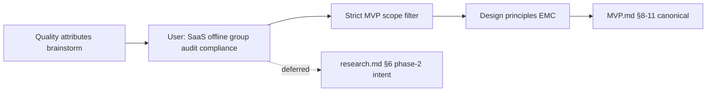

# Research — architecture & design discovery

This document preserves **conversation history and reasoning** for the K‑12 Library Management system—including **prior Cursor sessions** (§3) and the **architecture discovery session** (§4). Use it to **rebuild context** after a break, onboard collaborators, or infer **user/product preferences** when extending the system.

**Canonical implementation spec:** [MVP.md](MVP.md) (requirements, architecture §8–§10, traceability §11).  
**Domain detail:** [reference.md](reference.md), [catalog.md](catalog.md), [loan.md](loan.md).

---

## 1. Purpose of this document

| Use | How |
|-----|-----|
| **Context recovery** | Read §3 (prior sessions) + §4 (architecture log) + §5 (decision evolution) |
| **User profile** | §2 + §3.5 (early product intent: India K‑12, single school, procurement) |
| **Feeder for AI / docs** | Paste or reference sections when generating ADRs, code, or phase‑2 plans |
| **Avoid duplicate debate** | §6 lists resolved vs deferred; §3.4 notes what never landed in repo files |

---

## 2. User profile & working preferences (inferred)

Signals from the discovery conversation—not a formal persona, but useful for prioritization.

| Dimension | Observation |
|-----------|-------------|
| **Domain focus** | K‑12 library management; bounded contexts Reference, Catalog, Loan already modeled in markdown |
| **Delivery style** | Wants **minimal coherent ship** (MVP), not a big-bang platform |
| **Scope discipline** | Explicitly asked to **strictly limit to MVP.md** when architecture drifted toward SaaS, offline, bulk checkout |
| **Architecture literacy** | Comfortable with quality attributes, bounded contexts, ADRs, traceability tables, mermaid |
| **Strategic vs tactical** | Started strategic (quality attributes), then constrained, then asked for **extensibility / maintainability / configurability** as first-class design keys |
| **Documentation** | Expects decisions to land in repo docs (`MVP.md`), not only in chat |
| **Product direction (stated, some post-MVP)** | Interest in multi-tenant SaaS, compliance-aware privacy, audit, group checkouts, offline—then **scoped out of MVP doc** when aligning to `MVP.md` |
| **Geography & pedagogy (early sessions)** | **India K‑12**; **CBSE**, bilingual; languages English, Hindi, Marathi, Sanskrit, French, German |
| **Deployment (early vs later)** | Early: **single school per deploy**, unique **rack** location; later chat: multi-tenant SaaS intent (deferred from MVP.md) |
| **Phase‑2 product ideas (early)** | Book **recommendation → procurement** with approval (librarian / principal, cost rules); **feedback** on books by age/class; e‑copies future scope |

**Implication for implementers:** Prefer **documented, traceable decisions**; honor **MVP.md as scope authority**; design the core so **phase‑2 capabilities** (§1 out-of-scope in MVP) plug in via commands/ports/events without rewriting circulation.

---

## 3. Prior LMS sessions (extracted from Cursor transcripts)

**Yes — extraction is possible.** Cursor stores agent transcripts under the project’s `.cursor` agent-transcripts folder. Four sessions were found for this LMS workspace. Summaries below; full JSONL logs are local to your machine (not in the git repo).

### 3.1 Session index

| Session | Transcript ID (Cursor) | Approx. focus | Primary repo outputs |
|---------|------------------------|---------------|----------------------|
| **A** | `fbb0f92b-4dd2-4746-9704-a0323a077c99` | Librarian-led **domain learning**; FR/NFR/DDD; India boards; procurement | *(chat only—no dedicated md in repo)* |
| **B** | `b4520868-19d6-4589-8e55-73287ddcb0eb` | Workflow **phases** (acquisition→transaction); Indian context; catalog MVP rules | *(superseded by later domain docs)* |
| **C** | `ac596fc5-a536-41d3-b987-99f609f872fd` | **Domain modeling** — Catalog, Loan, Reference; ontology; MVP.md; standards | `reference.md`, `catalog.md`, `loan.md`, `MVP.md`, `cursor_key_workflows_*.md`, `library_domain_model_final.md` |
| **D** | `713739d5-039d-4207-a855-56b40f272ebd` | **Architecture** — quality attributes, ADRs, traceability | `MVP.md` §8–§11, this `research.md` |

*Full logs: `.cursor/projects/.../agent-transcripts/<uuid>/<uuid>.jsonl` on your machine. In Cursor chat, cite a parent session as [title ≤6 words](uuid).*

### 3.2 Session A — Domain exploration & procurement (fbb0f92b)

**User themes (chronological):**

- Role-play: school librarian helping define an LMS.
- **K‑12 only**; needs a **database**; model extensible for **e‑copies** (future).
- **Single school** per deployment; physical **rack number** unique per library.
- Summarize as **Functional / Non-functional requirements**, **Business services**, **Domain objects** aligned with **DDD**.
- **Recommendation service**: suggest books not in library; capture **feedback/comments**; tune by age/class.
- Procurement assist: internet-assisted suggestions, **classification by age/standard/genre**; **Indian boards**.
- **CBSE**, **bilingual**; languages: English, Hindi, Marathi, Sanskrit, French, German.
- Link recommendations to **procurement** with **approval workflow** (library vs librarian + principal; **cost** rules with flexibility for more rules).

**Captured in repo?** Partially reflected in domain richness and `MVP.md` §1 out-of-scope (**procurement integration**). Recommendation/approval workflows are **not** in MVP.md.

### 3.3 Session B — Phased workflows & catalog MVP (b4520868)

**User themes:**

- Key domain concepts and workflows for **K‑12 school**.
- Workflows with **input/output** in sequence: acquisition/creation → transformation → processing → publishing → transactions.
- **Reference data** sources per step; merged tables; **Indian context** alignment.
- Phase merge/optimize; key domain objects; **catalog** as core subdomain use cases.
- **MVP per use case**: steps, rule list, reference data required.
- Bibliographic record: **genre**, **patron type**, **age/class minimum validity** + rules.

**Captured in repo?** Evolved into Session C domain files. Genre/age-gating on bibliographic record may appear in catalog rules—verify in `catalog.md` if still required vs simplified MVP metadata (title, language, ISBN, tags).

### 3.4 Session C — Domain specs & MVP consolidation (ac596fc5)

**Major user requests (selected):**

| Topic | Outcome in repo |
|-------|-----------------|
| K‑12 India workflows; acquisition / manage / issue-return | `cursor_key_workflows_for_k_12_library_m.md` → later split |
| Use cases + rule sets; MVP use cases; domain model | Domain rules in per-context files |
| Focus **Catalog**; rename Work → **Catalog**; **Copy** → **Holding** | `catalog.md` terminology |
| **Loan** domain; use case lists | `loan.md` |
| Add **Reference** domain (Patron, etc.); align Catalog/Loan | `reference.md`, cross-domain updates |
| Split: `catalog.md`, `loan.md`, `reference.md` | Done |
| **Technology stack** / microservices vs monolith | Discussed in chat; **ADR-001 modular monolith** now in `MVP.md` §10 |
| Entity attributes + **standards** (ISO, RFC, etc.) | Attribute tables in domain md files |
| **Stakeholders** on use cases | §3.0 / §3.1 in domain files |
| Ontology tables + **knowledge graphs** + **semantic models** | §3.3–§3.4, §2.4–§2.5 per domain; `MVP.md` §7 |
| Consolidate **MVP.md** + knowledge graph | `MVP.md` |
| **Design constraints** doc | **Ask-mode outline only — never written to repo** |
| Architecture & design requirements (A1–A10) | Chat identification; largely superseded by `MVP.md` §8–§11 |

**Not captured in repo (chat only):**

- `DESIGN_CONSTRAINTS.md` (proposed outline: bounded contexts, identifiers, time, security, MVP deferrals).
- Explicit NFR targets (availability, RPO/RTO, offline desk).

### 3.5 Session D — Architecture discovery (713739d5)

Fully summarized in **§4** below. Canonical output: `MVP.md` §8–§11.

### 3.6 Extraction coverage matrix

| Topic | Session | In repo? | Where |
|-------|---------|----------|--------|
| Three bounded contexts | C | Yes | Domain md + `MVP.md` |
| Holding vs Copy, Catalog naming | C | Yes | `catalog.md` |
| Semantic / knowledge graph | C | Yes | Domain §3.4; `MVP.md` §7 |
| MVP scope & journey | C, D | Yes | `MVP.md` §1–§6 |
| Modular monolith + orchestrator | C, D | Yes | `MVP.md` §8–§10 |
| Modular monolith vs microservices analysis | C | Partial | Chat; ADR-001 in MVP |
| Design constraints document | C | **No** | Proposed only |
| Tech stack recommendation | C | **No** | Chat only (Postgres, etc. discussed) |
| Single-school + rack location | A | **No** | Not in current MVP/catalog holding model explicitly |
| Procurement + recommendation + approval | A | **No** | Out of MVP §1 |
| CBSE / bilingual / language list | A | Partial | `language` on catalog; full board matrix not in MVP |
| SaaS / offline / group / audit (later) | D | **Deferred** | `research.md` §6.2 |
| Architecture traceability REQ-* | D | Yes | `MVP.md` §11 |

---

## 4. Architecture session log (May 2026, chronological)

### Turn 1 — Quality attributes from MVP

**User ask:** What are the must-have **quality attributes** to consider in design, based on MVP requirements? Collaborative list.

**Context used:** [MVP.md](MVP.md) §1–§7; cross-references to domain docs for rules (concurrency, idempotency, audit, PII) where relevant to MVP flows.

**Assistant output (summary):**

- Draft **P0 / P1 / P2** quality attributes tied to MVP journeys: correctness, concurrency, idempotency, durability, security/RBAC, privacy, auditability, temporal correctness (overdue), integration integrity, operability, performance, availability, evolvability, multi-tenancy.
- **Trade-off diagram** (correctness vs cost).
- **Open questions** for the user: deployment model, self-checkout, offline, compliance, peak concurrency, audit depth.

**Not yet in repo** — discussion only.

---

### Turn 2 — User constraints (product direction)

**User answers:**

| # | Answer |
|---|--------|
| 1 | **Multi-tenant SaaS** model |
| 2 | **Librarian-only** checkout (contrasts with MVP.md §5 listing patron self-checkout) |
| 3 | **Offline access** for a few use cases that need **strong consistency** |
| 4 | **Regional compliance** required; **design for privacy** |
| 5 | **Single and group** checkouts should be possible |
| 6 | **Audit records** should be maintained |

**Assistant output (summary):**

- Revised attribute set incorporating SaaS isolation, hybrid online/offline consistency, compliance/privacy, group checkout orchestration, mandatory audit.
- Recommended **fail-closed** offline for circulation writes; read caches for desk lookup.
- Flagged **tension:** group/bulk checkout is **out of scope** in MVP.md §1 (`bulk class issue`).

**Status:** Product **intent** captured; not yet reconciled with MVP.md authority.

---

### Turn 3 — Strict MVP scope

**User ask:** **Strictly limit to MVP scope**; drop requirements **not in MVP.md**.

**Assistant output (summary):**

- **Dropped from architecture commitments** (not in MVP.md): multi-tenant SaaS, offline, group/bulk checkout, regional compliance/DPDP as explicit attribute, mandatory audit trail, high-scale/HA SLAs.
- **Retained (MVP-derived):** correctness, integration integrity, single-item circulation safety, authorization per MVP actors (including **patron** on checkout/return per §5), read-model correctness, coherence, durability.
- **Shortlist of 7** MVP quality attributes.
- Noted user’s “librarian-only” from Turn 2 **conflicts** with MVP.md actors (patron self-checkout/return listed)—MVP text takes precedence in this pass.

**User preference signal:** **MVP.md is the scope contract** for documented architecture.

---

### Turn 4 — Design considerations (three key attributes)

**User ask:** What should **design considerations** be? Treat **extensibility, maintainability, configurability** as key attributes.

**Assistant output (summary):**

- Modular monolith, circulation orchestrator, command/query split, integration ports, policy resolver, data-driven `LoanRuleSet`, lifecycle state machines, optional domain events.
- Extension roadmap for §1 out-of-scope items (bulk issue, renewals, fines, OPAC, guardian/notices).
- Checklist mapping the three principles to checkout/return.
- **Still discussion** — not yet in MVP.md.

---

### Turn 5 — Encode in MVP.md

**User ask:** Add **architecture and design decisions** to MVP.md; **traceability table** from requirements → architecture → design.

**Action taken:** [MVP.md](MVP.md) extended with:

- **§8** Architecture overview (diagram)
- **§9** Quality attributes + extensibility / maintainability / configurability + extension roadmap
- **§10** ADR-001 … ADR-011 + design element map
- **§11** REQ-01 … REQ-25 traceability + command → handler table
- **§12** Related documents (renumbered)

**Canonical record:** MVP.md §8–§11 supersedes chat-only drafts for implementation.

---

### Turn 6 — This document

**User ask:** Keep **all communication** in `research.md` for context rebuild and user-profile feeder.

**Action:** This file.

---

## 5. Decision evolution



| Topic | Turn 2 (user intent) | Turn 3 (MVP strict) | Canonical in MVP.md |
|-------|----------------------|---------------------|---------------------|
| Multi-tenant SaaS | Yes | Dropped | Not in MVP; single-school modular monolith OK |
| Librarian-only checkout | Yes | MVP lists patron too | ADR-010: ADMIN, LIBRARIAN, **PATRON** per §3–§5 |
| Offline | Selective + strong consistency | Dropped | Not in MVP |
| Regional compliance / privacy | Yes | Dropped as explicit attr. | Not in MVP; privacy not expanded |
| Group checkout | Yes | Dropped (**bulk class issue** out of §1) | Single `patronId` + `holdingId`; roadmap §9.3 |
| Audit trail | Required | Dropped | Not in MVP ADRs |
| Extensibility / maintainability / configurability | Emphasized | Kept as **design principles** | §9.2, ADRs, traceability §11.1 |
| Modular monolith + orchestrator | — | Adopted | §8, ADR-001, ADR-002 |
| Ports + policy resolver + events | — | Adopted | ADR-004, ADR-005, ADR-009 |

---

## 6. Resolved vs deferred

### 6.1 Resolved (document in MVP.md)

- Three bounded contexts; circulation orchestrator for checkout/return only.
- Command/query separation; handler per §7.2 action.
- Integration ports: `PatronEligibility`, `HoldingLendability`.
- Strong consistency on checkout/return; configurable `LoanRuleSet` + patron type mapping.
- MVP quality attributes and REQ-01 … REQ-25 traceability.
- Extension roadmap for out-of-scope §1 features without touching circulation kernel.

### 6.2 Deferred (user intent — revisit in phase 2+)

| Item | Notes for future ADR |
|------|----------------------|
| **Multi-tenant SaaS** | `tenantId` on all rows, RLS, tenant in auth claims; may lift ADR-001 to multi-tenant deployment |
| **Librarian-only checkout** | If product overrides MVP actors, narrow PATRON role to read-only; update REQ-21 |
| **Offline desk** | Read cache + fail-closed writes recommended; do not offline-write checkout without conflict strategy |
| **Compliance (e.g. DPDP)** | Data map, retention, export/delete APIs; guardian consent when notices ship |
| **Group / bulk checkout** | New command + batch orchestration; reuse ports (§9.3) |
| **Audit log** | Append-only store for checkout, blocks, admin changes; separate from optional `checkoutOperatorId` in domain docs |

### 6.3 Open reconciliations

| ID | Question | Current canonical answer |
|----|----------|---------------------------|
| **OQ-1** | Patron self-checkout in MVP §5 vs librarian-only preference | MVP.md + ADR-010 include **PATRON**; user Turn 2 said librarian-only — **confirm product owner** |
| **OQ-2** | When to introduce SaaS multi-tenancy | After MVP ship or parallel “platform” track |
| **OQ-3** | Group checkout MVP shape | Multi-holding one patron vs class roster — both out of MVP §1 |

---

## 7. Quality attributes — discussion archive

### 7.1 Initial brainstorm (pre–MVP strict) — reference only

Included for history; **not** committed to MVP.md unless also in §9.1.

| Attribute | Rationale discussed |
|-----------|---------------------|
| Tenant isolation | SaaS answer Turn 2 |
| Concurrency / idempotency | Checkout races, idempotent return (domain docs) |
| Auditability | Turn 2 mandatory audit |
| Privacy / compliance | K‑12, DPDP mentioned in reference.md |
| Offline / partition tolerance | Turn 2 |
| Performance at desk | Scan workflows |

### 7.2 MVP-strict shortlist (in MVP.md §9.1)

1. Correctness  
2. Integration integrity  
3. Single-item circulation safety  
4. Authorization (MVP actors)  
5. Read-model correctness  
6. Coherence (three contexts)  
7. Durability  

---

## 8. Design principles — discussion archive (Session D)

**Extensibility**

- New commands for new features; optional domain events; policy resolver hook; stable ports.

**Maintainability**

- One handler per MVP action; domain rules not in UI; single circulation orchestrator for cross-context writes; tests anchored to §2 journey.

**Configurability**

- `LoanRuleSet` + `PatronType` mapping as data; fail closed if unmapped; optional `loanRuleSetId` on `Loan` for later policy audit.

**Anti-patterns called out**

- Plugin framework for every rule; microservices for MVP; feature flags for core limits; offline checkout without conflict model.

---

## 9. Architecture decisions index

Full text: [MVP.md §10](MVP.md#10-architecture--design-decisions).

| ADR | Title |
|-----|--------|
| ADR-001 | Modular monolith (Reference, Catalog, Loan) |
| ADR-002 | Circulation orchestrator |
| ADR-003 | Command/query separation |
| ADR-004 | Integration ports |
| ADR-005 | Policy resolver (PatronType → LoanRuleSet) |
| ADR-006 | Strong consistency on checkout/return |
| ADR-007 | Data-driven LoanRuleSet |
| ADR-008 | Lifecycle state machines in domain |
| ADR-009 | Optional domain events |
| ADR-010 | Role-based authorization (MVP actors) |
| ADR-011 | MVP scope guardrail (§1 out-of-scope) |

---

## 10. Traceability pointer

Full tables: [MVP.md §11](MVP.md#11-traceability--requirements--architecture--design).

- **REQ-01 … REQ-25** — requirement → architecture (ADR) → design (handler/component)  
- **§11.1** — extensibility / maintainability / configurability  
- **§11.2** — §7.2 action types → handlers  

---

## 11. Suggested prompts for context rebuild

When resuming work with an AI assistant or new developer, provide:

```
Read LMS/research.md §2–§3 (all sessions) and §4–§6 (architecture).
Canonical spec: MVP.md §1–§11.
Domain: reference.md, catalog.md, loan.md.
Phase-2 / chat-only intent: research.md §6.2 and §3.6.
Open questions: research.md §6.3.
```

**To pull more detail from a past session:** open the transcript JSONL for that session ID (§3.1) or ask the agent to “read research.md §3.x and expand.”

---

## 12. Related documents

| Document | Role |
|----------|------|
| [MVP.md](MVP.md) | Canonical MVP requirements + architecture + traceability |
| [research.md](research.md) | This file — discovery conversation & user intent |
| [reference.md](reference.md) | Reference domain spec |
| [catalog.md](catalog.md) | Catalog domain spec |
| [loan.md](loan.md) | Loan domain spec |
| [library_domain_model_final.md](library_domain_model_final.md) | Cross-domain overview |
| [cursor_key_workflows_for_k_12_library_m.md](cursor_key_workflows_for_k_12_library_m.md) | Consolidated index (points to domain docs) |

---

*Last updated: prior sessions extracted May 2026 (§3); architecture session §4–§6. Amend when new Cursor sessions or workshops add decisions.*
